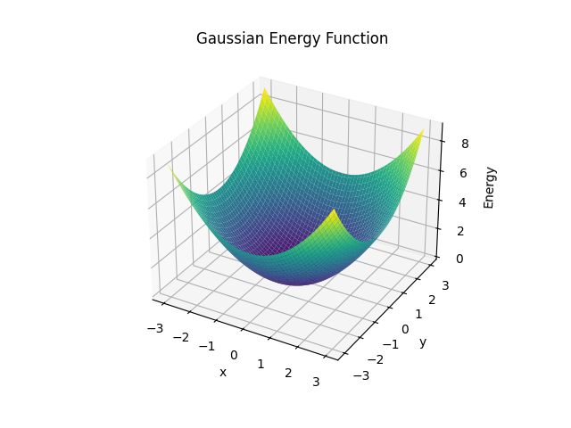
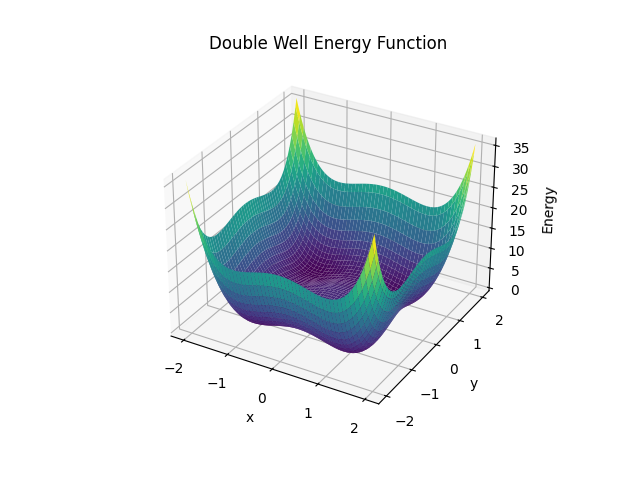
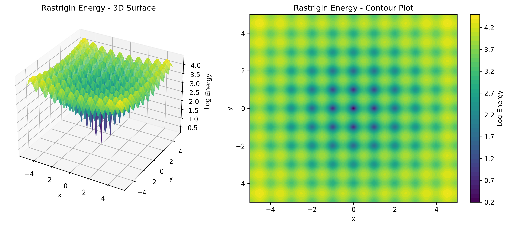
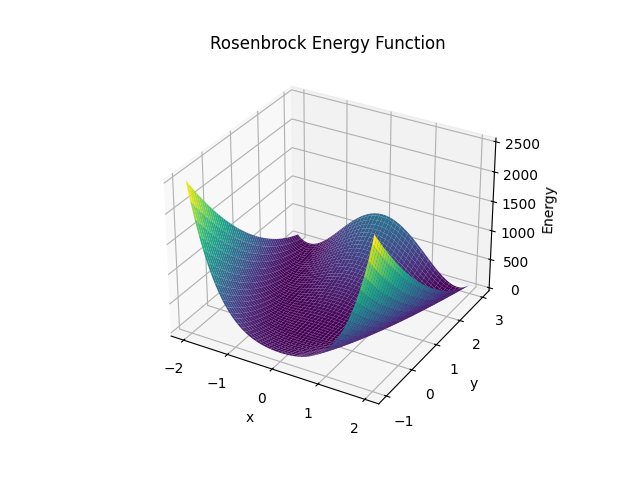
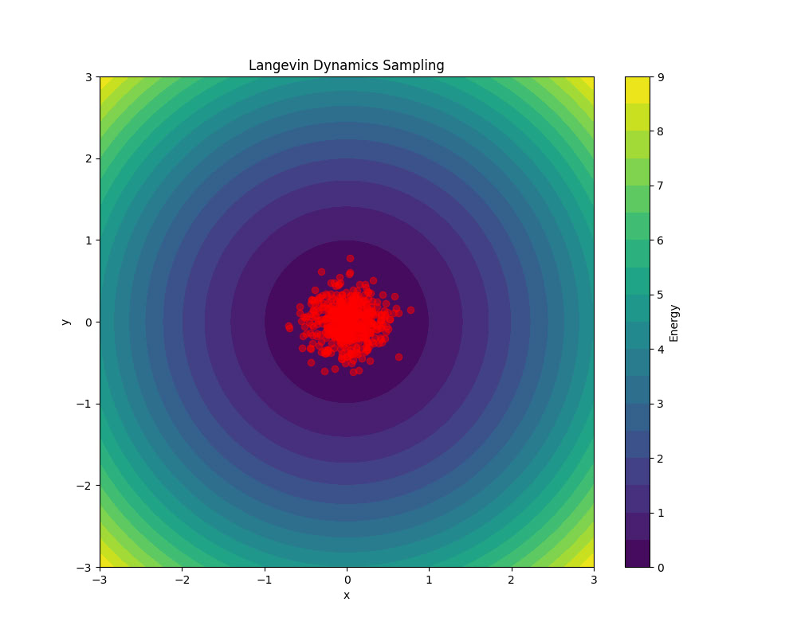
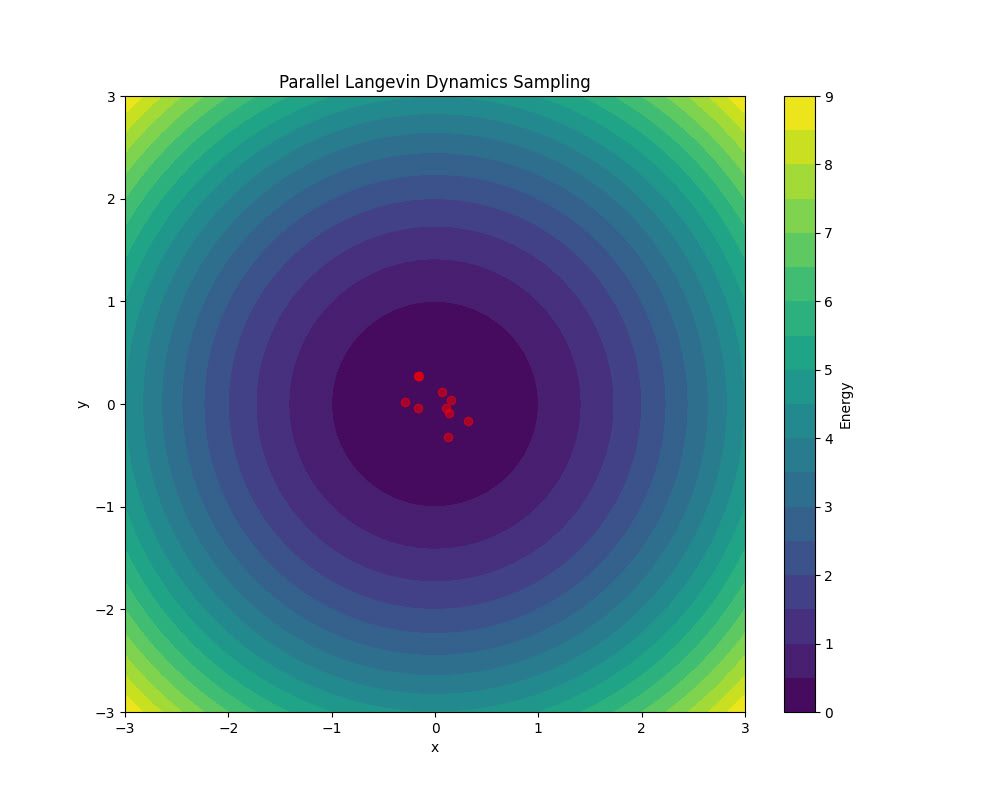

<p align="center">
  
</p>

<p align="center">⚡ Energy-Based Modeling library for PyTorch, offering tools for 🔬 sampling, 🧠 inference, and 📊 learning in complex distributions.</p>

<table align="center">
  <tr>
    <td></td>
    <td></td>
    <td></td>
    <td></td>
  </tr>
  <tr>
    <td align="center">Gaussian Function</td>
    <td align="center">Double Well Function</td>
    <td align="center">Rastrigin Function</td>
    <td align="center">Rosenbrock Function</td>
  </tr>
</table>

## About

TorchEBM is a CUDA-accelerated parallel library for Energy-Based Models (EBMs) built on PyTorch. It provides efficient 
implementations of sampling, inference, and learning algorithms for EBMs, with a focus on scalability and performance.

## Features

- **Core Components**:
  - Energy functions: Standard energy landscapes (Gaussian, Double Well, Rosenbrock, etc.)
  - Base sampler interfaces and common utilities

- **Advanced Samplers**:
  - **Langevin Dynamics**: Gradient-based MCMC with stochastic updates
  - **Hamiltonian Monte Carlo (HMC)**: Efficient exploration using Hamiltonian dynamics
  
- **Performance Optimizations**:
  - CUDA-accelerated implementations
  - Parallel sampling capabilities
  - Extensive diagnostics

## Installation

```bash
pip install torchebm
```

## Usage Examples

### Common Setup

```python
import torch
from torchebm.core import GaussianEnergy, DoubleWellEnergy

# Set device for computation
device = "cuda" if torch.cuda.is_available() else "cpu"

# Define dimensions
dim = 10
n_samples = 250
n_steps = 500
```

### Energy Function Examples

```python
# Create a multivariate Gaussian energy function
gaussian_energy = GaussianEnergy(
    mean=torch.zeros(dim, device=device),  # Center at origin
    cov=torch.eye(dim, device=device)      # Identity covariance (standard normal)
)

# Create a double well potential
double_well_energy = DoubleWellEnergy(barrier_height=2.0)
```

### 1. Langevin Dynamics Sampling

```python
from torchebm.samplers.langevin_dynamics import LangevinDynamics

# Define a 10D Gaussian energy function
energy_fn = GaussianEnergy(mean=torch.zeros(10), cov=torch.eye(10))

# Initialize Langevin dynamics sampler
langevin_sampler = LangevinDynamics(
    energy_function=energy_fn, step_size=5e-3, device=device
).to(device)

# Sample 10,000 points in 10 dimensions
final_samples = langevin_sampler.sample_chain(
    dim=10, n_steps=500, n_samples=10000, return_trajectory=False
)
print(final_samples.shape)  # Result shape: (10000, 10) - (n_samples, dim)

# Sample with trajectory and diagnostics
samples, diagnostics = langevin_sampler.sample_chain(
    dim=dim,
    n_steps=n_steps,
    n_samples=n_samples,
    return_trajectory=True,
    return_diagnostics=True,
)
print(samples.shape)  # Trajectory shape: (250, 500, 10) - (samples, n_steps, dim)
print(diagnostics.shape)  # Diagnostics shape: (500, 4, 250, 10) - (n_steps, 3, n_samples, dim)
# The diagnostics contain: Mean (dim=0), Variance (dim=1), Energy (dim=2)
```

### 2. Hamiltonian Monte Carlo (HMC)

```python
from torchebm.samplers.hmc import HamiltonianMonteCarlo

# Define a 10D Gaussian energy function
energy_fn = GaussianEnergy(mean=torch.zeros(10), cov=torch.eye(10))

# Initialize HMC sampler
hmc_sampler = HamiltonianMonteCarlo(
    energy_function=energy_fn, step_size=0.1, n_leapfrog_steps=10, device=device
)

# Sample 10,000 points in 10 dimensions
final_samples = hmc_sampler.sample_chain(
    dim=10, n_steps=500, n_samples=10000, return_trajectory=False
)
print(final_samples.shape)  # Result shape: (10000, 10) - (n_samples, dim)

# Sample with diagnostics and trajectory
final_samples, diagnostics = hmc_sampler.sample_chain(
    n_samples=n_samples,
    n_steps=n_steps,
    dim=dim,
    return_trajectory=True,
    return_diagnostics=True,
)

print(final_samples.shape)  # Trajectory shape: (250, 500, 10) - (n_samples, n_steps, dim)
print(diagnostics.shape)  # Diagnostics shape: (500, 4, 250, 10) - (n_steps, 4, n_samples, dim)
# The diagnostics contain: Mean (dim=0), Variance (dim=1), Energy (dim=2), Acceptance rates (dim=3)

# Sample from a custom initialization
x_init = torch.randn(n_samples, dim, dtype=torch.float32, device=device)
samples = hmc_sampler.sample_chain(x=x_init, n_steps=100)
print(samples.shape)  # Result shape: (250, 10) -> (n_samples, dim)
```

## Library Structure

```
torchebm/
├── core/                  # Core functionality
│   ├── energy_function.py # Energy function definitions
│   ├── basesampler.py     # Base sampler class
│   └── ...
├── samplers/              # Sampling algorithms
│   ├── langevin_dynamics.py  # Langevin dynamics implementation
│   ├── mcmc.py            # HMC implementation
│   └── ...
├── models/                # Neural network models
├── losses/                # BaseLoss functions for training
├── utils/                 # Utility functions
└── cuda/                  # CUDA optimizations
```

## Visualization Examples

<table>
  <tr>
    <td></td>
    <td></td>
    <td></td>
  </tr>
  <tr>
    <td align="center">Langevin Dynamics Sampling</td>
    <td align="center">Single Langevin Dynamics Trajectory</td>
    <td align="center">Parallel Langevin Dynamics Sampling</td>
  </tr>
</table>

Check out the `examples/` directory for sample scripts:
- `langevin_dynamics_sampling.py`: Demonstrates Langevin dynamics sampling
- `hmc_examples.py`: Demonstrates Hamiltonian Monte Carlo sampling
- `energy_fn_visualization.py`: Visualizes various energy functions

## Contributing

Contributions are welcome! Please check the issues page for current tasks or create a new issue to discuss proposed changes.

## License

This project is licensed under the MIT License - see the LICENSE file for details.

