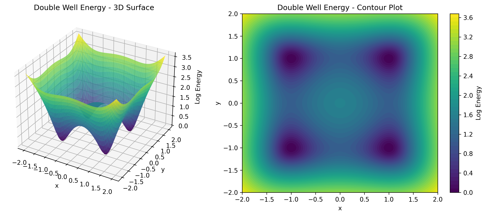

<p align="center">
  
</p>

<p align="center" style="margin-bottom: 20px;">
    <a href="https://pypi.org/project/torchebm/" target="_blank" title="PyPI version">
        
    </a>
    <a href="https://github.com/soran-ghaderi/torchebm/blob/master/LICENSE" target="_blank" title="License">
        
    </a>
    <a href="https://github.com/soran-ghaderi/torchebm" target="_blank" title="GitHub Repo Stars">
        
    </a>
    <a href="https://deepwiki.com/soran-ghaderi/torchebm"></a>
    <!-- Consider adding: build status, documentation status, code coverage -->
    <a href="https://github.com/soran-ghaderi/torchebm/actions" target="_blank" title="Build Status">
      
    </a>
    <!-- Docs badge -->
    <a href="https://github.com/soran-ghaderi/torchebm/actions" target="_blank" title="Documentation">
      
    </a>
<!--     <a href="https://pepy.tech/project/torchebm" target="_blank" title="Downloads">
        
    </a> -->
    <a href="https://pepy.tech/project/torchebm" target="_blank" title="Downloads">
        
    </a>
    <a href="https://pypi.org/project/torchebm/" target="_blank" title="Python Versions">
        
    </a>
</p>


<p align="center">⚡ Energy-Based Modeling library for PyTorch, offering tools for 🔬 sampling, 🧠 inference, and 📊 learning in complex distributions.</p>


## What is ∇ TorchEBM 🍓? 

**Energy-Based Models (EBMs)** offer a powerful and flexible framework for generative modeling by assigning an unnormalized probability (or "energy") to each data point. Lower energy corresponds to higher probability.

**TorchEBM** simplifies working with EBMs in [PyTorch](https://pytorch.org/). It provides a suite of tools designed for researchers and practitioners, enabling efficient implementation and exploration of:

*   **Defining complex energy functions:** Easily create custom energy landscapes using PyTorch modules.
*   **Training:** Loss functions and procedures suitable for EBM parameter estimation including score matching and contrastive divergence variants.
*   **Sampling:** Algorithms to draw samples from the learned distribution \( p(x) \).

## Documentation

For detailed documentation, including installation instructions, usage examples, and API references, please visit 
the 📚 [TorchEBM Website](https://soran-ghaderi.github.io/torchebm/).

## Features

- **Core Components**:
  - Energy functions: Standard energy landscapes (Gaussian, Double Well, Rosenbrock, etc.)
  - Datasets: Data generators for training and evaluation
  - Loss functions: Contrastive Divergence, Score Matching, and more
  - Sampling algorithms: Langevin Dynamics, Hamiltonian Monte Carlo (HMC), and more
  - Evaluation metrics: Diagnostics for sampling and training
   
- **Performance Optimizations**:
  - CUDA-accelerated implementations
  - Parallel sampling capabilities
  - Extensive diagnostics

<table align="center">
  <tr>
    <td></td>
    <td></td>
    <td></td>
    <td></td>
  </tr>
  <tr>
    <td align="center">Gaussian Function</td>
    <td align="center">Double Well Function</td>
    <td align="center">Rastrigin Function</td>
    <td align="center">Rosenbrock Function</td>
  </tr>
</table>

## Installation

```bash
pip install torchebm
```

#### Dependencies
- [PyTorch](https://pytorch.org/) (with CUDA support for optimal performance)
- Other dependencies are listed in [requirements.txt](requirements.txt)


## Usage Examples

### Common Setup

```python
import torch
from torchebm.core import GaussianEnergy, DoubleWellEnergy

# Set device for computation
device = "cuda" if torch.cuda.is_available() else "cpu"

# Define dimensions
dim = 10
n_samples = 250
n_steps = 500
```

### Energy Function Examples

```python
# Create a multivariate Gaussian energy function
gaussian_energy = GaussianEnergy(
    mean=torch.zeros(dim, device=device),  # Center at origin
    cov=torch.eye(dim, device=device)      # Identity covariance (standard normal)
)

# Create a double well potential
double_well_energy = DoubleWellEnergy(barrier_height=2.0)
```

### 1. Training a simple EBM Over a Gaussian Mixture Using Langevin Dynamics Sampler

```python
import torch.optim as optim
from torch.utils.data import DataLoader

from torchebm.losses import ContrastiveDivergence
from torchebm.datasets import GaussianMixtureDataset
from torchebm.samplers import LangevinDynamics

# Define an NN energy model
class MLPEnergy(BaseEnergyFunction):
    def __init__(self, input_dim, hidden_dim=64):
        super().__init__()
        self.net = nn.Sequential(
            nn.Linear(input_dim, hidden_dim),
            nn.SiLU(),
            nn.Linear(hidden_dim, hidden_dim),
            nn.SiLU(),
            nn.Linear(hidden_dim, 1),
        )

    def forward(self, x):
        return self.net(x).squeeze(-1) # a scalar value

energy_fn = MLPEnergy(input_dim=2).to(device)
sampler = LangevinDynamics(energy_function=energy_fn, step_size=0.01, device=device)

cd_loss_fn = ContrastiveDivergence(
  energy_function=energy_fn,
  sampler=sampler,
  k_steps=10  # MCMC steps for negative samples gen
)

optimizer = optim.Adam(energy_fn.parameters(), lr=0.001)

mixture_dataset = GaussianMixtureDataset(n_samples=500, n_components=4, std=0.1, seed=123).get_data()
dataloader = DataLoader(mixture_dataset, batch_size=32, shuffle=True)

# Training Loop
for epoch in range(10):
  epoch_loss = 0.0
  for i, batch_data in enumerate(dataloader):
    batch_data = batch_data.to(device)

    optimizer.zero_grad()

    loss, neg_samples = cd_loss(batch_data)

    loss.backward()
    optimizer.step()

    epoch_loss += loss.item()

  avg_loss = epoch_loss / len(dataloader)
  print(f"Epoch {epoch + 1}/{EPOCHS}, Loss: {avg_loss:.6f}")
```

### 2. Hamiltonian Monte Carlo (HMC)

```python
from torchebm.samplers import HamiltonianMonteCarlo

# Define a 10-D Gaussian energy function
energy_fn = GaussianEnergy(mean=torch.zeros(10), cov=torch.eye(10))

# Initialize HMC sampler
hmc_sampler = HamiltonianMonteCarlo(
  energy_function=energy_fn, step_size=0.1, n_leapfrog_steps=10, device=device
)

# Sample 10,000 points in 10 dimensions
final_samples = hmc_sampler.sample(
  dim=10, n_steps=500, n_samples=10000, return_trajectory=False
)
print(final_samples.shape)  # Result batch_shape: (10000, 10) - (n_samples, dim)

# Sample with diagnostics and trajectory
final_samples, diagnostics = hmc_sampler.sample(
  n_samples=n_samples,
  n_steps=n_steps,
  dim=dim,
  return_trajectory=True,
  return_diagnostics=True,
)

print(final_samples.shape)  # Trajectory batch_shape: (250, 500, 10) - (n_samples, k_steps, dim)
print(diagnostics.shape)  # Diagnostics batch_shape: (500, 4, 250, 10) - (k_steps, 4, n_samples, dim)
# The diagnostics contain: Mean (dim=0), Variance (dim=1), Energy (dim=2), Acceptance rates (dim=3)

# Sample from a custom initialization
x_init = torch.randn(n_samples, dim, dtype=torch.float32, device=device)
samples = hmc_sampler.sample(x=x_init, n_steps=100)
print(samples.shape)  # Result batch_shape: (250, 10) -> (n_samples, dim)
```

## Library Structure

```
torchebm/
├── core/                  # Core functionality
│   ├── energy_function.py # Energy function definitions
│   ├── basesampler.py     # Base sampler class
│   └── ...
├── samplers/              # Sampling algorithms
│   ├── langevin_dynamics.py  # Langevin dynamics implementation
│   ├── mcmc.py            # HMC implementation
│   └── ...
├── models/                # Neural network models
├── evaluation/            # Evaluation metrics and utilities
├── datasets/
│   └── generators.py      # Data generators for training
├── losses/                # BaseLoss functions for training
├── utils/                 # Utility functions
└── cuda/                  # CUDA optimizations
```

## Visualization Examples

<table>
  <tr>
    <td></td>
    <td></td>
    <td></td>
  </tr>
  <tr>
    <td align="center">Langevin Dynamics Sampling</td>
    <td align="center">Single Langevin Dynamics Trajectory</td>
    <td align="center">Parallel Langevin Dynamics Sampling</td>
  </tr>
</table>

Check out the `examples/` directory for sample scripts:
- `samplers/`: Demonstrates different sampling algorithms
- `datasets/`: Depicts data generation using built-in datasets
- `training_models/`: Shows how to train energy-based models using TorchEBM
- `visualization/`: Visualizes sampling results and trajectories
- and more!

## Contributing

Contributions are welcome! Step-by-step instructions for contributing to the project can be found on the [contributing.md](docs/developer_guide/contributing.md) page on the website.

Please check the issues page for current tasks or create a new issue to discuss proposed changes.

## Show your Support for ∇ TorchEBM 🍓

Please ⭐️ this repository if ∇ TorchEBM helped you and spread the word.

Thank you! 🚀

## Citation

If you use ∇ TorchEBM in your research, please cite it using the following BibTeX entry:

```bibtex
@misc{torchebm_library_2025,
  author       = {Ghaderi, Soran and Contributors},
  title        = {{TorchEBM}: A PyTorch Library for Training Energy-Based Models},
  year         = {2025},
  url          = {https://github.com/soran-ghaderi/torchebm},
}
```

## Changelog

For a detailed list of changes between versions, please see our [CHANGELOG](CHANGELOG.md).

## License

This project is licensed under the MIT License - see the [LICENSE](LICENSE) file for details.

## Research Collaboration

If you are interested in collaborating on research projects (**diffusion**-/**flow**-/**energy-based** models) or have 
any questions about the library, please feel free to reach out. I am open to discussions and collaborations that can 
enhance the capabilities of **∇ TorchEBM** 🍓 and contribute to the field of generative modeling.
