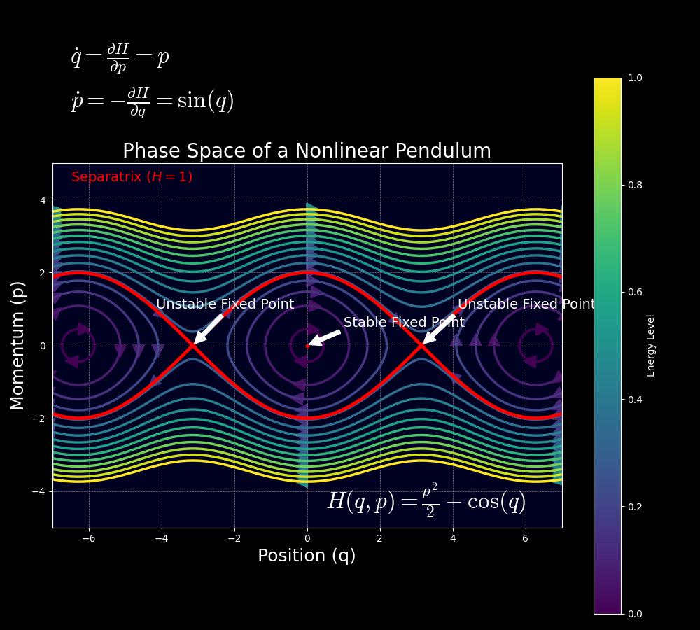
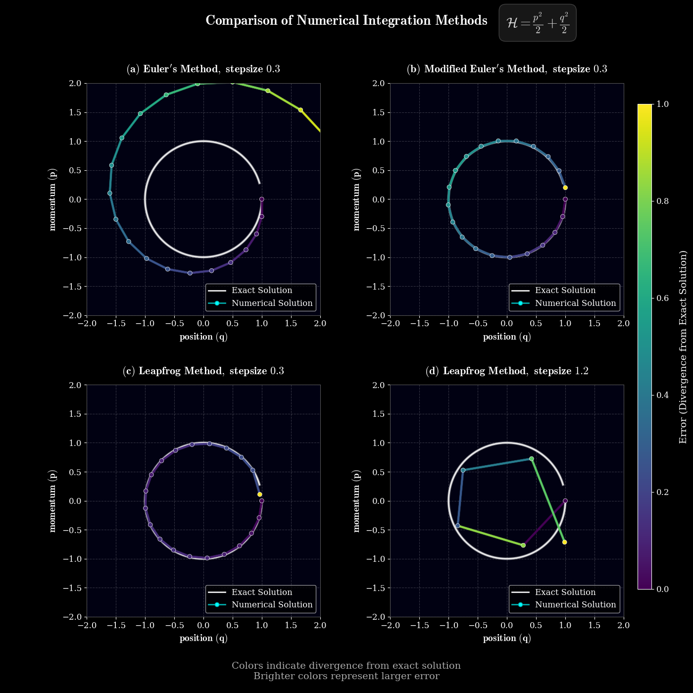

# Hamiltonian Mechanics :sparkles:

{ width="600" height="337.5" style="display: block; margin: 0 auto"}

<div style="text-align: justify">
<p>
Hamiltonian mechanics is a way to describe how physical systems, like planets or pendulums, move over 
time, focusing on energy rather than just forces. By reframing complex dynamics through energy lenses, 
this 19th-century physics framework now powers cutting-edge generative AI. It uses generalized coordinates \( q \) (like position) and their 
conjugate momenta \( p \) (related to momentum), forming a phase space that captures the system's state. This approach 
is particularly useful for complex systems with many parts, making it easier to find patterns and conservation laws.</p>
</div>


<!-- more -->


## Mathematical Reformation: From Second-Order to Phase Flow :gear:

Newton's \( F = m\ddot{q} \) requires solving second-order differential equations, which become unwieldy for constrained systems or when identifying conserved quantities. 

!!! abstract "The Core Idea"
    
    **Hamiltonian mechanics splits** \( \ddot{q} = F(q)/m \) **into two first-order equations** by introducing conjugate momentum \( p \):

    \begin{align*}
    \dot{q} = \frac{\partial H}{\partial p} & \text{(Position)}, \quad \dot{p} = -\frac{\partial H}{\partial q} & \text{(Momentum)}
    \end{align*}

    It decomposes acceleration into complementary momentum/position flows. This phase space perspective reveals hidden geometric structure.


### Lagrangian Prelude: Action Principles
The Lagrangian \( \mathcal{L}(q, \dot{q}) = K - U \) leads to Euler-Lagrange equations via variational calculus:
$$
\frac{d}{dt}\left( \frac{\partial \mathcal{L}}{\partial \dot{q}} \right) - \frac{\partial \mathcal{L}}{\partial q} = 0
$$

!!! warning "Kinetic Energy Symbol"
    Note that the \( K \) in the \( \mathcal{L}(q, \dot{q}) = K - U \) is also represented as **\( T \)**.

But these remain second-order. The critical leap comes through **Legendre Transformation \( (\dot{q} \rightarrow p) \)**.
The Hamiltonian is derived from the Lagrangian through a **Legendre transformation** by defining the conjugate momentum 
as \( p_i = \frac{\partial \mathcal{L}}{\partial \dot{q}_i} \); then the Hamiltonian can be written as:
$$
H(q,p) = \sum_i p_i \dot{q}_i - \mathcal{L}(q, \dot{q})
$$

??? info "Annotated \( H(q,p) \)" 
    $$
    H(q,p) = \sum_i \underbrace{p_i}_{\text{Conjugate Momentum}} \underbrace{\dot{q}_i}_{\text{Generalized Velocity}} - \underbrace{\mathcal{L}(q, \dot{q})}_{\text{Lagrangian}}
    $$

We can write \( H(q,p) \) more intuitively as:
$$
H(q,p) = K(p) + U(q)
$$


!!! question "Proof?"
    
    T is the Kinetic energy; for simplicity, I'll replace it with K.
 
    The negative sign arises because we are subtracting the Lagrangian from the sum of the products of momenta and 
    velocities. This ensures that the Hamiltonian represents the total energy of the system for conservative systems, 
    where the Lagrangian is \( K - U \) and the Hamiltonian becomes \( K + U \).
 
    For a simple system where \( K = \frac{1}{2}m\dot{q}^2 \) and \( U = U(q) \), the Hamiltonian would be:

    - **Kinetic Energy**: \( K = \frac{1}{2}m\dot{q}^2 \)
    - **Potential Energy**: \( U = U(q) \)
    - **Lagrangian**: \( \mathcal{L} = \frac{1}{2}m\dot{q}^2 - U(q) \)
    - **Conjugate Momentum**: \( p = m\dot{q} \)
    - **Hamiltonian**: \( H = p\dot{q} - \mathcal{L} = p\frac{p}{m} - \left(\frac{1}{2}m\left(\frac{p}{m}\right)^2 - U(q)\right) = \frac{p^2}{m} - \frac{p^2}{2m} + U(q) = \frac{p^2}{2m} + U(q) = K(p) + U(q) \)


This flips the script: instead of \( \dot{q} \)-centric dynamics, we get **symplectic phase flow**.

!!! question "Why This Matters"
    
    The Hamiltonian becomes the system's total energy \( H = K + U \) for many physical systems. 
    It also provides a framework where time evolution is a **canonical transformation** - 
    a symmetry preserving the fundamental Poisson bracket structure \( \{q_i, p_j\} = \delta_{ij} \).
    
    ??? info "Canonical and Non-Canonical Transformations"
    
        A canonical transformation is a change of variables that preserves the form of Hamilton's equations. It's like changing the map projection without altering the landscape.
    
        Consider a simple translation:
        $$ Q = q + a, \quad P = p + b $$
        This transformation preserves the Hamiltonian structure and Poisson bracket:
        \( \{Q, P\} = \{q + a, p + b\} = \{q, p\} = 1 = \delta_{ij} \)
        
        - Preserves Hamiltonian structure.
        - Maintains Poisson bracket invariance.
        - Time evolution can be viewed as a canonical transformation.
        
        On the other hand, non-canonical transformation changes the form of Hamilton's equations.
        
        For example, consider the transformation:

        $$ Q = q^3, \quad P = p^3 $$

        The Poisson bracket is:

        \( \{Q, P\} = \frac{\partial Q}{\partial q} \frac{\partial P}{\partial p} - \frac{\partial Q}{\partial p} \frac{\partial P}{\partial q} = 3q^2 \cdot 3p^2 - 0 = 9q^2p^2 \neq 1 \)

        ??? question "How to calculate those formula?"
             
            The Poisson bracket of two functions \( f \) and \( g \) is defined as:
            \( \{f, g\} = \sum_i \left( \frac{\partial f}{\partial q_i} \frac{\partial g}{\partial p_i} - \frac{\partial f}{\partial p_i} \frac{\partial g}{\partial q_i} \right) \)
            
            **Transformation 1: \( Q = q + a, \quad P = p + b \)**
            
            **Partial Derivatives**: 
            
            - \( \frac{\partial Q}{\partial q} = 1 \)
            - \( \frac{\partial Q}{\partial p} = 0 \)
            - \( \frac{\partial P}{\partial q} = 0 \)
            - \( \frac{\partial P}{\partial p} = 1 \)
            
            These derivatives can be represented in matrix form as:
            \( \frac{\partial (Q, P)}{\partial (q, p)} = \begin{pmatrix} 1 & 0 \\ 0 & 1 \end{pmatrix} \)
            
            This is a diagonal identity matrix, indicating that the transformation preserves the original structure.
            
            **Poisson Bracket Calculation**
            \( \{Q, P\} = \frac{\partial Q}{\partial q} \frac{\partial P}{\partial p} - \frac{\partial Q}{\partial p} \frac{\partial P}{\partial q} = (1)(1) - (0)(0) = 1 \)
            
            ---

            **Transformation 2: \( Q = q^3, \quad P = p^3 \)**
            
            **Partial Derivatives**
            - \( \frac{\partial Q}{\partial q} = 3q^2 \)
            - \( \frac{\partial Q}{\partial p} = 0 \)
            - \( \frac{\partial P}{\partial q} = 0 \)
            - \( \frac{\partial P}{\partial p} = 3p^2 \)
            
            These derivatives can be represented as:
            \( \frac{\partial (Q, P)}{\partial (q, p)} = \begin{pmatrix} 3q^2 & 0 \\ 0 & 3p^2 \end{pmatrix} \)
            
            This is a diagonal matrix but not the identity matrix, indicating that the transformation does not preserve the original structure.
            
            **Poisson Bracket Calculation**
            \( \{Q, P\} = \frac{\partial Q}{\partial q} \frac{\partial P}{\partial p} - \frac{\partial Q}{\partial p} \frac{\partial P}{\partial q} = (3q^2)(3p^2) - (0)(0) = 9q^2p^2 \)
             
            - **Transformation 1** preserves the Poisson bracket structure because it results in a constant value of 1, represented by an identity matrix.
            - **Transformation 2** does not preserve the Poisson bracket structure because the result depends on \( q \) and \( p \), represented by a non-identity diagonal matrix.

This transformation is not canonical because it does not preserve the Poisson bracket structure.


### Newton vs. Lagrange vs. Hamilton: A Philosophical Showdown

| Aspect                             | Newtonian                                         | Lagrangian                                                   | Hamiltonian                                                                          |
|------------------------------------|---------------------------------------------------|--------------------------------------------------------------|--------------------------------------------------------------------------------------|
| **State Variables**                | Position \( x \) and velocity \( \dot{x} \)       | Generalized coordinates \( q \) and velocities \( \dot{q} \) | Generalized coordinates \( q \) and conjugate momenta \( p \)                        |
| **Formulation**                    | Second-order differential equations \( (F=ma) \)  | Principle of least action (\( \delta \int L \, dt = 0 \))    | First-order differential equations from Hamiltonian function (Phase flow \( (dH) \)) |
| **Identifying Symmetries**         | Manual identification or through specific methods | Noether's theorem                                            | Canonical transformations and Poisson brackets                                       |
| **Machine Learning Connection**    | Physics-informed neural networks, simulations     | Optimal control, reinforcement learning                      | Hamiltonian Monte Carlo (HMC) sampling, energy-based models                          |
| **Energy Conservation**            | Not inherent (must be derived)                    | Built-in through conservation laws                           | Central (Hamiltonian is energy)                                                      |
| **General Coordinates**            | Possible, but often cumbersome                    | Natural fit                                                  | Natural fit                                                                          |
| **Time Reversibility**             | Yes                                               | Yes                                                          | Yes, especially in symplectic formulations                                           |

[//]: # (add the representation formula. ex. H = K + U, L = K - U, etc.)

### Hamilton's Equations: The Geometry of Phase Space :gear: 

The phase space is a mathematical space where we can represent the set of possible states of a physical system. For a system with \( n \) degrees of freedom, the phase space is a \( 2n \)-dimensional space, often visualized as a map where each point \( (q, p) \) represents a unique state. The evolution of the system is described by the motion of a point in this space, governed by Hamilton's equations.

<figure>
  <video width="640" height="360" autoplay loop muted>
    <source src="../../assets/images/blog/hamiltonian/pendulum_phase_space.mp4" type="video/mp4">
    Your browser does not support the video tag.
  </video>
   <figcaption>
   Phase space portrait of a nonlinear pendulum showing oscillatory motion (closed orbits), rotational motion (wavy trajectories), and separatrices (red curves) connecting unstable equilibrium points. Position (q) and momentum (p) dynamics illustrate energy conservation principles fundamental to Hamiltonian systems.
 </figcaption>
</figure>

This formulation offers several advantages. It makes it straightforward to identify conserved quantities and symmetries through canonical transformations and Poisson brackets, which provides deeper insights into the system's behavior. For instance, Liouville's theorem states that the volume in phase space occupied by an ensemble of systems remains constant over time, expressed as:

\[
\frac{\partial \rho}{\partial t} + \{\rho, H\} = 0
\]

or equivalently:

\[
\frac{\partial \rho}{\partial t} + \sum_i \left(\frac{\partial \rho}{\partial q_i}\frac{\partial H}{\partial p_i} - \frac{\partial \rho}{\partial p_i}\frac{\partial H}{\partial q_i}\right) = 0
\]

where \( \rho(q, p, t) \) is the density function. This helps us to represent the phase space flows and how they 
preserve area under symplectic transformations. Its relation to [symplectic geometry](https://en.wikipedia.org/wiki/Symplectic_geometry)
enables mathematical properties that are directly relevant to many numerical methods. For instance, it enables Hamiltonian Monte Carlo
to perform well in high-dimensions by defining MCMC strategies that increases the chances of accepting a sample (particle). 


### Symplecticity: The Sacred Invariant
Hamiltonian flows preserve the symplectic 2-form \( \omega = \sum_i dq_i \wedge dp_i \). 

??? info "Symplectic 2-form \( \omega \)"
        
    The symplectic 2-form, denoted by \( \omega = \sum_i dq_i \wedge dp_i \), is a mathematical object used in 
    symplectic geometry. It measures the area of parallelograms formed by vectors in the tangent space of a phase space.
     
    - **\( dq_i \) and \( dp_i \)**: Infinitesimal changes in position and momentum coordinates.
    - **\( \wedge \)**: The wedge product, which combines differential forms in an antisymmetric way meaning that \( dq_i \wedge dp_i = -dp_i \wedge dq_i \).
    - **\( \sum_i \)**: Sum over all degrees of freedom.
         
    Imagine a phase space where each point represents a state of a physical system. The symplectic form assigns a 
    value to each pair of vectors, effectively measuring the area of the parallelogram they span. This area is 
    preserved under Hamiltonian flows.
    
    **Key Properties**
    
    1. **Closed**: \( d\omega = 0 \) which means its exterior derivative is zero \( d\omega=0 \). This property ensures that the form does not change under continuous transformations.
    2. **Non-degenerate**: The form is non-degenerate if \( d\omega(X,Y)=0 \) for all \( Y \)s, then \( X=0 \). This ensures that every vector has a unique "partner" vector such that their pairing under \( \omega \) is non-zero.
    
    **Example**
    
    For a simple harmonic oscillator with one degree of freedom, \( \omega = dq \wedge dp \). This measures the area of parallelograms in the phase space spanned by vectors representing changes in position and momentum.
    
    **A Very Simplistic PyTorch Code**:
    While PyTorch doesn't directly handle differential forms, you can conceptually represent the symplectic form using tensors:
    
    ```python
    import torch
    
    # Conceptual representation of dq and dp as tensors
    dq = torch.tensor([1.0])  
    dp = torch.tensor([1.0])  
    
    # "Wedge product" conceptually represented using an outer product
    omega = torch.outer(dq, dp) - torch.outer(dp, dq)
    
    print(omega)
    ```

    This code illustrates the antisymmetric nature of the wedge product.


Numerically, this means good integrators must respect:

\[
\frac{\partial (q(t + \epsilon), p(t + \epsilon))}{\partial (q(t), p(t))}^T J \frac{\partial (q(t + \epsilon), p(t + \epsilon))}{\partial (q(t), p(t))} = J \quad \text{where } J = \begin{pmatrix} 0 & I \\ -I & 0 \end{pmatrix}
\]


??? info "Breaking Down the Formula"
    
    - **Geometric numerical integration** solves differential equations while preserving geometric properties of the system.
    - **Symplecticity** is a geometric property inherent to Hamiltonian systems. It ensures that the area of geometric 
    structures (e.g., parallelograms) in phase space \( (q, p) \) remains constant over time. This is encoded in the 
    symplectic form \( \omega = \sum_i dq_i \wedge dp_i \).
    
    - A numerical method is **symplectic** if it preserves \( \omega \). The Jacobian matrix of the transformation 
    from \( (q(t), p(t)) \) to \( (q(t + \epsilon), p(t + \epsilon)) \) must satisfy the condition above.
    - The **Jacobian matrix** \( \frac{\partial (q(t + \epsilon), p(t + \epsilon))}{\partial (q(t), p(t))} \) 
    quantifies how small changes in the initial state \( (q(t), p(t)) \) propagate to the next state \( (q(t + \epsilon), p(t + \epsilon)) \).
    
    - **\( q(t) \) and \( p(t) \)** : Position and momentum at time \( t \).
    - **\( q(t + \epsilon) \) and \( p(t + \epsilon) \)** : Updated position and momentum after one time step \( \epsilon \).
    - **\( \frac{\partial}{\partial (q(t), p(t))} \)** : Partial derivatives with respect to the initial state.

### How are We Going to Solve it?

Numerical solvers for differential equations inevitably introduce errors that affect solution accuracy.
These errors manifest as deviations from the true trajectory in phase space, particularly noticeable in
energy-conserving systems like the harmonic oscillator. The errors fall into two main categories: local
truncation error, arising from the approximation of continuous derivatives with discrete steps
(proportional to \( \mathcal{O}(\epsilon^n+1) \) where \( \epsilon \) is the step size and n depends on the method); and global accumulation error,
which compounds over integration time.

!!! bug "Forward Euler Method Fails at This!"
    
    ### Key Issue: Energy Drift from Non-Symplectic Updates
    
    The forward Euler method (FEM) violates the geometric structure of Hamiltonian systems, 
    leading to **energy drift** in long-term simulations. Let’s dissect why.
    
    ---
    
    ### Forward Euler in Hamiltonian Systems
    
    For a Hamiltonian \( H(q, p) \), the forward Euler updates position and momentum as: \(
    q(t + \epsilon) = q(t) + \epsilon \frac{\partial H}{\partial p}(q(t), p(t)),\quad 
    p(t + \epsilon) = p(t) - \epsilon \frac{\partial H}{\partial q}(q(t), p(t))
    \)
    
    Unlike Leapfrog Verlet, these updates **do not split** the position/momentum dependencies, breaking symplecticity.
    
    ---
    
    ### Step-by-Step Failure: Harmonic Oscillator Example
    
    **Hamiltonian**: \(
    H = \frac{1}{2}(q^2 + p^2) \quad \text{(mass-spring system with m = k = 1 )} \)
    
    **Forward Euler Updates**: \(
    q(t + \epsilon) = q(t) + \epsilon p(t) \quad \text{(position update)} \quad p(t + \epsilon) = p(t) - \epsilon q(t) \quad \text{(momentum update)}
    \)
    
    ---
    
    #### Jacobian Matrix Analysis
    
    The Jacobian \( M = \frac{\partial (q(t + \epsilon), p(t + \epsilon))}{\partial (q(t), p(t))} \) becomes: \(
    M = \begin{pmatrix}
    1 & \epsilon \\
    -\epsilon & 1
    \end{pmatrix}
    \)
    
    **Symplectic Condition Check**:  
    Does \( M^T J M = J \), where \( J = \begin{pmatrix} 0 & 1 \\ -1 & 0 \end{pmatrix} \)?
    
    1. **Transpose \( M^T \)**: \(
       M^T = \begin{pmatrix}
       1 & -\epsilon \\
       \epsilon & 1
       \end{pmatrix}
       \)
    
       2. **Compute \( J M \)**: \(
          J M = \begin{pmatrix}
          -\epsilon & 1 \\
          -1 & -\epsilon
          \end{pmatrix}
          \)
    
       3. **Final Product \( M^T J M \)**: \(
          M^T J M = \begin{pmatrix}
          0 & 1 + \epsilon^2 \\
          -1 - \epsilon^2 & 0
          \end{pmatrix} \neq J
          \)
    
    The result violates \( M^T J M = J \), proving **symplecticity fails** unless \( \epsilon = 0 \).
    
    \[
    \boxed{\frac{\partial (q(t + \epsilon), p(t + \epsilon))}{\partial (q(t), p(t))}^T J \frac{\partial (q(t + \epsilon), p(t + \epsilon))}{\partial (q(t), p(t))} \neq J}
    \]
    
    ---
    
    ### Practical Consequences: Energy Drift
    
    !!! failure "Why This Matters"
        - **Energy Drift**: FEM artificially injects/dissipates energy over time because \( H(q,p) \) is not conserved.  
        - **Phase Space Distortion**: Volume preservation fails, corrupting long-term trajectories.  
        - **Unusable for HMC**: Sampling in Hamiltonian Monte Carlo relies on symplectic integrators to maintain detailed balance.  
    
        **Example**: Simulating a harmonic oscillator with FEM shows spiraling/non-closing orbits in phase space, unlike the stable ellipses from Leapfrog Verlet.

To overcome this, we turn to symplectic integrators—methods that respect the underlying geometry of Hamiltonian 
systems, leading us naturally to the Leapfrog Verlet method, a powerful symplectic alternative. 🚀

## Symplectic Numerical Integrators :computer: 
### Leapfrog Verlet

For a separable Hamiltonian \( H(q,p) = K(p) + U(q) \), where the corresponding probability distribution is given by:

\[
P(q,p) = \frac{1}{Z} e^{-U(q)} e^{-K(p)},
\]

the Leapfrog Verlet integrator proceeds as follows:

\[
\begin{aligned}
p_{i}\left(t + \frac{\epsilon}{2}\right) &= p_{i}(t) - \frac{\epsilon}{2} \frac{\partial U}{\partial q_{i}}(q(t)) \\
q_{i}(t + \epsilon) &= q_{i}(t) + \epsilon \frac{\partial K}{\partial p_{i}}\left(p\left(t + \frac{\epsilon}{2}\right)\right) \\
p_{i}(t + \epsilon) &= p_{i}\left(t + \frac{\epsilon}{2}\right) - \frac{\epsilon}{2} \frac{\partial U}{\partial q_{i}}(q(t + \epsilon))
\end{aligned}
\]

This Störmer-Verlet scheme preserves symplecticity exactly, with local error \( \mathcal{O}(\epsilon^3) \) and global 
error \( \mathcal{O}(\epsilon^2) \). You can read more about 
<cite><a href="https://lemesurierb.people.charleston.edu/numerical-methods-and-analysis-python/main/ODE-IVP-6-multi-step-methods-introduction-python.html">
numerical methods and analysis in Python here</a></cite>.


!!! question "How Exactly?"
    
    1. **Leapfrog Verlet Update Equations**  
    For a separable Hamiltonian \( H(q, p) = K(p) + U(q) \), the method splits into three component-wise steps:
    
        1. **Half-step momentum update**: \(
           p_{i}\left(t + \frac{\epsilon}{2}\right) = p_{i}(t) - \frac{\epsilon}{2} \frac{\partial U}{\partial q_{i}}(q(t))
           \)
        
        2. **Full-step position update**: \(
           q_{i}(t + \epsilon) = q_{i}(t) + \epsilon \frac{\partial K}{\partial p_{i}}\left(p\left(t + \frac{\epsilon}{2}\right)\right)
           \)
        
        3. **Full-step momentum update**: \(
           p_{i}(t + \epsilon) = p_{i}\left(t + \frac{\epsilon}{2}\right) - \frac{\epsilon}{2} \frac{\partial U}{\partial q_{i}}(q(t + \epsilon))
           \)
    
    2. **Jacobian Matrix Calculation**  
    For the harmonic oscillator \( H(q, p) = \frac{1}{2}(q^2 + p^2) \), the updates simplify to:  

        \[
        q(t + \epsilon) = q(t) + \epsilon p(t) - \frac{\epsilon^2}{2} q(t), \quad
        p(t + \epsilon) = p(t) - \epsilon q(t) - \frac{\epsilon^2}{2} p(t).
        \]

        The Jacobian matrix \( M = \frac{\partial (q(t + \epsilon), p(t + \epsilon))}{\partial (q(t), p(t))} \) becomes: \(
        M = \begin{pmatrix}
        1 - \frac{\epsilon^2}{2} & \epsilon \\
        -\epsilon & 1 - \frac{\epsilon^2}{2}
        \end{pmatrix}.
        \)
    
    3. **Transpose of \( M \)**  
    The transpose \( M^T \) swaps off-diagonal terms: \(
    M^T = \begin{pmatrix}
    1 - \frac{\epsilon^2}{2} & -\epsilon \\
    \epsilon & 1 - \frac{\epsilon^2}{2}
    \end{pmatrix}.
    \)
    
    4. **Verify \( M^T J M = J \)**  
    Let \( J = \begin{pmatrix} 0 & 1 \\ -1 & 0 \end{pmatrix} \). Compute \( M^T J M \):
    
        1. **Calculate**: \(
        J M = \begin{pmatrix}
        -\epsilon & 1 - \frac{\epsilon^2}{2} \\
        -\left(1 - \frac{\epsilon^2}{2}\right) & -\epsilon
        \end{pmatrix}.
        \)
        
        2. **Calculate**: \(
        M^T J M = \begin{pmatrix}
        1 - \frac{\epsilon^2}{2} & -\epsilon \\
        \epsilon & 1 - \frac{\epsilon^2}{2}
        \end{pmatrix}
        \begin{pmatrix}
        -\epsilon & 1 - \frac{\epsilon^2}{2} \\
        -\left(1 - \frac{\epsilon^2}{2}\right) & -\epsilon
        \end{pmatrix}.
        \)
    
        After matrix multiplication: \(
        M^T J M = \begin{pmatrix}
        0 & 1 \\
        -1 & 0
        \end{pmatrix} = J.
        \)

    The Leapfrog Verlet method satisfies \( M^T J M = J \), proving it **preserves the symplectic structure**. This matches its theoretical property as a symplectic integrator.
    
    \[
    \boxed{\frac{\partial (q(t + \epsilon), p(t + \epsilon))}{\partial (q(t), p(t))}^T J \frac{\partial (q(t + \epsilon), p(t + \epsilon))}{\partial (q(t), p(t))} = J}
    \]
    

      

### Why Symplectic Matters
They're the **reversible neural nets** of physics simulations!

Symplectic integrators like Leapfrog Verlet are critical for **long-term stability** in Hamiltonian systems.  

- **Phase space preservation**: The volume in \( (q, p) \)-space is conserved exactly, avoiding artificial energy drift.  
- **Approximate energy conservation**: While energy \( H(q,p) \) is not perfectly conserved (due to \( \mathcal{O}(\epsilon^2) \) error), it oscillates near the true value over exponentially long timescales.  
- **Practical relevance**: This makes symplectic integrators indispensable in molecular dynamics and Hamiltonian Monte Carlo (HMC), where accurate sampling relies on stable trajectories.  


<figure>

<figcaption>
Comparison of numerical integration methods for a simple harmonic oscillator in phase space. Color gradients 
indicate error magnitude with brighter colors showing larger divergence from the exact solution (white). 
Euler's method (a) exhibits energy growth, Modified Euler's method (b) shows improved stability, while 
Leapfrog maintains excellent energy conservation at small stepsize (c) but develops geometric distortion 
at larger stepsize (d).
</figcaption>
</figure>

Euler's method (first-order) systematically injects energy into the system,
causing the characteristic outward spiral seen in the plots. Modified Euler's method (second-order) significantly
reduces this energy drift. Most importantly, symplectic integrators like the Leapfrog method preserve the
geometric structure of Hamiltonian systems even with relatively large step sizes by maintaining phase space
volume conservation. This structural preservation is why Leapfrog remains the preferred method for long-time
simulations in molecular dynamics and astronomy, where energy conservation is critical despite the visible
polygon-like discretization artifacts at large step sizes.

Non-symplectic methods (e.g., Euler-Maruyama) often fail catastrophically in these settings.


| Integrator                     | Symplecticity      | Order | Type                         | Local Error | Global Error | Suitable For                                                                             | Computational Cost |
|--------------------------------|--------------------|-------|------------------------------|------------|--------------|------------------------------------------------------------------------------------------|-------------------|
| Euler Method                   | :x:                | 1     | Explicit                     | O(ε²)      | O(ε)         | Quick prototypes and Short-term simulations of general ODEs                              | Low               |
| Symplectically Euler           | :heavy_check_mark: | 1     | Explicit                     | O(ε²)      | O(ε)         | Simple Hamiltonian systems                                                               | Low               |
| Leapfrog (Verlet)              | :heavy_check_mark: | 2     | Explicit                     | O(ε³)      | O(ε²)        | Molecular dynamics, Long-term simulations of Hamiltonian systems                         | Moderate          |
| Runge-Kutta 4                  | :x:                | 4     | Explicit                     | O(ε⁵)      | O(ε⁴)        | Short-term accuracy, General ODEs, but not recommended for long-term Hamiltonian systems | High              |
| Forest-Ruth Integrator         | :heavy_check_mark: | 4     | Explicit                     | O(ε⁵)      | O(ε⁴)        | High-accuracy long-term simulations                                                      | High              |
| Yoshida 6th-order              | :heavy_check_mark: | 6     | Explicit                     | O(ε⁷)      | O(ε⁶)        | High-accuracy                                                                            | High              |
| Heun’s Method (RK2)            | :x:                | 2     | Explicit                     | O(ε³)      | O(ε²)        | General ODEs requiring moderate accuracy                                                 | Moderate          |
| Third-order Runge-Kutta        | :x:                | 3     | Explicit                     | O(ε⁴)      | O(ε³)        | When higher accuracy than RK2 is needed without the cost of RK4                          | High              |
| Implicit Midpoint Rule         | :heavy_check_mark: | 2     | Implicit (solving equations) | O(ε³)      | O(ε²)        | Hamiltonian systems, stiff problems                                                      | High              |
| Fourth-order Adams-Bashforth   | :x:                | 4     | Multi-step (explicit)        | O(ε⁵)      | O(ε⁴)        | Non-stiff problems with smooth solutions, after initial steps                            | Low               |
| Backward Euler Method          | :x:                | 1     | Implicit (solving equations) | O(ε²)      | O(ε)         | Stiff problems, where stability is crucial                                               | High              |


## Hamiltonian Monte Carlo

Hamiltonian Monte Carlo (HMC) is a Markov chain Monte Carlo (MCMC) method that leverages Hamiltonian dynamics to 
efficiently sample from complex probability distributions, particularly in Bayesian statistics and machine learning.

### From Phase Space to Probability Space

HMC interprets target distribution \( P(z) \) as a Boltzmann distribution:

\[
P(z) = \frac{1}{Z} e^{\frac{-E(z)}{T}}
\]

Substituting into this formulation, the Hamiltonian gives us a joint density:

\[ 
P(q,p) = \frac{1}{Z} e^{-U(q)} e^{-K(p)} \quad \text{where } U(q) = -\log[p(q), p(q|D)]
\]

where \( p(q|D) \) is the likelihood of the given data \( D \) and T=1 and therefore removed. We estimate our posterior
distribution using the potential energy \( U(q) \) since \( P(q,p) \) consists of two independent probability distributions.

Augment with artificial momentum \( p \sim \mathcal{N}(0,M) \), then simulate Hamiltonian dynamics to propose new \( q' \) 
based on the distribution of the position variables \( U(q) \) which acts as the "potential energy" of the target distribution \( P(q) \), thereby creating
valleys at high-probability regions.

For more on HMC, check out [this explanation](https://arxiv.org/abs/1701.02434) or 
[this tutorial](https://mc-stan.org/docs/2_19/reference-manual/hamiltonian-monte-carlo.html).

!!! tip ""
    - **Physical Systems**: \( H(q,p) = U(q) + K(p) \) represents total energy  
    - **Sampling Systems**: \( H(q,p) = -\log P(q) + \frac{1}{2}p^T M^{-1} p \) defines exploration dynamics  


The kinetic energy with the popular form of \( K(p) = \frac{1}{2}p^T M^{-1} p \), often Gaussian, 
injects momentum to traverse these landscapes. Crucially, the mass matrix \( M \) plays the role of a 
**preconditioner** - diagonal \( M \) adapts to parameter scales, while dense \( M \) can align with correlation 
structure. \( M \) is symmetric, positive definite and typically diagonal.

!!! question "What is Positive Definite?"
    **Positive Definite**: For any non-zero vector \( x \), the expression \( x^T M x \) is always positive. This ensures stability and efficiency.

    <figure>
    
     <figcaption>
        Illustration of different quadratic forms in two variables that shows how different covariance matrices 
        influence the shape of these forms. The plots depict:<br>
        a) **Positive Definite Form**: A bowl-shaped surface where all eigenvalues are positive, indicating a minimum.<br>
        b) **Negative Definite Form**: An inverted bowl where all eigenvalues are negative, indicating a maximum.<br>
        c) **Indefinite Form**: A saddle-shaped surface with both positive and negative eigenvalues, indicating neither a maximum nor a minimum.<br>
        Each subplot includes the matrix \( M \) and the corresponding quadratic form \( Q(x) = x^T M x \).
    </figcaption>
    </figure>

    \[
    x^T M x > 0
    \]

??? example "Kinetic Energy Choices"
    - **Gaussian (Standard HMC)**: \( K(p) = \frac{1}{2}p^T M^{-1} p \)  
      Yields Euclidean trajectories, efficient for moderate dimensions.  
    - **Relativistic (Riemannian HMC)**: \( K(p) = \sqrt{p^T M^{-1} p + c^2} \)  
      Limits maximum velocity, preventing divergences in ill-conditioned spaces.  
    - **Adaptive (Surrogate Gradients)**: Learn \( K(p) \) via neural networks to match target geometry.

!!! tip "Key Intuition"
    The Hamiltonian \( H(q,p) = U(q) + \frac{1}{2}p^T M^{-1} p \) creates an energy landscape where momentum **carries 
    the sampler through high-probability regions**, avoiding random walk behavior.

### The HMC Algorithm

The algorithm involves:

1. **Initialization**: Start with an initial position \( q_0 \) and sample momentum \( p_0 \sim \mathcal{N}(0,M) \).

2. **Leapfrog Integration**: Use the leapfrog method to approximate Hamiltonian dynamics. For a step size \( \epsilon \) and L steps, update:

   - Half-step momentum: \( p(t + \frac{\epsilon}{2}) = p(t) - \frac{\epsilon}{2} \frac{\partial U}{\partial q}(q(t)) \)
   - Full-step position: \( q(t + \epsilon) = q(t) + \epsilon \frac{\partial K}{\partial p}(p(t + \frac{\epsilon}{2})) \), where \( K(p) = \frac{1}{2} p^T M^{-1} p \), so \( \frac{\partial K}{\partial p} = M^{-1} p \)
   - Full-step momentum: \( p(t + \epsilon) = p(t + \frac{\epsilon}{2}) - \frac{\epsilon}{2} \frac{\partial U}{\partial q}(q(t + \epsilon)) \)

   This is repeated L times to get proposed \( \dot{q} \) and \( \dot{p} \).

3. **Metropolis-Hastings Acceptance**: Accept the proposed \( \dot{q} \) with probability \( \min(1, e^{H(q_0,p_0) - H(\dot{q},\dot{p})}) \), where \( H(q,p) = U(q) + K(p) \).

This process generates a Markov chain with stationary distribution \( P(q) \), leveraging Hamiltonian dynamics to take larger, more efficient steps compared to random-walk methods.

??? question "Why Better Than Random Walk?"
    HMC navigates high-dimensional spaces along energy contours - 
    like following mountain paths instead of wandering randomly!

??? info "Recap of the Hamilton's equations?"
    
    \[
    \begin{cases}
    \dot{q} = \nabla_p K(p) = M^{-1}p & \text{(Guided exploration)} \\
    \dot{p} = -\nabla_q U(q) = \nabla_q \log P(q) & \text{(Bayesian updating)}
    \end{cases}
    \]

This coupled system drives \( (q,p) \) along iso-probability contours of \( P(q) \), with momentum **rotating** rather 
than **resetting** at each step like in Random Walk Metropolis--think of following mountain paths instead of wandering
randomly! The key parameters - integration time \( \tau = L\epsilon \) and step size \( \epsilon \) - balance exploration vs. computational cost:  
    
- **Short \( \tau \)**: Local exploration, higher acceptance  
- **Long \( \tau \)**: Global moves, risk of U-turns (periodic orbits)  

!!! tip "Key Parameters and Tuning"  
    Tuning \( M \) to match the covariance of \( P(q) \) (e.g., via warmup adaptation) and setting \( \tau \sim \mathcal{O}(1/\lambda_{\text{max}}) \), where \( \lambda_{\text{max}} \) is the largest eigenvalue of \( \nabla^2 U \), often yields optimal mixing.


### Connection with Energy-Based Models
Energy-based models (EBMs) are a class of generative models that define a probability distribution over data points 
using an energy function. The probability of a data point is proportional to \( e^{-E(x)} \), where \( E(x) \) is the 
energy function. This formulation is directly analogous to the Boltzmann distribution in statistical physics, where the 
probability is related to the energy of a state. In Hamiltonian mechanics, the Hamiltonian function \( H(q, p) \) 
represents the total energy of the system, and the probability distribution in phase space is given 
by \( e^{-H(q,p)/T} \), where \( T \) is the temperature.

In EBMs, Hamiltonian Monte Carlo (HMC) is often used to sample from the model's distribution. HMC leverages 
Hamiltonian dynamics to propose new states, which are then accepted or rejected based on the Metropolis-Hastings 
criterion. This method is particularly effective for high-dimensional problems, as it reduces the correlation between 
samples and allows for more efficient exploration of the state space. For instance, in image generation tasks, HMC 
can sample from the distribution defined by the energy function, facilitating the generation of high-quality images.


EBMs define probability through Hamiltonians:

\[
p(x) = \frac{1}{Z}e^{-E(x)} \quad \leftrightarrow \quad H(q,p) = E(q) + K(p)
\]

## :crystal_ball: Potential Research Directions

### Symplecticity in Machine Learning Models

<figure>
  
  <figcaption>Overview of the Hamiltonian Neural Networks architecture. Image from the HNN paper.</figcaption>
</figure>

Incorporate the symplectic structure of Hamiltonian mechanics into machine learning models to preserve properties 
like energy conservation, which is crucial for long-term predictions. Generalizing Hamiltonian Neural Networks (HNNs), 
as discussed in [Hamiltonian Neural Networks](https://greydanus.github.io/2019/05/15/hamiltonian-nns/), to more complex systems or developing new architectures that preserve symplecticity

### HMC for Complex Distributions:
HMC for sampling from complex, high-dimensional, and multimodal distributions, such as those encountered in deep learning.
Combining HMC with other techniques, like parallel tempering, could handle distributions with multiple modes more 
effectively.

### Combining Hamiltonian Mechanics with Other ML Techniques:
Integrate Hamiltonian mechanics with reinforcement learning to guide exploration in continuous state and action spaces.
Using it to model the environment could improve exploration strategies, as seen in potential applications in robotics. 
Additionally, using Hamiltonian mechanics to define approximate posteriors in variational inference could lead to more 
flexible and accurate approximations.   

### Hamiltonian GANs
Employing Hamiltonian formalism as an inductive bias for the generation of physically plausible videos with neural networks.
Imagine generator-discriminator dynamics governed by:

The possibilities make phase space feel infinite...

### <span style="color: orangered;">Want to Team Up on This</span> 🤓
If you are an ML researcher and are interested in collaborating on researching EBMs, 
diffusion- and flow-based models, or have other relevant ideas in mind for generalization over out-of-distribution 
data (downstream tasks can be anything in from molecular design to robotics motion planning to LLMs), please feel free to reach out!

Also follow me on 
<a href="https://twitter.com/soranghadri" target="_blank"><strong>Twitter</strong></a> / 
<a href="https://bsky.app/profile/soranghaderi.bsky.social" target="_blank">BlueSky</a> or 
<a href="https://github.com/soran-ghaderi" target="_blank"><strong>GitHub</strong></a>—I’m usually rambling about this stuff there. 
Also on <a href="https://www.linkedin.com/in/soran-ghaderi" target="_blank">LinkedIn</a> and 
<a href="https://soran-ghaderi.medium.com/" target="_blank">Medium</a> / 
<a href="https://towardsdatascience.com/author/soran-ghaderi/" target="_blank">TDS</a> if you’re curious. 
To find more about my research interests, check out my 
<a href="https://soran-ghaderi.github.io/" target="_blank"><strong>personal website</strong></a>.


---

## :books: Useful Links

- [An Introduction to Multistep Methods: Leap-frog](https://lemesurierb.people.charleston.edu/numerical-methods-and-analysis-python/main/ODE-IVP-6-multi-step-methods-introduction-python.html)
- [The beginners guide to Hamiltonian Monte Carlo](https://bayesianbrad.github.io/posts/2019_hmc.html)
- [Hamiltonian Monte Carlo](https://bjlkeng.io/posts/hamiltonian-monte-carlo/)
- [Hamiltonian Monte Carlo - Stan](https://mc-stan.org/docs/2_19/reference-manual/hamiltonian-monte-carlo.html) - Stan explained
- [Hamiltonian Mechanics For Dummies: An Intuitive Introduction](https://profoundphysics.com/hamiltonian-mechanics-for-dummies/).
- [Hamiltonian mechanics Wikipedia page](https://en.wikipedia.org/wiki/Hamiltonian_mechanics)
- [An introduction to Lagrangian and Hamiltonian mechanics Lecture notes](https://www.macs.hw.ac.uk/~simonm/mechanics.pdf)
- [Hamiltonian Mechanics - Jeremy Tatum, University of Victoria](https://phys.libretexts.org/Bookshelves/Classical_Mechanics/Classical_Mechanics_%28Tatum%29/14:_Hamiltonian_Mechanics)

- [Hamiltonian Neural Networks - Blog](https://greydanus.github.io/2019/05/15/hamiltonian-nns/)
- [Hamiltonian Neural Networks](https://arxiv.org/abs/1906.01563)
- Other: [Natural Intelligence - A blog by Sam Greydanus](https://greydanus.github.io/) - Many interesting topics 
