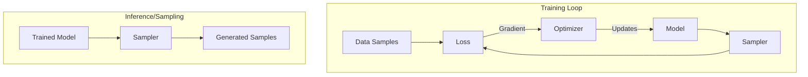

# TorchEBM Architecture

This document provides a comprehensive overview of TorchEBM's architecture, from high-level design principles to the details of its core components.

## Design Philosophy

TorchEBM is built on a foundation of modularity, performance, and ease of use. Our core philosophy is to provide a set of powerful, composable tools for energy-based modeling that are both highly efficient and intuitive for researchers and developers.

<div class="grid cards" markdown>

-   :material-puzzle:{ .lg .middle } __Modularity & Composability__

    ---

    Components are designed to be mixed and matched, allowing for flexible construction of complex models and algorithms.

-   :material-flash:{ .lg .middle } __Performance__

    ---

    The library is optimized for speed, leveraging PyTorch's vectorized operations and providing CUDA support for critical components.

-   :material-book-open-variant:{ .lg .middle } __Intuitiveness__

    ---

    APIs are designed to be clean, consistent, and well-documented, following standard PyTorch conventions.

</div>

## Project Structure

The repository is organized into the following key directories:

```
torchebm/
├── torchebm/              # Main package source code
│   ├── core/              # Core functionality and base classes
│   ├── samplers/          # Sampling algorithms
│   ├── losses/            # Loss functions for training
│   ├── models/            # Pre-built model architectures
│   └── utils/             # Utility functions
├── tests/                 # Unit and integration tests
├── docs/                  # Documentation source
├── examples/              # Example usage scripts
└── setup.py               # Package installation script
```

## Core Components

TorchEBM's functionality is centered around a few fundamental abstractions:

### 1. Models (`torchebm.core.BaseModel`)

A **Model** defines the energy function \( E(x) \), which assigns a scalar energy value to each input state \( x \). This is the central component of any EBM. In TorchEBM, models are PyTorch modules (`nn.Module`) that implement a `forward(x)` method to compute the energy.

### 2. Samplers (`torchebm.core.BaseSampler`)

A **Sampler** is an algorithm that generates samples from the probability distribution defined by an energy model, \( p(x) = \frac{e^{-E(x)}}{Z} \). Samplers in TorchEBM are designed to work with any `BaseModel` instance. Examples include `LangevinDynamics` and `HamiltonianMonteCarlo`.

### 3. Losses (`torchebm.core.BaseLoss`)

A **Loss** function is used to train the parameters of a model. These typically rely on a sampler to generate "negative" samples from the model's current distribution to contrast with "positive" samples from the data. `ContrastiveDivergence` is a key example.

### Component Interactions

The components interact in a clear, defined workflow, particularly during training:



1.  A **Loss** function takes the **Model** and a batch of real data.
2.  It uses a **Sampler** to generate samples from the model's current distribution.
3.  The loss is computed based on the energies of the real and generated samples.
4.  The gradient of the loss is used to update the **Model**'s parameters.

This modular design allows you to, for example, swap out different samplers to see their effect on the training of a given model, without changing the model or the loss function. 