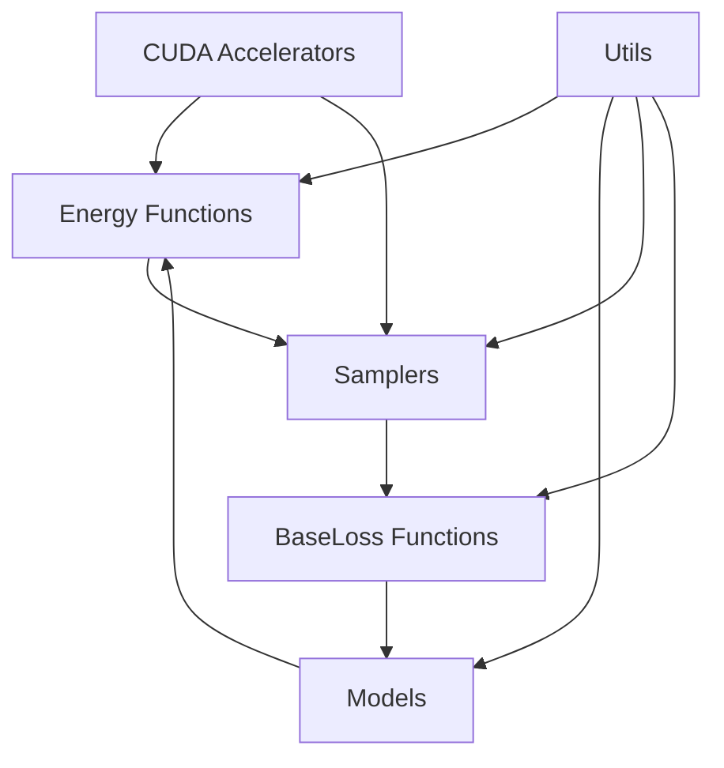

# Architecture

This document outlines the architecture and design principles of TorchEBM, providing insights into how the library is structured and how its components interact.

## Core Components

TorchEBM is designed around several key components that work together to provide a flexible and powerful framework for energy-based modeling:

<div class="grid" markdown>
<div markdown>

### Energy Functions

The `BaseEnergyFunction` base class defines the interface for all energy functions. It provides methods for:

- Computing energy values
- Computing gradients
- Handling batches of inputs
- CUDA acceleration

Implemented energy functions include Gaussian, Double Well, Rastrigin, Rosenbrock, and more.

</div>
<div markdown>

### Samplers

The `BaseSampler` class defines the interface for sampling algorithms. Key features include:

- Generating samples from energy functions
- Running sampling chains
- Collecting diagnostics
- Parallelized sampling

Implemented samplers include Langevin Dynamics and Hamiltonian Monte Carlo.

</div>
</div>

<div class="grid" markdown>
<div markdown>

### BaseLoss Functions

BaseLoss functions are used to train energy-based models. They include:

- Contrastive Divergence (CD)
- Persistent Contrastive Divergence (PCD)
- Parallel Tempering Contrastive Divergence
- Score Matching (planned)

</div>
<div markdown>

### Models

Neural network models that can be used as energy functions:

- Base model interfaces
- Integration with PyTorch modules
- Support for custom architectures
- GPU acceleration

</div>
</div>

## Architecture Diagram



## Design Principles

!!! abstract "Key Design Principles"

    TorchEBM follows these core design principles:

    1. **Modularity**: Components can be used independently and combined flexibly
    2. **Extensibility**: Easy to add new energy functions, samplers, and loss functions
    3. **Performance**: Optimized for both CPU and GPU execution
    4. **Compatibility**: Seamless integration with PyTorch ecosystem
    5. **Usability**: Clear, consistent API with comprehensive documentation

## Component Interactions

### Energy Function and Sampler Interaction

The energy function provides the landscape that the sampler traverses:

```python
# Energy function computes energy and gradients
energy = energy_fn(x)  # Forward pass
gradient = energy_fn.gradient(x)  # Gradient computation

# Sampler uses gradients for updates
x_new = x - step_size * gradient + noise
```

### Sampler and BaseLoss Function Interaction

Samplers are used by loss functions to generate negative samples during training:

```python
# BaseLoss function uses sampler to generate negative samples
negative_samples = sampler.sample_chain(x_init, n_steps=10)

# BaseLoss computation uses both data samples and negative samples
loss = loss_fn(data_samples, negative_samples)
```

## Module Organization

TorchEBM's codebase is organized into the following modules:

| Module | Description | Key Classes |
|--------|-------------|------------|
| `torchebm.core` | Core functionality and base classes | `BaseEnergyFunction`, `BaseSampler` |
| `torchebm.samplers` | Sampling algorithms | `LangevinDynamics`, `HamiltonianMonteCarlo` |
| `torchebm.losses` | BaseLoss functions | `ContrastiveDivergence`, `PersistentContrastiveDivergence` |
| `torchebm.models` | Neural network models | `BaseModel` |
| `torchebm.cuda` | CUDA-accelerated implementations | Various CUDA kernels |
| `torchebm.utils` | Utility functions and helpers | Visualization tools, diagnostics |

## Performance Considerations

TorchEBM is designed with performance in mind:

- **Vectorization**: Operations are vectorized for efficient batch processing
- **GPU Acceleration**: Most operations can run on CUDA devices
- **Memory Management**: Careful memory management to avoid unnecessary allocations
- **Parallel Sampling**: Samples can be generated in parallel for better utilization of hardware

## Extension Points

TorchEBM is designed to be extended in several ways:

1. **Custom Energy Functions**: Create your own energy functions by subclassing `BaseEnergyFunction`
2. **Custom Samplers**: Implement new sampling algorithms by subclassing `BaseSampler`
3. **Custom BaseLoss Functions**: Create new training objectives for energy-based models
4. **Neural Network Energy Functions**: Use neural networks as energy functions

For more details on implementing extensions, see our [API Design](api_design.md) documentation. 