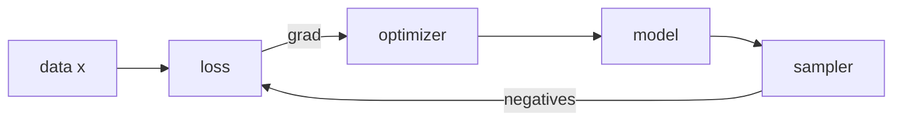

# Architecture

TorchEBM is organised around a small set of base classes (`BaseModel`,
`BaseSampler`, `BaseLoss`, `BaseIntegrator`, `BaseInterpolant`,
`BaseCoupling`). Everything else is composition: a loss uses a sampler or a
coupling, a sampler uses an integrator, an integrator steps a field derived
from a model. The user-facing statement of this design is
[Design and Scope](../concepts/design.md); this page is the contributor view.

## Package layout

The tree below is generated from the installed package at build time (comments
come from `docs/hooks/gen_diagrams.py`; new subpackages appear automatically):

<!-- torchebm:tree packages -->

Mirror this layout under `tests/` when adding tests.

## Core abstractions

One contract per axis. The table is generated at build time from the root base
classes exported by `torchebm.core` and the first line of their docstrings, so
it tracks the code by construction:

<!-- torchebm:table contracts -->

The current composition map and export counts, generated from the installed
package at build time (see `docs/hooks/gen_diagrams.py`; per-family class
trees render the same way on the Concepts pages):

<!-- torchebm:diagram components -->

String registries (`get_integrator`, `get_coupling`, `get_interpolant`) make
each axis addressable by name; `resolve_*` helpers validate instances against
the family a consumer requires. Every component exported through
`torchebm.*.__init__` is auto-discovered by the benchmark suite (see
[Performance and Benchmarking](performance.md)).

## How the pieces compose

Training wiring depends on the loss family; two patterns cover the library.

### Sampler-free (score, flow, EqM, EM warm-up)

The loss computes its target from data plus a coupling and an interpolation
step; no sampler runs during training. Each step is: couple the batch, draw
\(t\), interpolate, regress. Samplers only appear at generation time.

### Sampler-based (CD family, EM joint phase)

Contrastive divergence draws negatives from the current model via a sampler
every step:

```mermaid
graph LR
    data[data x] --> loss
    model --> sampler
    sampler -- negatives --> loss
    loss -- grad --> opt[optimizer]
    opt --> model
```

### Generation (all objectives)

A sampler drives a field derived from the trained model through an integrator:
MCMC samplers step the energy's force, `FlowSampler` integrates the velocity
(or converted score/noise prediction) as an ODE or SDE. Swapping any one piece
(e.g. `integrator="heun"` for `"rk4"`) never requires touching the others.

## Time conditioning

Not all objectives condition the model on \( t \):

- **EquilibriumMatching**: time-invariant; the model receives no time input,
  and `FlowSampler(negate_velocity=True)` integrates it.
- **FlowSampler with velocity/score models**: time-conditional; the field is
  \( v(x, t) \) and the sampler feeds \( t \) every step.
- **EnergyMatching**: the potential \(V(x)\) is time-independent; time lives
  in the temperature schedule of the generation sweep.

See `torchebm/losses/equilibrium_matching.py` and
`torchebm/samplers/flow.py` for the reference patterns.
