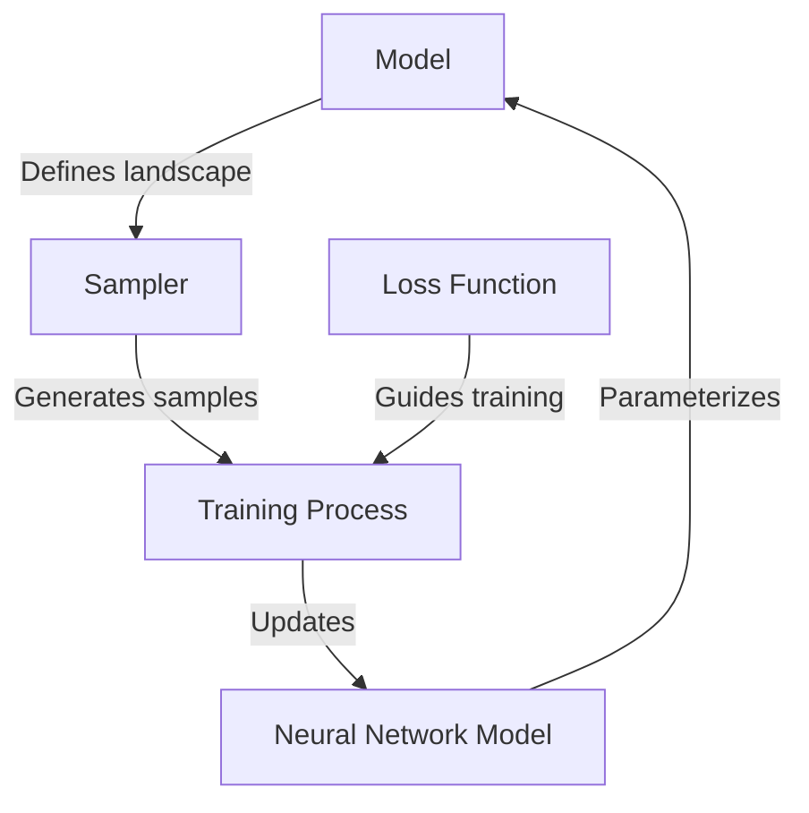

# Core Components

!!! abstract "Building Blocks"
    TorchEBM is built around several core components that form the foundation of the library. This guide provides in-depth information about these components and how they interact.

## Component Overview

<div class="grid cards" markdown>

-   :material-function-variant:{ .lg .middle } __Models__

    ---

    Define the energy landscape for probability distributions.

    ```python
    energy = model(x)  # Evaluate energy at point x
    ```

-   :material-chart-scatter-plot:{ .lg .middle } __Samplers__

    ---

    Generate samples from energy-based distributions.

    ```python
    samples = sampler.sample(n_samples=1000)  # Generate 1000 samples
    ```

-   :material-abacus:{ .lg .middle } __Loss Functions__

    ---

    Train energy-based models from data.

    ```python
    loss = loss_fn(model, data_samples)  # Compute training loss
    ```

-   :material-graph:{ .lg .middle } __Neural Network Models__

    ---

    Parameterize models with neural networks.

    ```python
    model = BaseModel(network=nn.Sequential(...))
    ```

</div>

## Models

Models are the core building block of TorchEBM. They define a scalar energy value for each point in the sample space.

### Base Model

The `BaseModel` class is the foundation for all models:

```python
class BaseModel(nn.Module):
    """Base class for all models.
    
    A model maps points in the sample space to scalar energy values.
    Lower energy corresponds to higher probability density.
    """
    
    def forward(self, x: torch.Tensor) -> torch.Tensor:
        """Compute energy for input points.
        
        Args:
            x: Input tensor of batch_shape (batch_size, dim)
            
        Returns:
            Tensor of batch_shape (batch_size,) containing energy values
        """
        raise NotImplementedError
        
    def score(self, x: torch.Tensor) -> torch.Tensor:
        """Compute score function (gradient of energy) for input points.
        
        Args:
            x: Input tensor of batch_shape (batch_size, dim)
            
        Returns:
            Tensor of batch_shape (batch_size, dim) containing score values
        """
        x = x.requires_grad_(True)
        energy = self.forward(x)
        return torch.autograd.grad(energy.sum(), x, create_graph=True)[0]
```

### Analytical Models

TorchEBM provides several analytical models for testing and benchmarking:

=== "Gaussian Model"

    ```python
    class GaussianModel(BaseModel):
        """Gaussian model.
        
        Model defined by a multivariate Gaussian distribution:
        E(x) = 0.5 * (x - mean)^T * precision * (x - mean)
        """
        
        def __init__(self, mean: torch.Tensor, cov: torch.Tensor):
            """Initialize Gaussian model.
            
            Args:
                mean: Mean vector of shape (dim,)
                cov: Covariance matrix of shape (dim, dim)
            """
            super().__init__()
            self.register_buffer("mean", mean)
            self.register_buffer("cov", cov)
            self.register_buffer("precision", torch.inverse(cov))
            self._dim = mean.size(0)
            
        def forward(self, x: torch.Tensor) -> torch.Tensor:
            """Compute Gaussian energy.
            
            Args:
                x: Input tensor of shape (batch_size, dim)
                
            Returns:
                Tensor of shape (batch_size,) containing energy values
            """
            centered = x - self.mean
            return 0.5 * torch.sum(
                centered * (self.precision @ centered.T).T,
                dim=1
            )
    ```

=== "Double Well Model"

    ```python
    class DoubleWellModel(BaseModel):
        """Double well model.
        
        Model with two local minima:
        E(x) = a * (x^2 - b)^2
        """
        
        def __init__(self, a: float = 1.0, b: float = 2.0):
            """Initialize double well model.
            
            Args:
                a: Scale parameter
                b: Parameter controlling the distance between wells
            """
            super().__init__()
            self.a = a
            self.b = b
            
        def forward(self, x: torch.Tensor) -> torch.Tensor:
            """Compute double well energy.
            
            Args:
                x: Input tensor of shape (batch_size, dim)
                
            Returns:
                Tensor of shape (batch_size,) containing energy values
            """
            return self.a * torch.sum((x**2 - self.b)**2, dim=1)
    ```

### Composite Models

Models can be composed to create more complex landscapes:

```python
class CompositeModel(BaseModel):
    """Composite model.
    
    Combines multiple models through addition.
    """
    
    def __init__(self, models: List[BaseModel], weights: Optional[List[float]] = None):
        """Initialize composite model.
        
        Args:
            models: List of models to combine
            weights: Optional weights for each model
        """
        super().__init__()
        self.models = nn.ModuleList(models)
        if weights is None:
            weights = [1.0] * len(models)
        self.weights = weights
        
    def forward(self, x: torch.Tensor) -> torch.Tensor:
        """Compute composite energy.
        
        Args:
            x: Input tensor of batch_shape (batch_size, dim)
            
        Returns:
            Tensor of batch_shape (batch_size,) containing energy values
        """
        return sum(w * f(x) for w, f in zip(self.weights, self.models))
```

## Samplers

Samplers generate samples from energy-based distributions. They provide methods to initialize and update samples based on the energy landscape.

### Base Sampler

The `Sampler` class is the foundation for all sampling algorithms:

```python
class Sampler(ABC):
    """Base class for all samplers.
    
    A sampler generates samples from an energy-based distribution.
    """
    
    def __init__(self, model: BaseModel):
        """Initialize sampler.
        
        Args:
            model: Model to sample from
        """
        self.model = model
        
    @abstractmethod
    def sample(self, n_samples: int, **kwargs) -> torch.Tensor:
        """Generate samples from the energy-based distribution.
        
        Args:
            n_samples: Number of samples to generate
            **kwargs: Additional sampler-specific parameters
            
        Returns:
            Tensor of batch_shape (n_samples, dim) containing samples
        """
        pass
        
    @abstractmethod
    def sample_chain(self, dim: int, n_steps: int, n_samples: int = 1, **kwargs) -> torch.Tensor:
        """Generate samples using a Markov chain.
        
        Args:
            dim: Dimensionality of samples
            n_steps: Number of steps in the chain
            n_samples: Number of parallel chains to run
            **kwargs: Additional sampler-specific parameters
            
        Returns:
            Tensor of batch_shape (n_samples, dim) containing final samples
        """
        pass
```

### Langevin Dynamics

The `LangevinDynamics` sampler implements Langevin Monte Carlo:

```python
class LangevinDynamics(Sampler):
    """Langevin dynamics sampler.
    
    Uses Langevin dynamics to sample from an energy-based distribution.
    """
    
    def __init__(
        self,
        model: BaseModel,
        step_size: float = 0.01,
        noise_scale: float = 1.0
    ):
        """Initialize Langevin dynamics sampler.
        
        Args:
            model: Model to sample from
            step_size: Step size for updates
            noise_scale: Scale of noise added at each step
        """
        super().__init__(model)
        self.step_size = step_size
        self.noise_scale = noise_scale
        
    def sample_step(self, x: torch.Tensor) -> torch.Tensor:
        """Perform one step of Langevin dynamics.
        
        Args:
            x: Current samples of batch_shape (n_samples, dim)
            
        Returns:
            Updated samples of batch_shape (n_samples, dim)
        """
        # Compute score (gradient of energy)
        score = self.model.score(x)
        
        # Update samples
        noise = torch.randn_like(x) * np.sqrt(2 * self.step_size * self.noise_scale)
        x_new = x - self.step_size * score + noise
        
        return x_new
        
    def sample_chain(
        self,
        dim: int,
        n_steps: int,
        n_samples: int = 1,
        initial_samples: Optional[torch.Tensor] = None,
        return_trajectory: bool = False
    ) -> Union[torch.Tensor, Tuple[torch.Tensor, torch.Tensor]]:
        """Generate samples using a Langevin dynamics chain.
        
        Args:
            dim: Dimensionality of samples
            n_steps: Number of steps in the chain
            n_samples: Number of parallel chains to run
            initial_samples: Optional initial samples
            return_trajectory: Whether to return the full trajectory
            
        Returns:
            Tensor of batch_shape (n_samples, dim) containing final samples,
            or a tuple of (samples, trajectory) if return_trajectory is True
        """
        # Initialize samples
        if initial_samples is None:
            x = torch.randn(n_samples, dim)
        else:
            x = initial_samples.clone()
            
        # Initialize trajectory if needed
        if return_trajectory:
            trajectory = torch.zeros(n_steps + 1, n_samples, dim)
            trajectory[0] = x
            
        # Run chain
        for i in range(n_steps):
            x = self.sample_step(x)
            if return_trajectory:
                trajectory[i + 1] = x
                
        if return_trajectory:
            return x, trajectory
        else:
            return x
            
    def sample(self, n_samples: int, dim: int, n_steps: int = 100, **kwargs) -> torch.Tensor:
        """Generate samples from the energy-based distribution.
        
        Args:
            n_samples: Number of samples to generate
            dim: Dimensionality of samples
            n_steps: Number of steps in the chain
            **kwargs: Additional parameters passed to sample_chain
            
        Returns:
            Tensor of batch_shape (n_samples, dim) containing samples
        """
        return self.sample_chain(dim=dim, n_steps=n_steps, n_samples=n_samples, **kwargs)
```

## Loss Functions

Loss functions are used to train energy-based models from data. They provide methods to compute gradients for model updates.

### Base Loss Function

The `BaseLoss` class is the foundation for all loss functions:

```python
class BaseLoss(ABC):
    """Base class for all loss functions.
    
    A loss function computes a loss value for an energy-based model.
    """
    
    @abstractmethod
    def __call__(
        self,
        model: nn.Module,
        data_samples: torch.Tensor,
        **kwargs
    ) -> torch.Tensor:
        """Compute loss for the model.
        
        Args:
            model: Energy-based model
            data_samples: Samples from the target distribution
            **kwargs: Additional loss-specific parameters
            
        Returns:
            Scalar loss value
        """
        pass
```

### Contrastive Divergence

The `ContrastiveDivergence` loss implements the contrastive divergence algorithm:

```python
class ContrastiveDivergence(BaseLoss):
    """Contrastive divergence loss.
    
    Uses contrastive divergence to train energy-based models.
    """

    def __init__(
            self,
            sampler: Sampler,
            k: int = 1,
            batch_size: Optional[int] = None
    ):
        """Initialize contrastive divergence loss.
        
        Args:
            sampler: Sampler to generate model samples
            k: Number of sampling steps (CD-k_steps)
            batch_size: Optional batch size for sampling
        """
        super().__init__()
        self.sampler = sampler
        self.k = k
        self.batch_size = batch_size

    def __call__(
            self,
            model: nn.Module,
            data_samples: torch.Tensor,
            **kwargs
    ) -> torch.Tensor:
        """Compute contrastive divergence loss.
        
        Args:
            model: Energy-based model
            data_samples: Samples from the target distribution
            **kwargs: Additional parameters passed to the sampler
            
        Returns:
            Scalar loss value
        """
        # Get data statistics
        batch_size = self.batch_size or data_samples.size(0)
        dim = data_samples.size(1)

        # Set the model as the sampler's model
        self.sampler.model = model

        # Generate model samples
        model_samples = self.sampler.sample(
            dim=dim,
            n_steps=self.k,
            n_samples=batch_size,
            **kwargs
        )

        # Compute energies
        data_energy = model(data_samples).mean()
        model_energy = model(model_samples).mean()

        # Compute loss
        loss = data_energy - model_energy

        return loss
```

## Neural Network Models

Models can be parameterized using neural networks.

### Neural Network Model

A class can be used to wrap a neural network as a model:

```python
class NeuralNetworkModel(BaseModel):
    """Neural network-based model.
    
    Uses a neural network to parameterize a model.
    """
    
    def __init__(self, network: nn.Module):
        """Initialize model.
        
        Args:
            network: Neural network that outputs scalar energy values
        """
        super().__init__()
        self.network = network
        
    def forward(self, x: torch.Tensor) -> torch.Tensor:
        """Compute energy using the neural network.
        
        Args:
            x: Input tensor of batch_shape (batch_size, dim)
            
        Returns:
            Tensor of batch_shape (batch_size,) containing energy values
        """
        return self.network(x).squeeze(-1)
```

## Component Interactions

The following diagram illustrates how the core components interact:



### Typical Usage Flow

1. **Define a model** - Either analytical or neural network-based
2. **Create a sampler** - Using the model
3. **Generate samples** - Using the sampler
4. **Train a model** - Using the loss function and sampler
5. **Use the trained model** - For tasks like generation or density estimation

```python
# Define model
model = GaussianModel(mean=torch.zeros(2), cov=torch.eye(2))

# Create sampler
sampler = LangevinDynamics(model=model, step_size=0.01)

# Generate samples
samples = sampler.sample(dim=2, n_steps=1000, n_samples=100)

# Create and train a model
nn_model = NeuralNetworkModel(network=MLP(input_dim=2, hidden_dims=[32, 32], output_dim=1))
loss_fn = ContrastiveDivergence(sampler=sampler, k=10)

# Training loop
optimizer = torch.optim.Adam(nn_model.parameters(), lr=0.001)
for epoch in range(100):
    optimizer.zero_grad()
    loss = loss_fn(nn_model, data_samples)
    loss.backward()
    optimizer.step()
```

## Extension Points

TorchEBM is designed to be extensible at several points:

* **New Models** - Create by subclassing `BaseModel`
* **New Samplers** - Create by subclassing `Sampler`
* **New Loss Functions** - Create by subclassing `BaseLoss`
* **New Neural Network Models** - Create by subclassing `BaseModel` or using custom networks

## Component Lifecycle

Each component in TorchEBM has a typical lifecycle:

1. **Initialization** - Configure the component with parameters
2. **Usage** - Use the component to perform its intended function
3. **Composition** - Combine with other components
4. **Extension** - Extend with new functionality

Understanding this lifecycle helps when implementing new components or extending existing ones.

## Best Practices

When working with TorchEBM components, follow these best practices:

* **Models**: Ensure they're properly normalized for stable training
* **Samplers**: Check mixing time and adjust parameters accordingly
* **Loss Functions**: Monitor training stability and adjust hyperparameters
* **Neural Network Models**: Use appropriate architecture for the problem domain

!!! tip "Performance Optimization"
    For large-scale applications, consider using CUDA-optimized implementations and batch processing for better performance.

<div class="grid cards" markdown>

-   :material-code-json:{ .lg .middle } __Models__

    ---

    Learn about model implementation details.

    [:octicons-arrow-right-24: Models](implementation_energy.md)

-   :material-access-point:{ .lg .middle } __Samplers__

    ---

    Explore sampler implementation details.

    [:octicons-arrow-right-24: Samplers](implementation_samplers.md)

-   :material-function-variant:{ .lg .middle } __Loss Functions__

    ---

    Understand loss function implementation details.

    [:octicons-arrow-right-24: Loss Functions](implementation_losses.md)

</div> 