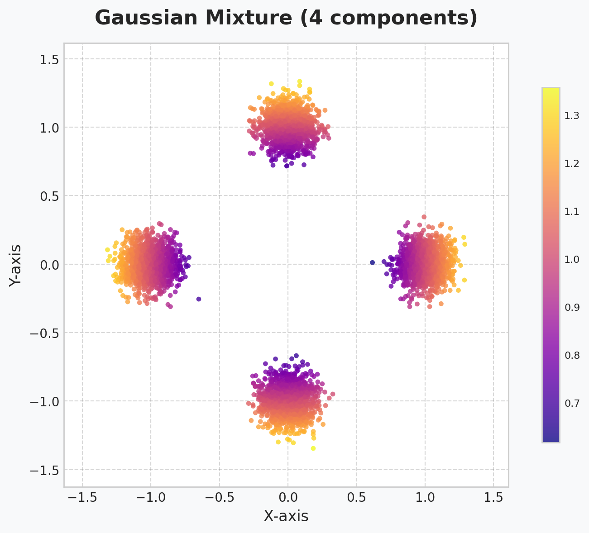
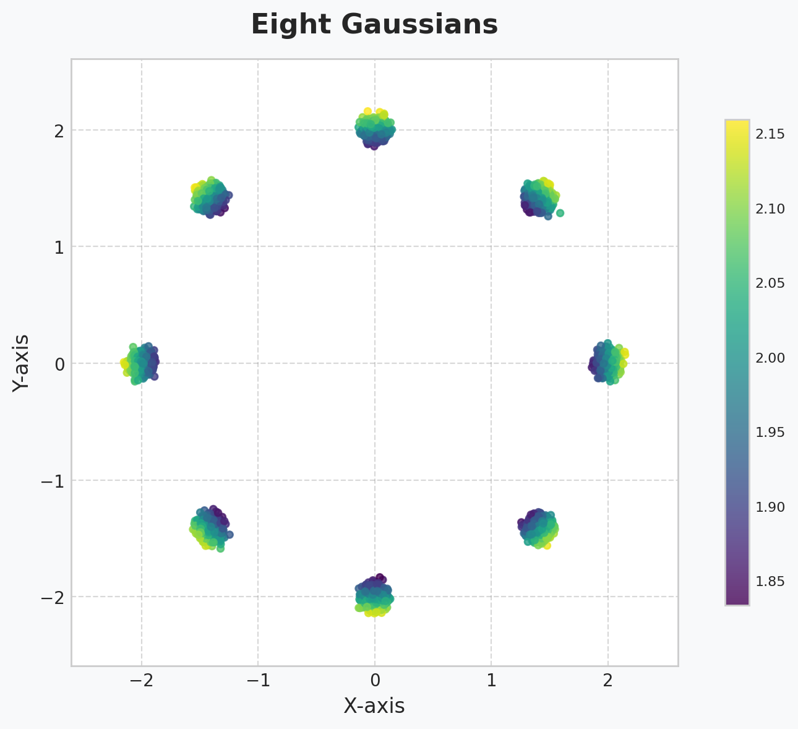
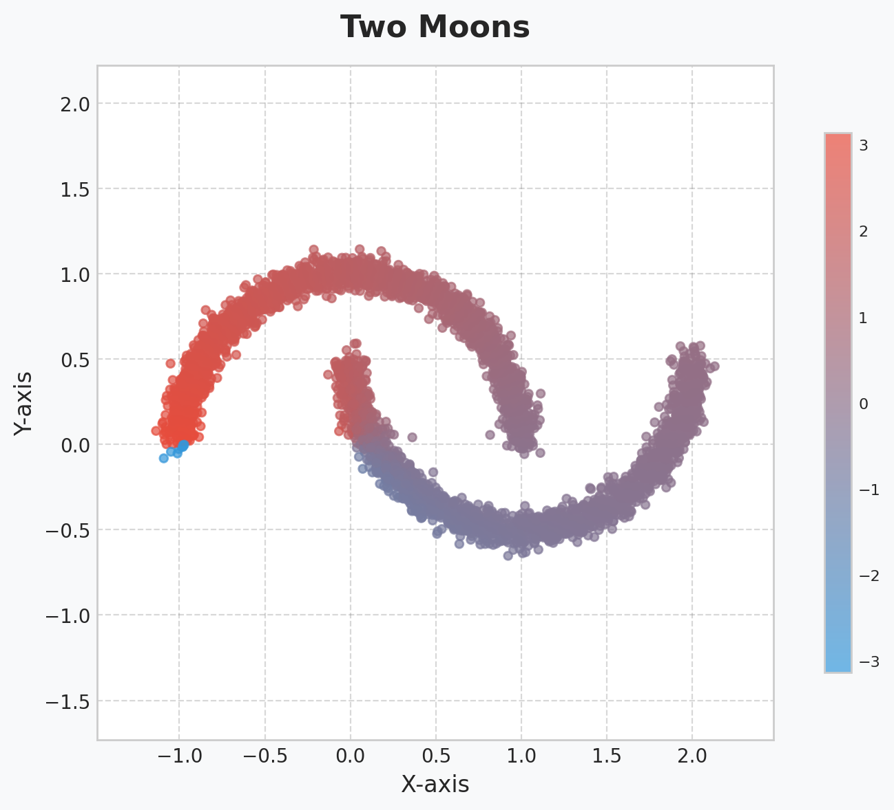
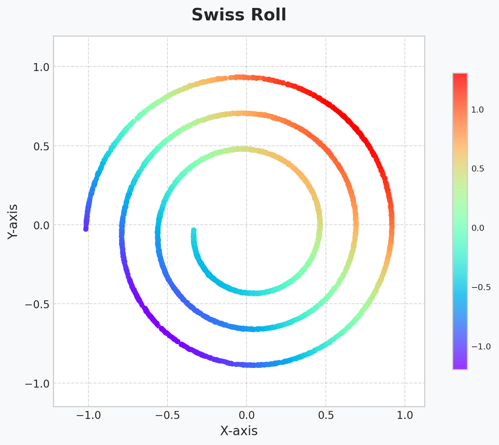
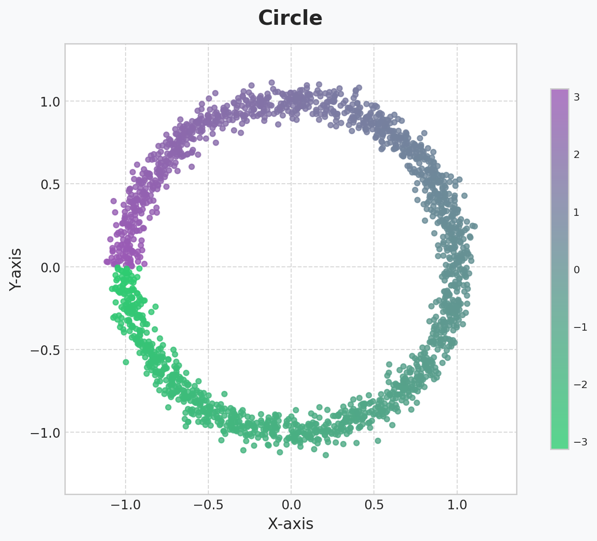
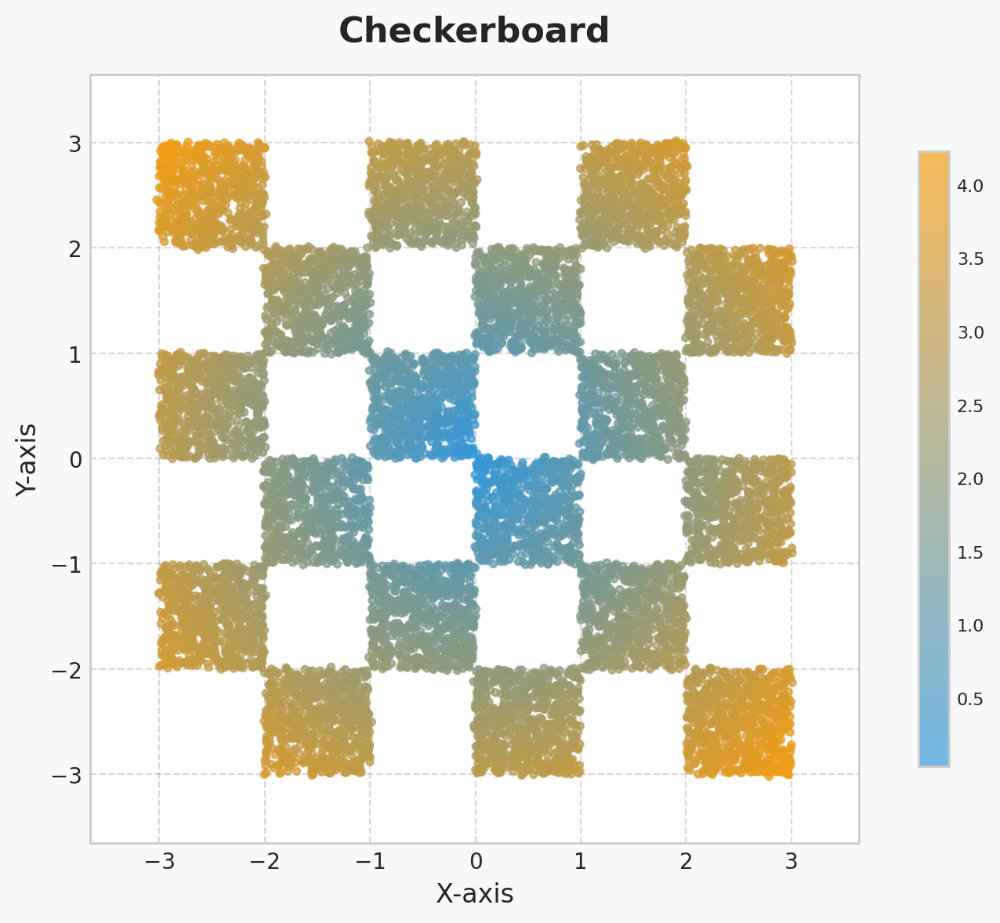
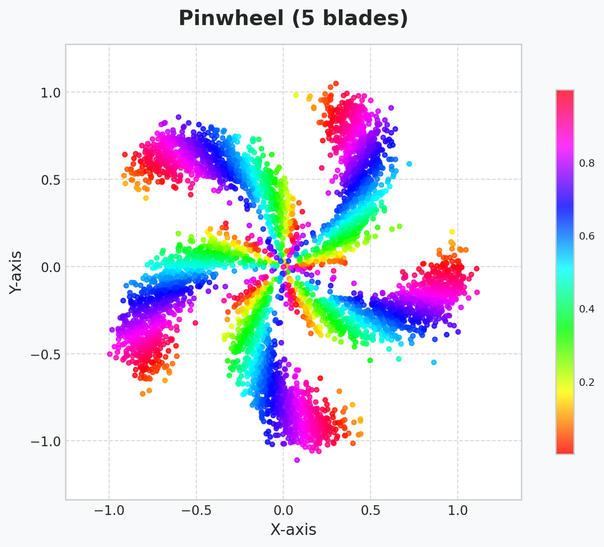
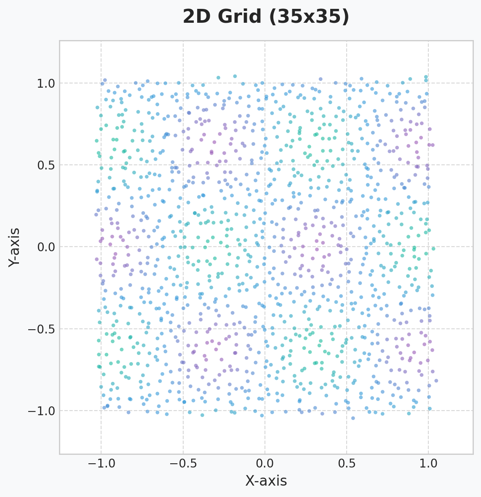

# Working with Datasets

TorchEBM includes a suite of synthetic datasets primarily for 2D distributions, which are invaluable for testing models and algorithms. These are available in the `torchebm.datasets` module and are implemented as standard PyTorch `Dataset` classes, making them fully compatible with `DataLoader`.

## Synthetic 2D Datasets

These datasets are useful for visualizing how an EBM learns complex, multimodal distributions.

```python
import torch
import numpy as np
import matplotlib.pyplot as plt
from torch.utils.data import DataLoader
from torchebm.datasets import (
    GaussianMixtureDataset, EightGaussiansDataset, TwoMoonsDataset,
    SwissRollDataset, CircleDataset, CheckerboardDataset,
    PinwheelDataset, GridDataset
)

def plot_datasets(datasets, titles):
    fig, axes = plt.subplots(2, 4, figsize=(20, 10))
    axes = axes.flatten()
    for i, (data, title) in enumerate(zip(datasets, titles)):
        ax = axes[i]
        ax.scatter(data[:, 0], data[:, 1], s=5, alpha=0.7)
        ax.set_title(title)
        ax.grid(True, alpha=0.3)
        ax.axis('equal')
    plt.tight_layout()
    plt.show()

n_samples = 1000
seed = 42

datasets_to_plot = [
    GaussianMixtureDataset(n_samples=n_samples, n_components=8, std=0.07, radius=1.5, seed=seed).get_data(),
    EightGaussiansDataset(n_samples=n_samples, std=0.05, scale=2.0, seed=seed).get_data(),
    TwoMoonsDataset(n_samples=n_samples, noise=0.1, seed=seed).get_data(),
    SwissRollDataset(n_samples=n_samples, noise=0.1, arclength=3.0, seed=seed).get_data(),
    CircleDataset(n_samples=n_samples, noise=0.05, radius=1.0, seed=seed).get_data(),
    CheckerboardDataset(n_samples=n_samples, range_limit=4.0, noise=0.05, seed=seed).get_data(),
    PinwheelDataset(n_samples=n_samples, n_classes=5, noise=0.05, seed=seed).get_data(),
    GridDataset(n_samples_per_dim=30, range_limit=2.0, noise=0.02, seed=seed).get_data()
]
dataset_titles = [
    "Gaussian Mixture", "Eight Gaussians", "Two Moons", "Swiss Roll",
    "Circle", "Checkerboard", "Pinwheel", "2D Grid"
]

plot_datasets(datasets_to_plot, dataset_titles)
```

<div class="grid cards" markdown>

-   :material-image-frame:{ .lg .middle } __Gaussian Mixture__

    ---

    

    *A mixture of eight distinct Gaussian distributions arranged in a circle.*

-   :material-image-frame:{ .lg .middle } __Eight Gaussians__

    ---

    

    *A classic synthetic dataset with eight Gaussian modes in a circular pattern.*

-   :material-image-frame:{ .lg .middle } __Two Moons__

    ---

    

    *Two interleaving half-circles, a common benchmark for nonlinear distributions.*

-   :material-image-frame:{ .lg .middle } __Swiss Roll__

    ---

    

    *A spiral-shaped manifold, useful for testing manifold learning algorithms.*

-   :material-image-frame:{ .lg .middle } __Circle__

    ---

    

    *Data points distributed on the circumference of a circle.*

-   :material-image-frame:{ .lg .middle } __Checkerboard__

    ---

    

    *A grid-like pattern of clusters, challenging for models to capture.*

-   :material-image-frame:{ .lg .middle } __Pinwheel__

    ---

    

    *A dataset with swirling arms, testing a model's ability to learn rotational structures.*

-   :material-image-frame:{ .lg .middle } __2D Grid__

    ---

    

    *A uniform grid of points, useful for evaluating coverage and mode detection.*

</div>

## Using with DataLoader

Since these are `torch.utils.data.Dataset` subclasses, they integrate seamlessly with `DataLoader` for batching during training.

```python
dataset = TwoMoonsDataset(n_samples=2048, noise=0.05)
dataloader = DataLoader(
    dataset,
    batch_size=256,
    shuffle=True,
    drop_last=True
)

for batch in dataloader:
    # Each batch is a tensor of shape [256, 2]
    print(f"Batch shape: {batch.shape}")
    break
```

## Training Example

Here’s a brief example of how to use a dataset to train an EBM. This is a condensed version of the full training process covered in the next chapter.

```python
import torch.nn as nn
import torch.optim as optim
from torchebm.core import BaseModel
from torchebm.samplers import LangevinDynamics
from torchebm.losses import ContrastiveDivergence

class MLPModel(BaseModel):
    def __init__(self, input_dim=2, hidden_dim=128):
        super().__init__()
        self.network = nn.Sequential(
            nn.Linear(input_dim, hidden_dim),
            nn.ReLU(),
            nn.Linear(hidden_dim, 1)
        )
    def forward(self, x):
        return self.network(x).squeeze(-1)

device = torch.device('cuda' if torch.cuda.is_available() else 'cpu')
model = MLPModel().to(device)

dataset = TwoMoonsDataset(n_samples=2048, noise=0.05, device=device)
dataloader = DataLoader(dataset, batch_size=256, shuffle=True)

sampler = LangevinDynamics(model=model, step_size=0.1, noise_scale=0.1)
loss_fn = ContrastiveDivergence(model=model, sampler=sampler, n_steps=10)
optimizer = optim.Adam(model.parameters(), lr=1e-3)

for epoch in range(5):
    for data_batch in dataloader:
        optimizer.zero_grad()
        loss, _ = loss_fn(data_batch)
        loss.backward()
        optimizer.step()
    print(f"Epoch {epoch+1}, Loss: {loss.item():.4f}")
```
This example demonstrates the core workflow: creating a dataset, feeding it to a `DataLoader`, and using the batches to train a model with a sampler and a loss function like `ContrastiveDivergence`. 