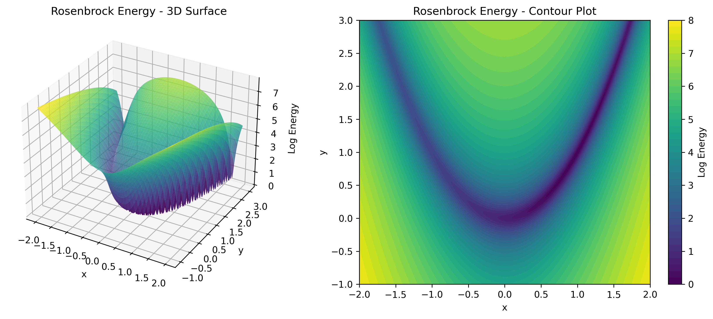

# Energy Landscape Visualization

This example demonstrates how to visualize various energy function landscapes in TorchEBM.

!!! tip "Key Concepts Covered"
    - Visualizing energy functions in 2D
    - Comparing different energy landscapes
    - Using matplotlib for 3D visualization

## Overview

Energy-based models rely on energy functions that define landscapes over the sample space. Visualizing these landscapes helps us understand the behavior of different energy functions and the challenges in sampling from them.

This example shows how to plot various built-in energy functions from TorchEBM:
- Rosenbrock
- Ackley
- Rastrigin
- Double Well
- Gaussian
- Harmonic

## Code Example

```python
import numpy as np
import torch
from matplotlib import pyplot as plt

from torchebm.core.base_energy_function import (
    RosenbrockEnergy, AckleyEnergy, RastriginEnergy,
    DoubleWellEnergy, GaussianEnergy, HarmonicEnergy
)


def plot_energy_function(energy_fn, x_range, y_range, title):
    x = np.linspace(x_range[0], x_range[1], 100)
    y = np.linspace(y_range[0], y_range[1], 100)
    X, Y = np.meshgrid(x, y)
    Z = np.zeros_like(X)

    for i in range(X.shape[0]):
        for j in range(X.shape[1]):
            point = torch.tensor([X[i, j], Y[i, j]], dtype=torch.float32).unsqueeze(0)
            Z[i, j] = energy_fn(point).item()

    fig = plt.figure()
    ax = fig.add_subplot(111, projection='3d')
    ax.plot_surface(X, Y, Z, cmap='viridis')
    ax.set_title(title)
    ax.set_xlabel('x')
    ax.set_ylabel('y')
    ax.set_zlabel('Energy')
    plt.show()


energy_functions = [
    (RosenbrockEnergy(), [-2, 2], [-1, 3], 'Rosenbrock Energy Function'),
    (AckleyEnergy(), [-5, 5], [-5, 5], 'Ackley Energy Function'),
    (RastriginEnergy(), [-5, 5], [-5, 5], 'Rastrigin Energy Function'),
    (DoubleWellEnergy(), [-2, 2], [-2, 2], 'Double Well Energy Function'),
    (GaussianEnergy(torch.tensor([0.0, 0.0]),
                    torch.tensor([[1.0, 0.0], [0.0, 1.0]])),
     [-3, 3], [-3, 3], 'Gaussian Energy Function'),
    (HarmonicEnergy(), [-3, 3], [-3, 3], 'Harmonic Energy Function')
]

# Plot each energy function
for energy_fn, x_range, y_range, title in energy_functions:
    plot_energy_function(energy_fn, x_range, y_range, title)
```

## Energy Function Characteristics

<div class="grid" markdown>
<div markdown>

### Rosenbrock Energy

The Rosenbrock function creates a long, narrow, banana-shaped valley. The global minimum is inside the valley at (1,1), but finding it is challenging because the valley is very flat and the gradient provides little guidance.

**Mathematical Definition**:
$E(x) = \sum_{i=1}^{n-1} \left[ a(x_{i+1} - x_i^2)^2 + (x_i - 1)^2 \right]$

</div>
<div markdown>

### Ackley Energy

The Ackley function is characterized by a nearly flat outer region and a large hole at the center. It has many local minima but only one global minimum at (0,0).

**Mathematical Definition**:
$E(x) = -a \exp\left(-b\sqrt{\frac{1}{d}\sum_{i=1}^{d}x_i^2}\right)$ 
$- \exp\left(\frac{1}{d}\sum_{i=1}^{d}\cos(c x_i)\right) + a + \exp(1)$

</div>
</div>

<div class="grid" markdown>
<div markdown>

### Rastrigin Energy

The Rastrigin function has many regularly distributed local minima, making it highly multimodal. Its surface looks like an "egg carton." The global minimum is at (0,0).

**Mathematical Definition**:
$E(x) = An + \sum_{i=1}^n \left[ x_i^2 - A\cos(2\pi x_i) \right]$

</div>
<div markdown>

### Double Well Energy

The Double Well function features two distinct minima (wells) separated by an energy barrier. It's a classic example of a bimodal distribution and is often used to test sampling algorithms' ability to traverse energy barriers.

**Mathematical Definition**:
$E(x) = a(x^2 - b)^2$

</div>
</div>

<div class="grid" markdown>
<div markdown>

### Gaussian and Harmonic Energy

The Gaussian energy function represents a simple quadratic energy landscape with a single minimum. It corresponds to a multivariate Gaussian distribution in the probability space.

**Mathematical Definition**:

$E(x) = \frac{1}{2}(x-\mu)^T\Sigma^{-1}(x-\mu)$

</div>
<div markdown>

### Harmonic Energy

The Harmonic energy function represents a simple quadratic potential (like a spring). It has a single global minimum at the origin and is convex everywhere. 

**Mathematical Definition**:

$E(x) = \frac{1}{2}\sum_{i=1}^{d}x_i^2$

</div>
</div>

## Visualization Results

Below are the visualizations of the energy functions described above. Each visualization shows both a 3D surface plot and a 2D contour plot to help understand the landscape structure.

### Rosenbrock Energy


*The Rosenbrock function creates a long, narrow, banana-shaped valley. Finding the global minimum at (1,1) is challenging because the valley is very flat and provides little gradient information.*

### Ackley Energy


*The Ackley function has a nearly flat outer region and a large hole at the center. It contains many local minima but only one global minimum at (0,0).*

### Rastrigin Energy


*The Rastrigin function's "egg carton" surface has many regularly distributed local minima, making it highly multimodal. The global minimum is at (0,0).*

### Double Well Energy


*The Double Well energy features two distinct minima (wells) separated by an energy barrier, making it ideal for testing sampling algorithms' ability to traverse energy barriers.*

### Gaussian Energy


*The Gaussian energy function has a simple quadratic landscape with a single minimum, corresponding to a multivariate Gaussian distribution.*

[//]: # (### Harmonic Energy)

[//]: # ()
[//]: # (![Harmonic Energy Function]&#40;../assets/images/e_functions/harmonic.png&#41;)

[//]: # ()
[//]: # (*The Harmonic energy function represents a simple quadratic potential with a single global minimum at the origin.*)

!!! note
    Visualizing these energy functions helps understand why some distributions are more challenging to sample from than others. For instance, the narrow valleys in the Rosenbrock function or the many local minima in the Rastrigin function make it difficult for sampling algorithms to efficiently explore the full distribution.

## Extensions

You can extend this example to:

1. Create custom energy functions by implementing the `BaseEnergyFunction` interface
2. Visualize energy functions in higher dimensions using projection techniques
3. Animate sampling trajectories on top of these energy landscapes

For more advanced energy landscape visualizations, including contour plots and comparing sampling algorithms, see the [Langevin Sampler Trajectory](langevin_trajectory.md) example. 