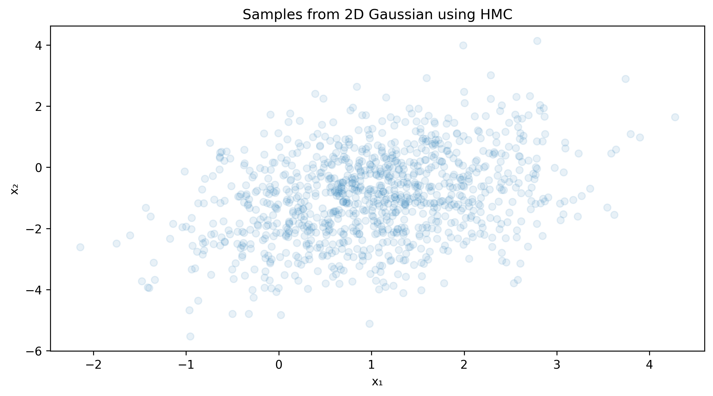

# Hamiltonian Monte Carlo Sampling

This example demonstrates how to use the Hamiltonian Monte Carlo (HMC) sampler in TorchEBM to efficiently sample from energy landscapes.

!!! tip "Key Concepts Covered"
    - Basic usage of Hamiltonian Monte Carlo
    - High-dimensional sampling
    - Working with diagnostics
    - GPU acceleration

## Overview

Hamiltonian Monte Carlo (HMC) is an advanced Markov Chain Monte Carlo (MCMC) method that uses the geometry of the energy landscape to make more efficient sampling proposals. By incorporating gradient information and simulating Hamiltonian dynamics, HMC can explore distributions more efficiently than random-walk methods, particularly in high dimensions.

## Basic Example

The following example shows how to sample from a 2D Gaussian distribution using HMC:

```python
import torch
import matplotlib.pyplot as plt
import numpy as np
from torchebm.core import GaussianEnergy
from torchebm.samplers.mcmc import HamiltonianMonteCarlo

# Create energy function for a 2D Gaussian
device = torch.device("cuda" if torch.cuda.is_available() else "cpu")
dim = 2  # dimension of the state space
n_steps = 100  # steps between samples
n_samples = 1000  # num of samples
mean = torch.tensor([1.0, -1.0], device=device)
cov = torch.tensor([[1.0, 0.5], [0.5, 2.0]], device=device)
energy_fn = GaussianEnergy(mean, cov)

# Initialize HMC sampler
hmc_sampler = HamiltonianMonteCarlo(
    energy_function=energy_fn,
    step_size=0.1,
    n_leapfrog_steps=5,
    device=device
)

# Generate samples
initial_state = torch.zeros(n_samples, dim, device=device)
samples = hmc_sampler.sample_chain(
    x=initial_state,
    n_steps=n_steps
)

# Plot results
samples = samples.cpu().numpy()
plt.figure(figsize=(10, 5))
plt.scatter(samples[:, 0], samples[:, 1], alpha=0.1)
plt.title("Samples from 2D Gaussian using HMC")
plt.xlabel("x₁")
plt.ylabel("x₂")
plt.show()
```

### Visualization Result



*This plot shows 1000 samples from a 2D Gaussian distribution generated using Hamiltonian Monte Carlo. Note how the samples efficiently cover the target distribution's high-probability regions. The samples reflect the covariance structure with the characteristic elliptical shape around the mean [1.0, -1.0].*

## How HMC Works

<div class="grid" markdown>
<div markdown>

Hamiltonian Monte Carlo uses principles from physics to improve sampling efficiency:

1. **Hamiltonian System**: Introduces momentum variables alongside position variables
2. **Leapfrog Integration**: Simulates the Hamiltonian dynamics using a symplectic integrator
3. **Metropolis Acceptance**: Ensures detailed balance by accepting/rejecting proposals
4. **Momentum Resampling**: Periodically resamples momentum to explore different directions

</div>
<div markdown>

The HMC update consists of these steps:

1. Sample momentum variables from a Gaussian distribution
2. Simulate Hamiltonian dynamics using leapfrog integration
3. Compute the acceptance probability based on the change in total energy
4. Accept or reject the proposal based on the acceptance probability
5. Repeat from step 1

</div>
</div>

## Key Parameters

The HMC sampler has several important parameters:

| Parameter | Description |
|-----------|-------------|
| `step_size` | Size of each leapfrog step - controls the discretization granularity |
| `n_leapfrog_steps` | Number of leapfrog steps per proposal - controls trajectory length |
| `mass_matrix` | Optional matrix to adjust the momentum distribution (defaults to identity) |
| `adaptation_rate` | Rate for adapting step size based on acceptance rates (if using adaptation) |

## Working with Diagnostics

HMC provides several diagnostic metrics to monitor sampling quality:

```python
final_samples, diagnostics = hmc_sampler.sample_chain(
    n_samples=n_samples,
    n_steps=n_steps,
    dim=dim,
    return_trajectory=True,
    return_diagnostics=True,
)

# Example diagnostics provided by HMC
acceptance_rate = diagnostics[-1].mean()  # Average acceptance rate
energy_trajectory = diagnostics[:, 0]  # Energy values across sampling
hamiltonian_conservation = diagnostics[:, 1]  # How well energy is conserved
```

!!! info "Good Acceptance Rates"
    For HMC, an acceptance rate between 60-90% typically indicates good performance. If the rate is too low, the step size should be decreased. If it's too high, the step size might be inefficiently small.

## Performance Considerations

<div class="grid cards" markdown>

-   :fontawesome-solid-bolt:{ .lg .middle } __GPU Acceleration__

    ---

    HMC can benefit significantly from GPU acceleration, especially for large sample sizes or high-dimensional problems.

    ```python
    device = "cuda" if torch.cuda.is_available() else "cpu"
    hmc_sampler = HamiltonianMonteCarlo(
        energy_function=energy_fn, 
        step_size=0.1, 
        n_leapfrog_steps=10, 
        device=device
    )
    ```

-   :fontawesome-solid-sliders:{ .lg .middle } __Parameter Tuning__

    ---

    The performance of HMC is sensitive to the choice of step size and number of leapfrog steps.

    ```python
    # For higher dimensions, use more leapfrog steps
    n_leapfrog_steps = max(5, int(np.sqrt(dim)))
    
    # Step size should decrease with dimension
    step_size = min(0.1, 0.5 * dim**(-0.25))
    ```

-   :fontawesome-solid-gauge-high:{ .lg .middle } __Warm-up Period__

    ---

    Consider discarding initial samples to allow the chain to reach the target distribution.

    ```python
    # Run 100 warm-up steps before collecting samples
    warm_up_samples = hmc_sampler.sample_chain(
        x=initial_state, n_steps=100
    )
    # Use the final state as the starting point
    samples = hmc_sampler.sample_chain(
        x=warm_up_samples, n_steps=1000
    )
    ```

-   :fontawesome-solid-chart-line:{ .lg .middle } __Parallel Chains__

    ---

    Run multiple chains in parallel to improve exploration and assess convergence.

    ```python
    # Run 10 chains in parallel
    n_chains = 10
    samples = hmc_sampler.sample_chain(
        dim=dim, n_steps=1000, n_samples=n_chains
    )
    ```

</div>

## Comparison with Langevin Dynamics

HMC differs from Langevin dynamics in several important ways:

| Feature | HMC | Langevin Dynamics |
|---------|-----|-------------------|
| **Computational Cost** | Higher (multiple gradient evaluations per step) | Lower (one gradient evaluation per step) |
| **Exploration Efficiency** | More efficient, especially in high dimensions | Less efficient, more random walk behavior |
| **Parameters to Tune** | Step size and number of leapfrog steps | Step size and noise scale |
| **Acceptance Step** | Uses Metropolis acceptance | No explicit acceptance step |
| **Autocorrelation** | Typically lower | Typically higher |

## Advanced Usage

HMC can be customized for specific problems:

```python
# Custom mass matrix for anisotropic distributions
mass_matrix = torch.diag(torch.ones(dim) * 0.1)
hmc_sampler = HamiltonianMonteCarlo(
    energy_function=energy_fn,
    step_size=0.1,
    n_leapfrog_steps=10,
    mass_matrix=mass_matrix,
    device=device
)

# Adaptive step size
hmc_adaptive = HamiltonianMonteCarlo(
    energy_function=energy_fn,
    step_size=0.1,
    n_leapfrog_steps=10,
    adapt_step_size=True,
    target_acceptance=0.8,
    device=device
)
```

## Conclusion

Hamiltonian Monte Carlo provides efficient sampling for complex, high-dimensional distributions. It leverages gradient information to make informed proposals, resulting in faster mixing and lower autocorrelation compared to simpler methods. While it requires more computation per step than methods like Langevin dynamics, it often requires fewer steps overall to achieve the same sampling quality.

### Visualization Result


*This plot shows 1000 samples from a 2D Gaussian distribution generated using Hamiltonian Monte Carlo. Note how the samples efficiently cover the target distribution's high-probability regions. The samples reflect the covariance structure with the characteristic elliptical shape around the mean [1.0, -1.0].* 