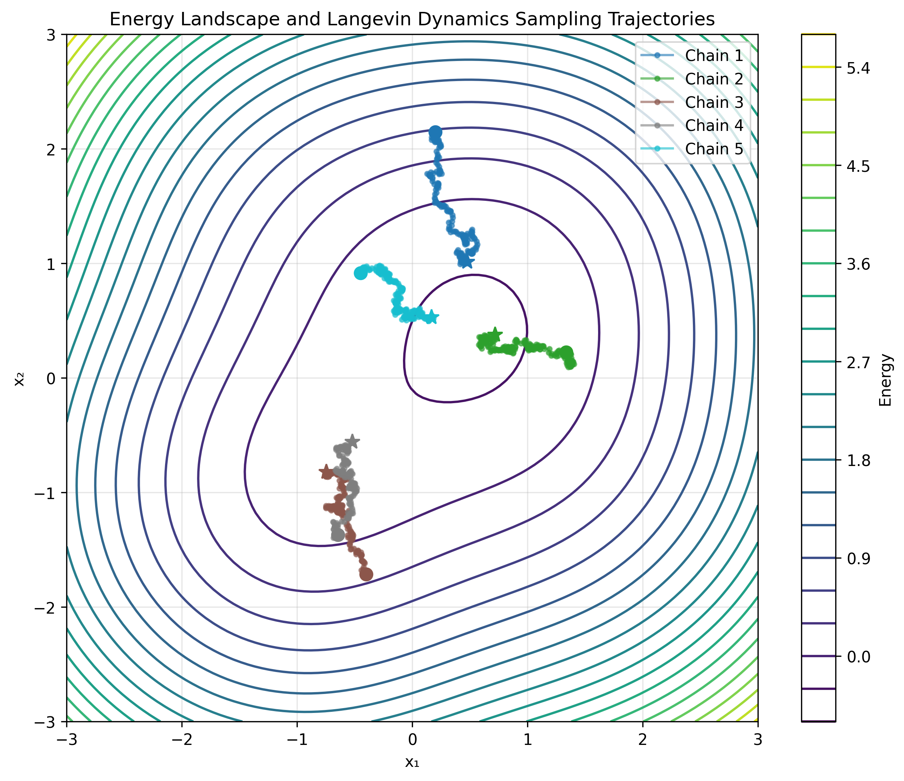

# Langevin Sampler Trajectory

This example demonstrates how to visualize the trajectories of Langevin dynamics samplers on multimodal energy landscapes.

!!! abstract "Key Concepts Covered"
    - Creating custom energy functions
    - Visualizing energy landscapes
    - Tracking and plotting sampling trajectories
    - Working with multimodal distributions

## Overview

Visualizing sampling trajectories helps understand how different sampling algorithms explore the energy landscape. This example creates a multimodal energy function and visualizes multiple sampling chains as they traverse the landscape.

## Multimodal Energy Function

First, we define a custom energy function with multiple local minima:

```python
import torch
import numpy as np
import matplotlib.pyplot as plt
from torchebm.samplers.langevin_dynamics import LangevinDynamics

class MultimodalEnergy:
    """
    A 2D energy function with multiple local minima to demonstrate sampling behavior.
    """

    def __init__(self, device=None, dtype=torch.float32):
        self.device = device or ("cuda" if torch.cuda.is_available() else "cpu")
        self.dtype = dtype

        # Define centers and weights for multiple Gaussian components
        self.centers = torch.tensor(
            [[-1.0, -1.0], [1.0, 1.0], [-0.5, 1.0], [1.0, -0.5]],
            device=self.device,
            dtype=self.dtype,
        )

        self.weights = torch.tensor(
            [1.0, 0.8, 0.6, 0.7], device=self.device, dtype=self.dtype
        )

    def __call__(self, x: torch.Tensor) -> torch.Tensor:
        # Ensure input has correct dtype and shape
        x = x.to(dtype=self.dtype)
        if x.dim() == 1:
            x = x.view(1, -1)

        # Calculate distance to each center
        dists = torch.cdist(x, self.centers)

        # Calculate energy as negative log of mixture of Gaussians
        energy = -torch.log(
            torch.sum(self.weights * torch.exp(-0.5 * dists.pow(2)), dim=-1)
        )

        return energy

    def gradient(self, x: torch.Tensor) -> torch.Tensor:
        # Ensure input has correct dtype and shape
        x = x.to(dtype=self.dtype)
        if x.dim() == 1:
            x = x.view(1, -1)

        # Calculate distances and Gaussian components
        diff = x.unsqueeze(1) - self.centers
        exp_terms = torch.exp(-0.5 * torch.sum(diff.pow(2), dim=-1))
        weights_exp = self.weights * exp_terms

        # Calculate gradient
        normalizer = torch.sum(weights_exp, dim=-1, keepdim=True)
        gradient = torch.sum(
            weights_exp.unsqueeze(-1) * diff / normalizer.unsqueeze(-1), dim=1
        )

        return gradient

    def to(self, device):
        self.device = device
        self.centers = self.centers.to(device)
        self.weights = self.weights.to(device)
        return self
```

## Visualization Function

Next, we create a function to visualize the energy landscape and multiple Langevin dynamics sampling trajectories:

```python
def visualize_energy_landscape_and_sampling():
    # Set up device and dtype
    device = torch.device("cuda" if torch.cuda.is_available() else "cpu")
    dtype = torch.float32

    # Create energy function
    energy_fn = MultimodalEnergy(device=device, dtype=dtype)

    # Initialize the standard Langevin dynamics sampler from the library
    sampler = LangevinDynamics(
        energy_function=energy_fn, 
        step_size=0.01, 
        noise_scale=0.1, 
        device=device
    )

    # Create grid for energy landscape visualization
    x = np.linspace(-3, 3, 100)
    y = np.linspace(-3, 3, 100)
    X, Y = np.meshgrid(x, y)

    # Calculate energy values
    grid_points = torch.tensor(
        np.stack([X.flatten(), Y.flatten()], axis=1), device=device, dtype=dtype
    )
    energy_values = energy_fn(grid_points).cpu().numpy().reshape(X.shape)

    # Set up sampling parameters
    dim = 2  # 2D energy function
    n_steps = 200
    
    # Create figure
    plt.figure(figsize=(10, 8))
    
    # Plot energy landscape with clear contours
    contour = plt.contour(X, Y, energy_values, levels=20, cmap="viridis")
    plt.colorbar(contour, label="Energy")
    
    # Run multiple independent chains from different starting points
    n_chains = 5
    
    # Define distinct colors for the chains
    colors = plt.cm.tab10(np.linspace(0, 1, n_chains))
    
    # Generate seeds for random starting positions to make chains start in different areas
    seeds = [42, 123, 456, 789, 999]
    
    for i, seed in enumerate(seeds):
        # Set the seed for reproducibility
        torch.manual_seed(seed)
        
        # Run one chain using the standard API
        trajectory = sampler.sample_chain(
            dim=dim,              # 2D space
            n_samples=1,          # Single chain
            n_steps=n_steps,      # Number of steps
            return_trajectory=True  # Return full trajectory
        )
        
        # Extract trajectory data
        traj_np = trajectory.cpu().numpy().squeeze(0)  # Remove n_samples dimension
        
        # Plot the trajectory
        plt.plot(
            traj_np[:, 0], 
            traj_np[:, 1], 
            'o-', 
            color=colors[i], 
            alpha=0.6, 
            markersize=3,
            label=f"Chain {i+1}"
        )
        
        # Mark the start and end points
        plt.plot(traj_np[0, 0], traj_np[0, 1], 'o', color=colors[i], markersize=8)
        plt.plot(traj_np[-1, 0], traj_np[-1, 1], '*', color=colors[i], markersize=10)

    # Add labels and title
    plt.title("Energy Landscape and Langevin Dynamics Sampling Trajectories")
    plt.xlabel("x₁")
    plt.ylabel("x₂")
    plt.grid(True, alpha=0.3)
    plt.legend()
```

## Running the Example

To run the example, simply execute:

```python
if __name__ == "__main__":
    print("Running energy landscape visualization...")
    visualize_energy_landscape_and_sampling()
```

## Expected Results

<div class="grid" markdown>
<div markdown>

When you run this example, you'll see a contour plot of the energy landscape with multiple chains of Langevin dynamics samples overlaid. The visualization shows:

- **Energy landscape**: Contour lines representing the multimodal energy function
- **Multiple sampling chains**: Different colored trajectories starting from random initial points
- **Trajectory progression**: You can see how samples move from high-energy regions to low-energy regions

</div>
<div markdown>



The key insights from this visualization:

1. Sampling chains are attracted to areas of low energy (high probability)
2. Chains can get trapped in local minima and have difficulty crossing energy barriers
3. The stochastic nature of Langevin dynamics helps chains occasionally escape local minima
4. Sampling efficiency depends on starting points and energy landscape geometry

</div>
</div>

## Understanding Multimodal Sampling

Multimodal distributions present special challenges for sampling algorithms:

!!! info "Challenges in Multimodal Sampling"
    1. **Energy barriers**: Chains must overcome barriers between modes
    2. **Mode-hopping**: Chains may have difficulty transitioning between distant modes
    3. **Mixing time**: The time required to adequately explore all modes increases
    4. **Mode coverage**: Some modes may be missed entirely during finite sampling

The visualization helps understand these challenges by showing:

- How chains explore the space around each mode
- Whether chains successfully transition between modes
- If certain modes are favored over others
- The impact of initialization on the final sampling distribution

## API Usage Notes

This example demonstrates several key aspects of using the TorchEBM library:

1. **Creating custom energy functions**: How to implement a custom energy function with gradient support
2. **Using the Langevin dynamics sampler**: Using the standard library API
3. **Parallel chain sampling**: Running multiple chains to explore different areas of the space
4. **Trajectory tracking**: Enabling `return_trajectory=True` to record the full sampling path

The standard pattern for using `LangevinDynamics.sample_chain` is:

```python
# Initialize the sampler
sampler = LangevinDynamics(energy_function=my_energy_fn, step_size=0.01)

# Run sampling with trajectory tracking
trajectory = sampler.sample_chain(
    dim=2,                 # Dimension of the space
    n_samples=10,          # Number of parallel chains
    n_steps=100,           # Number of steps to run
    return_trajectory=True # Return the full trajectory rather than just final points
)
```

## Extensions and Variations

This example can be extended in various ways:

1. **Compare different samplers**: Add HMC or other samplers for comparison
2. **Vary step size and noise**: Show the impact of different parameters
3. **Use more complex energy functions**: Create energy functions with more challenging landscapes
4. **Add diagnostics visualization**: Plot energy evolution and other metrics alongside trajectories

## Visualization Results

When running the example, you'll see a visualization of the energy landscape with multiple sampling chains:


*This visualization shows a multimodal energy landscape (contour lines) with five independent Langevin dynamics sampling chains (colored trajectories). Each chain starts from a random position (marked by a circle) and evolves through 200 steps (ending at the stars). The trajectories show how the chains are attracted to the energy function's local minima. Note how some chains follow the gradient to the nearest minimum, while others may explore multiple regions of the space.*