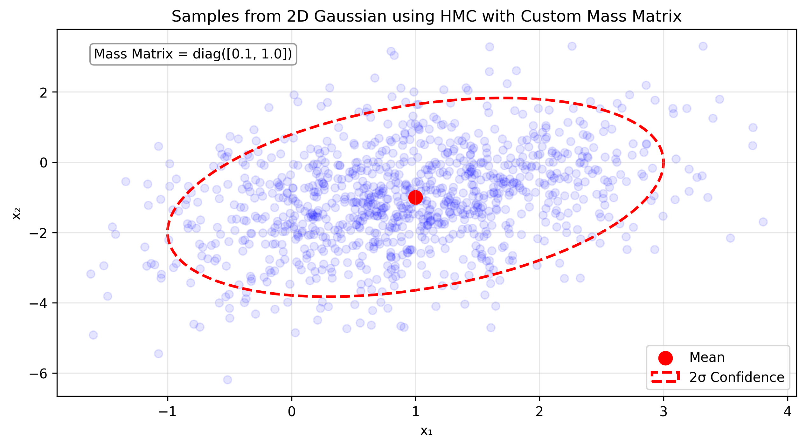
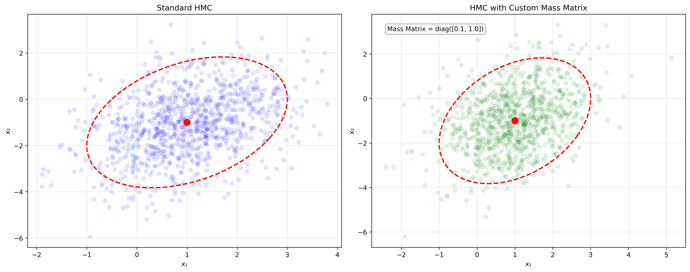

# Hamiltonian Monte Carlo Sampling

This example demonstrates how to use the Hamiltonian Monte Carlo (HMC) sampler in TorchEBM to efficiently sample from energy landscapes.

!!! tip "Key Concepts Covered"
    - Basic usage of Hamiltonian Monte Carlo
    - High-dimensional sampling
    - Working with diagnostics
    - GPU acceleration
    - Custom mass matrix configuration

## Overview

Hamiltonian Monte Carlo (HMC) is an advanced Markov Chain Monte Carlo (MCMC) method that uses the geometry of the energy landscape to make more efficient sampling proposals. By incorporating gradient information and simulating Hamiltonian dynamics, HMC can explore distributions more efficiently than random-walk methods, particularly in high dimensions.

## Basic Example

The following example shows how to sample from a 2D Gaussian distribution using HMC:

```python
import torch
import matplotlib.pyplot as plt
import numpy as np
from torchebm.core import GaussianEnergy
from torchebm.samplers.hmc import HamiltonianMonteCarlo

# Create energy function for a 2D Gaussian
device = torch.device("cuda" if torch.cuda.is_available() else "cpu")
dim = 2  # dimension of the state space
n_steps = 100  # steps between samples
n_samples = 1000  # num of samples
mean = torch.tensor([1.0, -1.0], device=device)
cov = torch.tensor([[1.0, 0.5], [0.5, 2.0]], device=device)
energy_fn = GaussianEnergy(mean, cov)

# Initialize HMC sampler
hmc_sampler = HamiltonianMonteCarlo(
    energy_function=energy_fn,
    step_size=0.1,
    n_leapfrog_steps=5,
    device=device
)

# Generate samples
initial_state = torch.zeros(n_samples, dim, device=device)
samples = hmc_sampler.sample_chain(
    x=initial_state,
    n_steps=n_steps
)

# Plot results
samples = samples.cpu().numpy()
plt.figure(figsize=(10, 5))
plt.scatter(samples[:, 0], samples[:, 1], alpha=0.1)
plt.title("Samples from 2D Gaussian using HMC")
plt.xlabel("x₁")
plt.ylabel("x₂")
plt.show()
```

### Sample Distribution Visualization


<figure markdown>
  
  <figcaption>HMC Sampling from 2D Gaussian</figcaption>
</figure>

*This plot shows 1000 samples from a 2D Gaussian distribution generated using Hamiltonian Monte Carlo. Note how the samples efficiently cover the target distribution's high-probability regions. The samples reflect the covariance structure with the characteristic elliptical shape around the mean [1.0, -1.0], represented by the red point and dashed ellipse.*

## How HMC Works

<div class="grid" markdown>
<div markdown>

Hamiltonian Monte Carlo uses principles from physics to improve sampling efficiency:

1. **Hamiltonian System**: Introduces momentum variables alongside position variables
2. **Leapfrog Integration**: Simulates the Hamiltonian dynamics using a symplectic integrator
3. **Metropolis Acceptance**: Ensures detailed balance by accepting/rejecting proposals
4. **Momentum Resampling**: Periodically resamples momentum to explore different directions

</div>
<div markdown>

The HMC update consists of these steps:

1. Sample momentum variables from a Gaussian distribution
2. Simulate Hamiltonian dynamics using leapfrog integration
3. Compute the acceptance probability based on the change in total energy
4. Accept or reject the proposal based on the acceptance probability
5. Repeat from step 1

</div>
</div>

## Key Parameters

The HMC sampler has several important parameters:

| Parameter | Description |
|-----------|-------------|
| `step_size` | Size of each leapfrog step - controls the discretization granularity |
| `n_leapfrog_steps` | Number of leapfrog steps per proposal - controls trajectory length |
| `mass` | Optional parameter to adjust the momentum distribution (defaults to identity) |
| `device` | Device to run computations on ("cpu" or "cuda") |

## Working with Diagnostics

HMC provides several diagnostic metrics to monitor sampling quality. The diagnostics tensor includes information about the sampling process:

```python
final_samples, diagnostics = hmc_sampler.sample_chain(
    n_samples=n_samples,
    n_steps=n_steps,
    dim=dim,
    return_trajectory=True,
    return_diagnostics=True,
)

# The diagnostics tensor has shape (n_steps, 4, n_samples, dim) and contains:
mean_values = diagnostics[:, 0, :, :]  # Mean of samples at each step
variance_values = diagnostics[:, 1, :, :]  # Variance of samples at each step 
energy_values = diagnostics[:, 2, :, :]  # Energy values of samples
acceptance_rates = diagnostics[:, 3, :, :]  # Acceptance rates for each sample

# To get the overall acceptance rate at the last step:
overall_acceptance_rate = acceptance_rates[-1].mean()
```

!!! info "Good Acceptance Rates"
    For HMC, an acceptance rate between 60-90% typically indicates good performance. If the rate is too low, the step size should be decreased. If it's too high, the step size might be inefficiently small.

## Performance Considerations

<div class="grid cards" markdown>

-   :fontawesome-solid-bolt:{ .lg .middle } __GPU Acceleration__

    ---

    HMC can benefit significantly from GPU acceleration, especially for large sample sizes or high-dimensional problems.

    ```python
    device = "cuda" if torch.cuda.is_available() else "cpu"
    hmc_sampler = HamiltonianMonteCarlo(
        energy_function=energy_fn, 
        step_size=0.1, 
        n_leapfrog_steps=10, 
        device=device
    )
    ```

-   :fontawesome-solid-sliders:{ .lg .middle } __Parameter Tuning__

    ---

    The performance of HMC is sensitive to the choice of step size and number of leapfrog steps.

    ```python
    # For higher dimensions, use more leapfrog steps
    n_leapfrog_steps = max(5, int(np.sqrt(dim)))
    
    # Step size should decrease with dimension
    step_size = min(0.1, 0.5 * dim**(-0.25))
    ```

-   :fontawesome-solid-gauge-high:{ .lg .middle } __Warm-up Period__

    ---

    Consider discarding initial samples to allow the chain to reach the target distribution.

    ```python
    # Run 100 warm-up steps before collecting samples
    warm_up_samples = hmc_sampler.sample_chain(
        x=initial_state, n_steps=100
    )
    # Use the final state as the starting point
    samples = hmc_sampler.sample_chain(
        x=warm_up_samples, n_steps=1000
    )
    ```

-   :fontawesome-solid-chart-line:{ .lg .middle } __Parallel Chains__

    ---

    Run multiple chains in parallel to improve exploration and assess convergence.

    ```python
    # Run 10 chains in parallel
    n_chains = 10
    samples = hmc_sampler.sample_chain(
        dim=dim, n_steps=1000, n_samples=n_chains
    )
    ```

</div>

## Comparison with Langevin Dynamics

HMC differs from Langevin dynamics in several important ways:

| Feature | HMC | Langevin Dynamics |
|---------|-----|-------------------|
| **Computational Cost** | Higher (multiple gradient evaluations per step) | Lower (one gradient evaluation per step) |
| **Exploration Efficiency** | More efficient, especially in high dimensions | Less efficient, more random walk behavior |
| **Parameters to Tune** | Step size and number of leapfrog steps | Step size and noise scale |
| **Acceptance Step** | Uses Metropolis acceptance | No explicit acceptance step |
| **Autocorrelation** | Typically lower | Typically higher |

## Using Custom Mass Matrix

The mass parameter in HMC affects how momentum is sampled and can improve sampling efficiency for certain distributions:

```python
# Custom mass parameter (diagonal values)
mass = torch.tensor([0.1, 1.0], device=device)

# Initialize HMC sampler with custom mass
hmc_sampler = HamiltonianMonteCarlo(
    energy_function=energy_fn,
    step_size=0.1,
    n_leapfrog_steps=10,
    mass=mass,
    device=device
)

# Generate samples
initial_state = torch.zeros(n_samples, dim, device=device)
samples = hmc_sampler.sample_chain(
    x=initial_state,
    n_steps=n_steps
)
```

The mass parameter can be provided as either:

- A scalar value (float) that's applied to all dimensions
- A tensor of values for a diagonal mass matrix

When using a diagonal mass matrix, each dimension can have different momentum scaling. This can be useful when dimensions have different scales or variances.

### Custom Mass Matrix Results


<figure markdown>
  
  <figcaption>HMC Sampling with Custom Mass Matrix</figcaption>
</figure>

*This plot shows samples from the same 2D Gaussian distribution using HMC with a custom diagonal mass parameter [0.1, 1.0]. The mass parameter affects the sampling dynamics, allowing more efficient exploration of the distribution. The red point indicates the mean, and the dashed ellipse represents the 2σ confidence region.*

## Side-by-Side Comparison

The following visualization compares standard HMC with HMC using a custom mass parameter:

<figure markdown>
  
  <figcaption>HMC Implementation Comparison</figcaption>
</figure>


*This side-by-side comparison shows standard HMC (left) and HMC with a custom mass parameter (right) sampling from the same Gaussian distribution. Both methods effectively sample the distribution, but with slightly different dynamics due to the mass parameter configuration.*

## Conclusion

Hamiltonian Monte Carlo provides efficient sampling for complex, high-dimensional distributions. It leverages gradient information to make informed proposals, resulting in faster mixing and lower autocorrelation compared to simpler methods. While it requires more computation per step than methods like Langevin dynamics, it often requires fewer steps overall to achieve the same sampling quality.

By adjusting parameters like the mass value, step size, and number of leapfrog steps, you can optimize HMC for specific sampling tasks and distribution characteristics. 