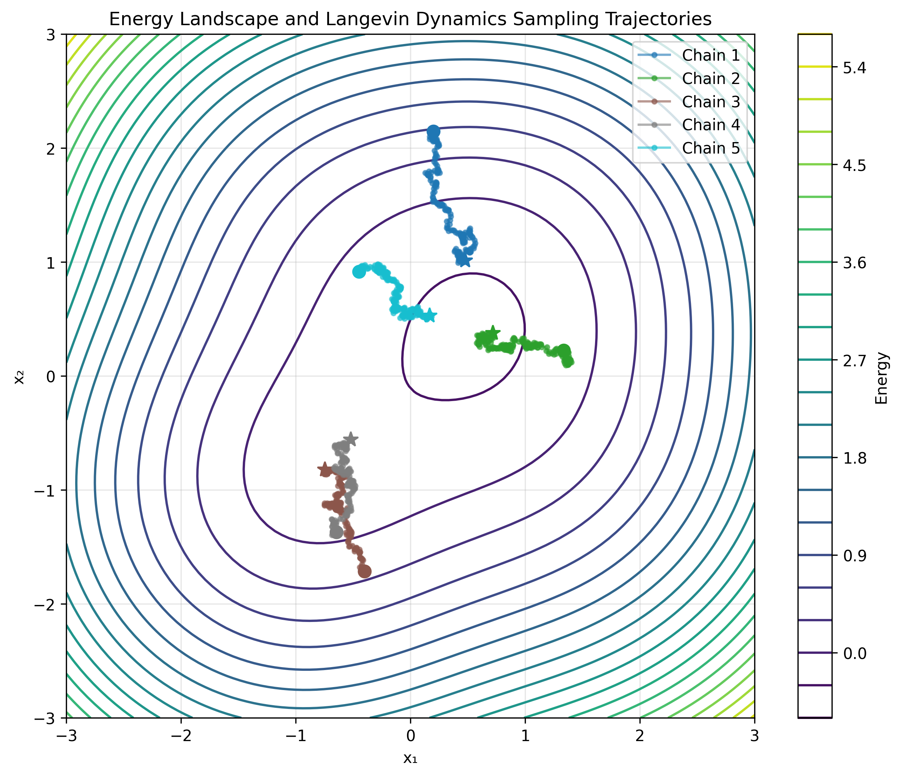
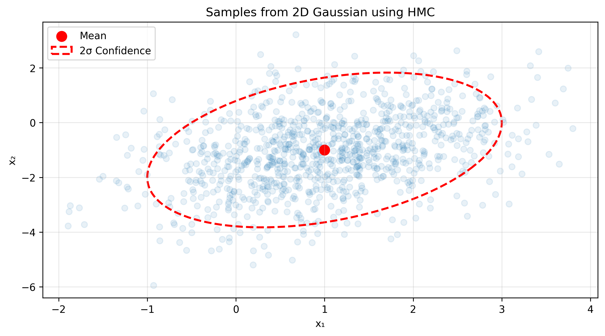

# Sampling from EBMs

Sampling is a fundamental operation for energy-based models. Since the partition function \( Z(\theta) \) is intractable, we cannot sample from \( p_{\theta}(x) \) directly. Instead, we use iterative Markov Chain Monte Carlo (MCMC) methods to generate samples. These samples are crucial for both training (e.g., with Contrastive Divergence) and inference.

TorchEBM provides powerful and efficient MCMC samplers. Let's explore the two primary ones: `LangevinDynamics` and `HamiltonianMonteCarlo`.

## Langevin Dynamics

Langevin Dynamics is a gradient-based MCMC method. It explores the energy landscape by moving samples in the direction of the negative energy gradient (downhill), while adding Gaussian noise to prevent collapsing to a single mode and to ensure the samples eventually represent the true distribution.

The update rule is:

\[ x_{t+1} = x_t - \frac{\epsilon^2}{2} \nabla_x E(x_t) + \epsilon w_t, \quad w_t \sim \mathcal{N}(0, I) \]

where \( \epsilon \) is the step size.

### Basic Example

Here's how to sample from a `GaussianModel` using `LangevinDynamics`.

```python
import torch
import matplotlib.pyplot as plt
from torchebm.core import GaussianModel
from torchebm.samplers import LangevinDynamics

device = torch.device("cuda" if torch.cuda.is_available() else "cpu")

mean = torch.tensor([1.0, -1.0])
cov = torch.tensor([[1.0, 0.5], [0.5, 2.0]])
model = GaussianModel(mean, cov).to(device)

sampler = LangevinDynamics(
    model=model,
    step_size=0.1,
    noise_scale=0.1,
)

initial_particles = torch.randn(1000, 2, device=device)
samples = sampler.sample(x=initial_particles, n_steps=100)

plt.figure(figsize=(6, 6))
plt.scatter(samples[:, 0].cpu().numpy(), samples[:, 1].cpu().numpy(), alpha=0.5, s=10)
plt.title("Samples from GaussianModel via Langevin Dynamics")
plt.grid(True, alpha=0.3)
plt.show()
```

<figure markdown>
  { width="500" }
  <figcaption>Samples generated from a Gaussian distribution using Langevin Dynamics.</figcaption>
</figure>

### Visualizing Sampler Trajectories

To understand how a sampler explores the energy landscape, it's useful to visualize its trajectory. Let's use a more complex, multimodal energy function to see how `LangevinDynamics` navigates it.

```python
import numpy as np
import torch.nn as nn
from torchebm.core import BaseModel

class MultimodalModel(BaseModel):
    def __init__(self):
        super().__init__()
        self.centers = nn.Parameter(torch.tensor([
            [-1.5, -1.5], [1.5, 1.5], [-1.5, 1.5], [1.5, -1.5]
        ]), requires_grad=False)
        self.weights = nn.Parameter(torch.tensor([1.0, 1.0, 0.8, 0.8]), requires_grad=False)

    def forward(self, x: torch.Tensor) -> torch.Tensor:
        dists = torch.cdist(x, self.centers)
        energy = -torch.logsumexp(-0.5 * dists.pow(2) * self.weights, dim=-1)
        return energy

model = MultimodalModel().to(device)
sampler = LangevinDynamics(model=model, step_size=0.1, noise_scale=0.1)

initial_particles = torch.zeros(5, 2, device=device) # 5 chains
trajectory = sampler.sample(x=initial_particles, n_steps=200, return_trajectory=True)

#  The plotting code (omitted for brevity, see full example for details)
# This would involve creating a contour plot of the energy landscape
# and overlaying the trajectories.
```

<figure markdown>
  { width="500" }
  <figcaption>
    Five Langevin Dynamics chains exploring a multimodal energy landscape. The chains (colored lines) start at the center and are drawn towards the low-energy regions (modes).
  </figcaption>
</figure>

This visualization reveals that while Langevin Dynamics finds low-energy regions, chains can sometimes get "stuck" in local minima, highlighting a common challenge in MCMC sampling.

## Hamiltonian Monte Carlo (HMC)

Hamiltonian Monte Carlo is a more advanced MCMC method that uses Hamiltonian dynamics from physics to propose more effective moves. By introducing an auxiliary momentum variable, HMC can make large moves that still have a high probability of being accepted, making it more efficient for exploring complex, high-dimensional distributions compared to the more random-walk nature of Langevin Dynamics.

### Basic Example

Sampling from our `GaussianModel` with HMC is just as easy.

```python
import torch
from torchebm.core import GaussianModel
from torchebm.samplers import HamiltonianMonteCarlo

device = torch.device("cuda" if torch.cuda.is_available() else "cpu")
mean = torch.tensor([1.0, -1.0])
cov = torch.tensor([[1.0, 0.5], [0.5, 2.0]])
model = GaussianModel(mean, cov).to(device)

hmc_sampler = HamiltonianMonteCarlo(
    model=model,
    step_size=0.1,
    n_leapfrog_steps=10
)

initial_particles = torch.randn(1000, 2, device=device)
samples = hmc_sampler.sample(x=initial_particles, n_steps=25) # HMC often needs fewer steps

# Plotting is the same as before
```

<figure markdown>
  { width="500" }
  <figcaption>Samples generated from a Gaussian distribution using Hamiltonian Monte Carlo.</figcaption>
</figure>

### Key HMC Parameters

HMC has two main tuning parameters:
-   `step_size`: The step size for the leapfrog integrator that simulates the dynamics.
-   `n_leapfrog_steps`: The number of leapfrog steps to take for each proposal. The total trajectory time is `step_size * n_leapfrog_steps`.

Tuning these is key to HMC's performance. A good heuristic is to aim for an acceptance rate of around 60-90%, which can be monitored via the diagnostics returned by the sampler.

## Sampler Diagnostics

Both samplers can return diagnostic information. For HMC, this includes the acceptance rate of the Metropolis-Hastings correction step, which is a crucial indicator of sampler performance.

```python
# To get diagnostics, set return_diagnostics=True
samples, diagnostics = hmc_sampler.sample(
    x=initial_particles,
    n_steps=25,
    return_diagnostics=True
)

# Acceptance rate is in the last dimension of the diagnostics tensor
acceptance_rate = diagnostics['acceptance_rate'].mean()
print(f"Average acceptance rate: {acceptance_rate:.2f}")
```
An acceptance rate that is too high (e.g., >95%) suggests the `step_size` might be too small, leading to inefficient exploration. A rate that is too low (e.g., <50%) indicates the `step_size` is too large, causing proposals to be rejected too often. 