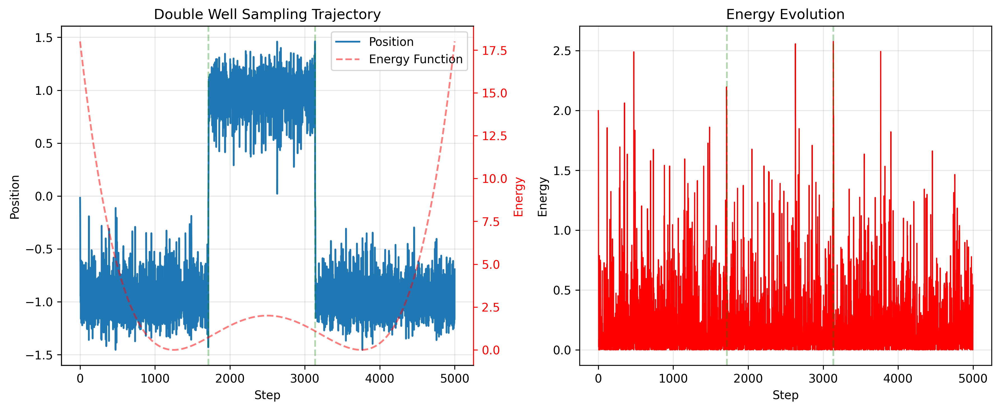

# Langevin Dynamics Sampling

This example demonstrates how to use the Langevin Dynamics sampler in TorchEBM to generate samples from various energy functions.

!!! info "Key Concepts Covered"
    - Basic usage of Langevin Dynamics
    - Parallel sampling with multiple chains
    - Performance considerations
    - Working with diagnostics

## Overview

Langevin dynamics is a powerful sampling method that uses gradients of the energy function to guide the exploration of the state space, combined with random noise to ensure proper exploration. It's particularly useful for sampling from complex, high-dimensional distributions.

## Basic Example

The following example shows how to sample from a 2D Gaussian distribution using Langevin dynamics:

```python
import torch
import matplotlib.pyplot as plt
from torchebm.core import GaussianEnergy
from torchebm.samplers.langevin_dynamics import LangevinDynamics

def basic_example():
    """
    Simple Langevin dynamics sampling from a 2D Gaussian distribution.
    """
    # Create energy function for a 2D Gaussian
    device = torch.device("cuda" if torch.cuda.is_available() else "cpu")
    dim = 2  # dimension of the state space
    n_steps = 100  # steps between samples
    n_samples = 1000  # num of samples
    mean = torch.tensor([1.0, -1.0])
    cov = torch.tensor([[1.0, 0.5], [0.5, 2.0]])
    energy_fn = GaussianEnergy(mean, cov, device=device)

    # Initialize sampler
    sampler = LangevinDynamics(
        energy_function=energy_fn,
        step_size=0.01,
        noise_scale=0.1,
        device=device,
    )

    # Generate samples
    initial_state = torch.zeros(n_samples, dim, device=device)
    samples = sampler.sample_chain(
        x=initial_state,
        n_steps=n_steps,
        n_samples=n_samples,
    )

    # Plot results
    samples = samples.cpu().numpy()
    plt.figure(figsize=(10, 5))
    plt.scatter(samples[:, 0], samples[:, 1], alpha=0.1)
    plt.title("Samples from 2D Gaussian using Langevin Dynamics")
    plt.xlabel("x₁")
    plt.ylabel("x₂")
    plt.show()
```

## High-Dimensional Sampling

Langevin dynamics scales well to high-dimensional spaces. Here's an example sampling from a 10D Gaussian:

```python
import torch
import time
from torchebm.core import GaussianEnergy
from torchebm.samplers.langevin_dynamics import LangevinDynamics

def langevin_gaussain_sampling():
    energy_fn = GaussianEnergy(mean=torch.zeros(10), cov=torch.eye(10))
    device = "cuda" if torch.cuda.is_available() else "cpu"

    # Initialize Langevin dynamics model
    langevin_sampler = LangevinDynamics(
        energy_function=energy_fn, step_size=5e-3, device=device
    ).to(device)

    # Initial state: batch of 100 samples, 10-dimensional space
    ts = time.time()
    # Run Langevin sampling for 500 steps
    final_x = langevin_sampler.sample_chain(
        dim=10, n_steps=500, n_samples=10000, return_trajectory=False
    )

    print(final_x.shape)  # Output: (10000, 10)  (final state)
    print("Time taken: ", time.time() - ts)

    # Sample with diagnostics and trajectory
    n_samples = 250
    n_steps = 500
    dim = 10
    final_samples, diagnostics = langevin_sampler.sample_chain(
        n_samples=n_samples,
        n_steps=n_steps,
        dim=dim,
        return_trajectory=True,
        return_diagnostics=True,
    )
    print(final_samples.shape)  # Output: (250, 500, 10)
    print(diagnostics.shape)  # (500, 3, 250, 10)
```

## Working with Diagnostics

TorchEBM can return diagnostic information during sampling to monitor the sampling process:

```python
from typing import Tuple
import torch
from torchebm.samplers.langevin_dynamics import LangevinDynamics
from torchebm.core import HarmonicEnergy

def sampling_utilities_example():
    """
    Example demonstrating various utility features:
    1. Chain thinning (future updates)
    2. Device management
    3. Custom diagnostics
    4. Convergence checking
    """

    # Initialize sampler with GPU support if available
    device = torch.device("cuda" if torch.cuda.is_available() else "cpu")
    sampler = LangevinDynamics(
        energy_function=HarmonicEnergy(), step_size=0.01, noise_scale=0.1
    ).to(device)

    # Generate samples with diagnostics
    initial_state = torch.tensor([2.0], device=device)
    samples, diagnostics = sampler.sample_chain(
        x=initial_state,
        n_steps=50,
        n_samples=1000,
        return_diagnostics=True,
    )

    # Custom analysis of results
    def analyze_convergence(
        samples: torch.Tensor, diagnostics: list
    ) -> Tuple[float, float]:
        """Example utility function to analyze convergence."""
        mean = samples.mean().item()
        std = samples.std().item()
        return mean, std

    mean, std = analyze_convergence(samples, diagnostics)
    print(f"Sample Statistics - Mean: {mean:.3f}, Std: {std:.3f}")
```

## Performance Considerations

<div class="grid" markdown>
<div markdown>

### GPU Acceleration

TorchEBM's Langevin dynamics sampler works efficiently on both CPU and GPU. When available, using a GPU can significantly accelerate sampling, especially for high-dimensional distributions or large sample sizes.

```python
device = "cuda" if torch.cuda.is_available() else "cpu"
sampler = LangevinDynamics(
    energy_function=energy_fn, 
    step_size=0.01,
    device=device
).to(device)
```

</div>
<div markdown>

### Parallel Sampling

The sampler automatically handles parallel sampling when you specify `n_samples > 1`. This parallelism is particularly efficient on GPUs.

```python
# Generate 1000 samples in parallel
samples = sampler.sample_chain(
    dim=10, 
    n_steps=100, 
    n_samples=1000
)
```

</div>
</div>

## Advanced Parameters

The Langevin dynamics sampler supports several parameters for fine-tuning:

| Parameter | Description |
|-----------|-------------|
| `step_size` | Controls the size of update steps |
| `noise_scale` | Controls the amount of random exploration |
| `decay` | Optional decay factor for step size during sampling |
| `thinning` | How many steps to skip between saved samples |
| `return_trajectory` | Whether to return the entire sampling trajectory |
| `return_diagnostics` | Whether to collect and return diagnostic information |

## Key Considerations

When using Langevin dynamics, keep in mind:

1. **Step Size**: Too large can cause instability, too small can make sampling inefficient
2. **Burn-in Period**: Initial samples may be far from the target distribution
3. **Energy Gradient**: Ensure your energy function has a well-defined gradient
4. **Tuning**: Optimal parameters depend on the specific energy landscape

## Conclusion

Langevin dynamics is a versatile sampling approach suitable for many energy-based models. It combines the efficiency of gradient-based methods with the exploration capability of stochastic methods, making it an excellent choice for complex distributions.

For a more visual exploration of Langevin dynamics, see the [Langevin Sampler Trajectory](langevin_trajectory.md) example that visualizes sampling trajectories overlaid on energy landscapes.

### Visualization Result


*This plot shows 1000 samples from a 2D Gaussian distribution generated using Langevin dynamics. The samples are concentrated around the mean [1.0, -1.0] and reflect the covariance structure with the characteristic elliptical shape.*

## Working with Double Well Energy and Diagnostics

Here's an example showing a trajectory from a Double Well energy function along with energy diagnostics:

```python
import torch
import matplotlib.pyplot as plt
from torchebm.core import DoubleWellEnergy
from torchebm.samplers.langevin_dynamics import LangevinDynamics

# Create Double Well energy function
device = torch.device("cuda" if torch.cuda.is_available() else "cpu")
energy_fn = DoubleWellEnergy(barrier_height=2.0)

# Initialize sampler
sampler = LangevinDynamics(
    energy_function=energy_fn,
    step_size=0.1,
    noise_scale=0.3,
    device=device
)

# Generate samples with trajectory and diagnostics
initial_state = torch.tensor([-1.5], device=device).view(1, 1)
trajectory, diagnostics = sampler.sample_chain(
    x=initial_state,
    n_steps=5000,
    return_trajectory=True,
    return_diagnostics=True
)

# Plot trajectory and energy
fig, (ax1, ax2) = plt.subplots(1, 2, figsize=(12, 5))
ax1.plot(trajectory[0, :, 0].cpu().numpy())
ax1.set_title("Single Chain Trajectory")
ax1.set_xlabel("Step")
ax1.set_ylabel("Position")
ax2.plot(diagnostics[:, 2, 0, 0].cpu().numpy())
ax2.set_title("Energy Evolution")
ax2.set_xlabel("Step")
ax2.set_ylabel("Energy")
plt.tight_layout()
plt.show()
```

### Diagnostics Visualization



*The left plot shows a single sampling chain trajectory in a Double Well energy landscape. The trajectory moves between the two wells over time. The right plot shows the corresponding energy evolution during sampling, with drops indicating transitions between wells.* 