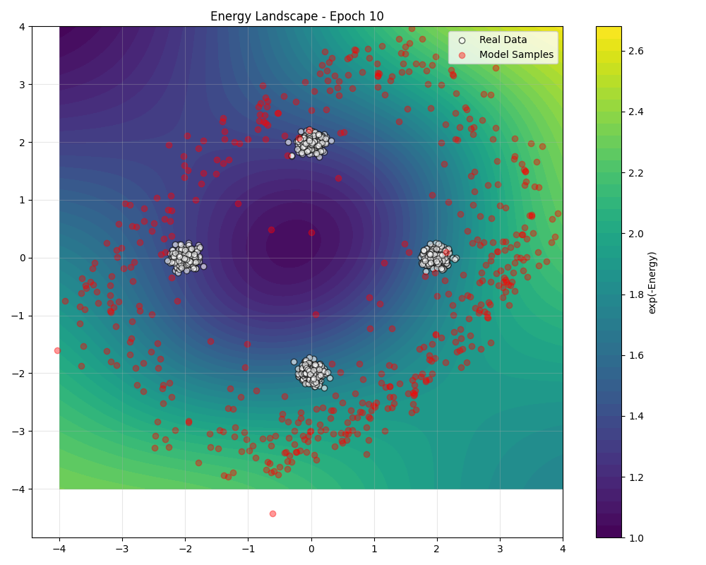
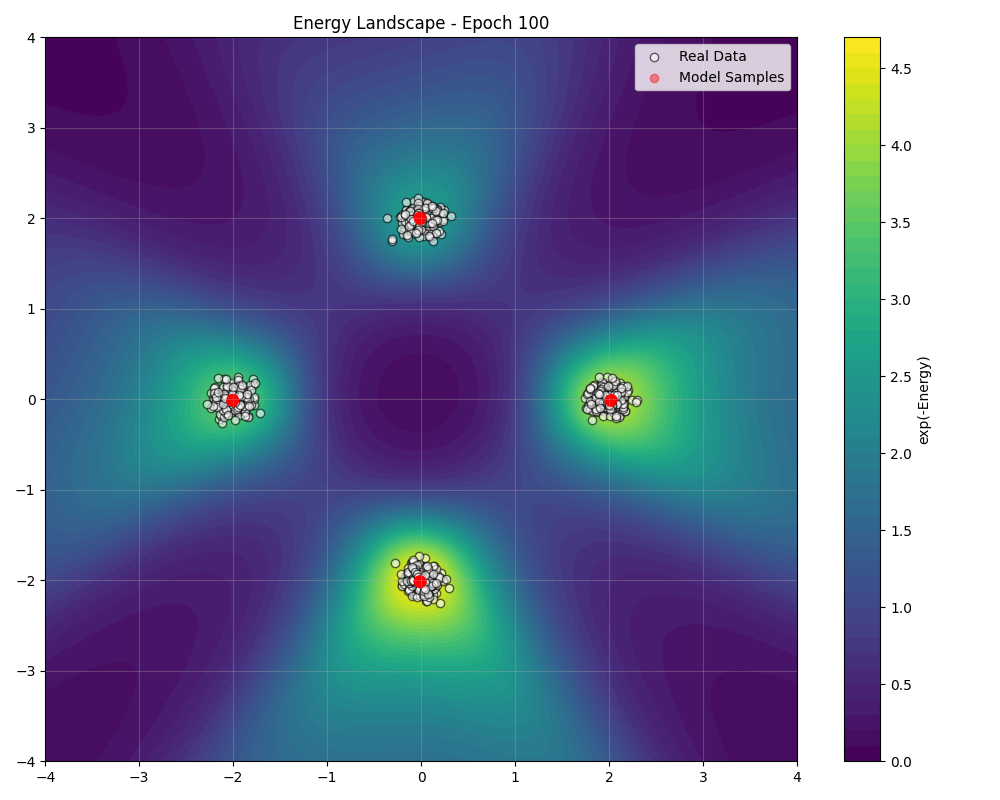

# Training an Energy-Based Model

This guide walks through the complete process of training an energy-based model using TorchEBM. We will train a simple MLP-based model to learn a 2D Gaussian mixture distribution, a classic "hello world" for EBMs that is easy to visualize.

## The Core Idea: Contrastive Divergence

Training an EBM involves minimizing the KL divergence between the data distribution \( p_{data}(x) \) and the model distribution \( p_{\theta}(x) \). The gradient of the log-likelihood is:

\[ \nabla_{\theta} \log p_{\theta}(x) = \mathbb{E}_{x \sim p_{data}} [-\nabla_{\theta} E_{\theta}(x)] - \mathbb{E}_{x \sim p_{\theta}} [-\nabla_{\theta} E_{\theta}(x)] \]

The first term pushes the energy down for real data ("positive samples"), and the second term pushes the energy up for data generated by the model ("negative samples").

Since we cannot sample directly from \( p_{\theta} \), we use an MCMC procedure like Langevin Dynamics to generate the negative samples. **Contrastive Divergence (CD)** is an algorithm that approximates this gradient by running the MCMC chain for only a few steps, initialized from the real data.

## Step 1: Set Up Environment

First, we import the necessary components from PyTorch and TorchEBM.

```python
import torch
import torch.nn as nn
import torch.optim as optim
from torch.utils.data import DataLoader
import matplotlib.pyplot as plt
import numpy as np

from torchebm.core import BaseModel
from torchebm.samplers import LangevinDynamics
from torchebm.losses import ContrastiveDivergence
from torchebm.datasets import GaussianMixtureDataset
```

## Step 2: Define the Model and Dataset

We'll use a simple MLP as our energy model and a `GaussianMixtureDataset` as our target distribution.

```python
# Define the energy model using a simple MLP
class MLPModel(BaseModel):
    def __init__(self, input_dim: int, hidden_dim: int = 128):
        super().__init__()
        self.network = nn.Sequential(
            nn.Linear(input_dim, hidden_dim),
            nn.ReLU(),
            nn.Linear(hidden_dim, hidden_dim),
            nn.ReLU(),
            nn.Linear(hidden_dim, 1),
        )

    def forward(self, x: torch.Tensor) -> torch.Tensor:
        return self.network(x).squeeze(-1)

# Set up device and dataset
device = torch.device("cuda" if torch.cuda.is_available() else "cpu")
dataset = GaussianMixtureDataset(
    n_samples=2048,
    n_components=8,
    std=0.1,
    radius=1.5,
    device=device,
    seed=42,
)
dataloader = DataLoader(dataset, batch_size=256, shuffle=True)
```

## Step 3: Initialize Training Components

Next, we initialize the model, the sampler for generating negative samples, the `ContrastiveDivergence` loss function, and the optimizer.

```python
# Model
model = MLPModel(input_dim=2).to(device)

# Sampler
sampler = LangevinDynamics(
    model=model,
    step_size=0.1,
    noise_scale=0.1,
)

# Loss Function
loss_fn = ContrastiveDivergence(
    model=model, 
    sampler=sampler, 
    n_steps=10 # k in CD-k
)

# Optimizer
optimizer = optim.Adam(model.parameters(), lr=1e-3)
```

## Step 4: The Training Loop

The training loop is a standard PyTorch loop. In each step, we pass a batch of real data to the `loss_fn`, which performs the following steps internally:
1.  Calculates the energy of the real data (`positive phase`).
2.  Initializes MCMC chains from the real data batch.
3.  Runs the `sampler` for `n_steps` to generate negative samples.
4.  Calculates the energy of the negative samples (`negative phase`).
5.  Computes the CD loss and returns it.

```python
print("Starting training...")
for epoch in range(100):
    for data_batch in dataloader:
        optimizer.zero_grad()
        loss, negative_samples = loss_fn(data_batch)
        loss.backward()
        optimizer.step()

    if (epoch + 1) % 10 == 0:
        print(f"Epoch [{epoch+1}/100], Loss: {loss.item():.4f}")
```

## Step 5: Visualizing the Results

Throughout training, it's crucial to visualize the learned energy landscape and the samples generated by the model. This helps diagnose issues and understand how the model is learning.

```python
# Helper function to plot energy landscape and samples
@torch.no_grad()
def visualize_training(model, real_data, sampler, epoch):
    plt.figure(figsize=(8, 8))
    
    # Create a grid to plot the energy landscape
    plot_range = 2.5
    grid_size = 100
    x_coords = torch.linspace(-plot_range, plot_range, grid_size, device=device)
    y_coords = torch.linspace(-plot_range, plot_range, grid_size, device=device)
    xv, yv = torch.meshgrid(x_coords, y_coords, indexing="xy")
    grid = torch.stack([xv.flatten(), yv.flatten()], dim=1)
    
    # Get energy values and convert to a probability density for visualization
    energy_values = model(grid).cpu().numpy().reshape(grid_size, grid_size)
    prob_density = np.exp(-energy_values)

    # Plot the landscape
    plt.contourf(xv.cpu().numpy(), yv.cpu().numpy(), prob_density, levels=50, cmap="viridis")
    
    # Generate model samples for visualization
    initial_noise = torch.randn(500, 2, device=device)
    model_samples = sampler.sample(x=initial_noise, n_steps=200).cpu().numpy()
    
    # Plot real and model samples
    plt.scatter(real_data[:, 0], real_data[:, 1], s=10, alpha=0.5, label="Real Data", c="white")
    plt.scatter(model_samples[:, 0], model_samples[:, 1], s=10, alpha=0.5, label="Model Samples", c="red")
    
    plt.title(f"Epoch {epoch}")
    plt.legend()
    plt.show()

# Visualize after training
model.eval()
visualize_training(model, dataset.get_data().cpu().numpy(), sampler, 100)
```

<div class="grid cards" markdown>
- 
- 
</div>

The visualization on the left shows the model early in training, where the energy landscape is still diffuse. On the right, after 100 epochs, the model has learned to assign low energy (high probability, bright regions) to the areas where the data lives, and the model samples (red dots) closely match the real data distribution (white dots).