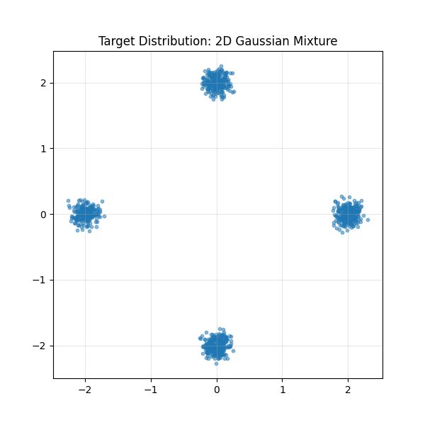
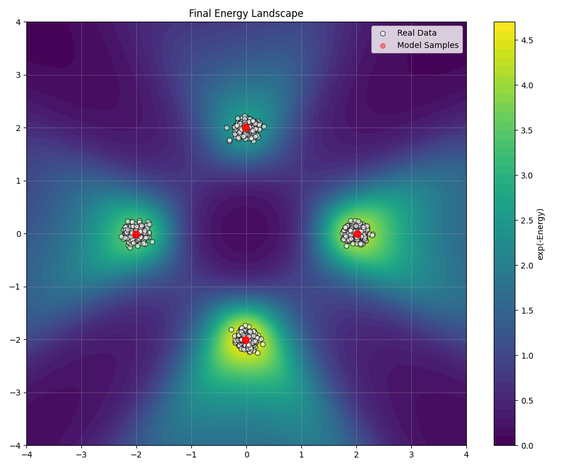

# Training an EBM on a Gaussian Mixture

This tutorial demonstrates how to train an energy-based model (EBM) on a 2D Gaussian mixture distribution using the TorchEBM library. We'll build a simple MLP-based energy function, train it with Contrastive Divergence, and visualize the results.

!!! tip "Key Concepts Covered"
    - Building an MLP-based energy function
    - Training with Contrastive Divergence
    - Sampling with Langevin dynamics
    - Visualizing the energy landscape and samples

## Overview

Energy-based models provide a flexible framework for modeling complex probability distributions. This tutorial focuses on a simple but illustrative example: learning a 2D Gaussian mixture distribution. This is a good starting point because:

1. It's easy to visualize in 2D
2. It has multimodal structure that challenges simple models
3. We can generate synthetic training data with known properties

## Prerequisites

Before starting, make sure you have TorchEBM installed:

```bash
pip install torchebm
```

We'll also use the following libraries:

```python
import torch
import torch.nn as nn
import torch.optim as optim
from torch.utils.data import DataLoader
import matplotlib.pyplot as plt
import numpy as np

from torchebm.core import BaseEnergyFunction
from torchebm.samplers import LangevinDynamics
from torchebm.losses import ContrastiveDivergence
from torchebm.datasets import GaussianMixtureDataset
```

## Step 1: Define the Energy Function

We'll create a simple MLP (Multi-Layer Perceptron) energy function by subclassing `BaseEnergyFunction`:

```python
class MLPEnergy(BaseEnergyFunction):
    """A simple MLP to act as the energy function."""

    def __init__(self, input_dim: int, hidden_dim: int = 64):
        super().__init__()
        self.network = nn.Sequential(
            nn.Linear(input_dim, hidden_dim),
            nn.ReLU(),
            nn.Linear(hidden_dim, hidden_dim),
            nn.ReLU(),
            nn.Linear(hidden_dim, 1),  # Output a single scalar energy value
        )

    def forward(self, x: torch.Tensor) -> torch.Tensor:
        return self.network(x).squeeze(-1)
```

This energy function maps input points to scalar energy values. Lower energy corresponds to higher probability density.

## Step 2: Create the Dataset

TorchEBM provides built-in datasets for testing and development. Let's use the `GaussianMixtureDataset`:

```python
# Hyperparameters
N_SAMPLES = 500
INPUT_DIM = 2
HIDDEN_DIM = 64
SEED = 42

# Device
device = torch.device("cuda" if torch.cuda.is_available() else "cpu")

# Create the dataset
dataset = GaussianMixtureDataset(
    n_samples=N_SAMPLES,
    n_components=4,  # Four Gaussian components
    std=0.1,
    radius=1.5,
    device=device,
    seed=SEED,
)

# Get the full tensor for visualization purposes
real_data_for_plotting = dataset.get_data()
print(f"Data batch_shape: {real_data_for_plotting.shape}")

# Create DataLoader
dataloader = DataLoader(
    dataset,
    batch_size=256,
    shuffle=True,
    drop_last=True,
)
```

<div class="grid" markdown>

<div markdown>
We can visualize the generated data to see what our target distribution looks like:

```python
plt.figure(figsize=(6, 6))
plt.scatter(real_data_for_plotting[:, 0].cpu().numpy(), 
            real_data_for_plotting[:, 1].cpu().numpy(), 
            s=10, alpha=0.5)
plt.title("Target Distribution: 2D Gaussian Mixture")
plt.grid(True, alpha=0.3)
plt.show()
```
</div>

<div markdown>



*The target distribution consists of 4 Gaussian components arranged in a circle.*
</div>

</div>

## Step 3: Define the Visualization Function

We'll create a function to visualize the energy landscape and generated samples during training:

```python
@torch.no_grad()
def plot_energy_and_samples(
        energy_fn: BaseEnergyFunction,
        real_samples: torch.Tensor,
        sampler: LangevinDynamics,
        epoch: int,
        device: torch.device,
        grid_size: int = 100,
        plot_range: float = 3.0,
        k_sampling: int = 100,
):
    """Plots the energy surface, real data, and model samples."""
    plt.figure(figsize=(8, 8))

    # Create grid for energy surface plot
    x_coords = torch.linspace(-plot_range, plot_range, grid_size, device=device)
    y_coords = torch.linspace(-plot_range, plot_range, grid_size, device=device)
    xv, yv = torch.meshgrid(x_coords, y_coords, indexing="xy")
    grid = torch.stack([xv.flatten(), yv.flatten()], dim=1)

    # Calculate energy on the grid
    energy_fn.eval()
    energy_values = energy_fn(grid).cpu().numpy().reshape(grid_size, grid_size)

    # Plot energy surface (using probability density for better visualization)
    log_prob_values = -energy_values
    log_prob_values = log_prob_values - np.max(log_prob_values)
    prob_density = np.exp(log_prob_values)

    plt.contourf(
        xv.cpu().numpy(),
        yv.cpu().numpy(),
        prob_density,
        levels=50,
        cmap="viridis",
    )
    plt.colorbar(label="exp(-Energy) (unnormalized density)")

    # Generate samples from the current model
    vis_start_noise = torch.randn(
        500, real_samples.shape[1], device=device
    )
    model_samples_tensor = sampler.sample(x=vis_start_noise, n_steps=k_sampling)
    model_samples = model_samples_tensor.cpu().numpy()

    # Plot real and model samples
    real_samples_np = real_samples.cpu().numpy()
    plt.scatter(
        real_samples_np[:, 0],
        real_samples_np[:, 1],
        s=10,
        alpha=0.5,
        label="Real Data",
        c="white",
        edgecolors="k",
        linewidths=0.5,
    )
    plt.scatter(
        model_samples[:, 0],
        model_samples[:, 1],
        s=10,
        alpha=0.5,
        label="Model Samples",
        c="red",
        edgecolors="darkred",
        linewidths=0.5,
    )

    plt.xlim(-plot_range, plot_range)
    plt.ylim(-plot_range, plot_range)
    plt.title(f"Epoch {epoch}")
    plt.xlabel("X1")
    plt.ylabel("X2")
    plt.legend()
    plt.grid(True, alpha=0.3)
    plt.show()
```

!!! tip "Visualizing Analytical Energy Functions"
    For more detailed information on analytical energy-function visualizations and techniques, see our [Energy Visualization Guide](../visualization/energy_visualization.md).
    You can find visualized 2D toy datasets in [Datasets](../datasets/index.md) examples.

## Step 4: Set Up the Training Components

Now we'll set up the model, sampler, loss function, and optimizer:

```python
# Hyperparameters for training
BATCH_SIZE = 256
EPOCHS = 200
LEARNING_RATE = 1e-3
SAMPLER_STEP_SIZE = 0.1
SAMPLER_NOISE_SCALE = 0.1
CD_K = 10  # MCMC steps for CD
USE_PCD = False  # Whether to use Persistent CD
VISUALIZE_EVERY = 20

# Create the energy model
energy_model = MLPEnergy(INPUT_DIM, HIDDEN_DIM).to(device)

# Set up the Langevin dynamics sampler
sampler = LangevinDynamics(
    energy_function=energy_model,
    step_size=SAMPLER_STEP_SIZE,
    noise_scale=SAMPLER_NOISE_SCALE,
    device=device,
)

# Set up the Contrastive Divergence loss
loss_fn = ContrastiveDivergence(
    energy_function=energy_model, 
    sampler=sampler, 
    n_steps=CD_K, 
    persistent=USE_PCD
).to(device)

# Optimizer
optimizer = optim.Adam(energy_model.parameters(), lr=LEARNING_RATE)
```

!!! info "Langevin Dynamics"
    Langevin dynamics is a sampling method that uses gradient information to explore the energy landscape. It adds noise to the gradient updates, allowing the sampler to overcome energy barriers and explore multimodal distributions.

!!! tip "Persistent Contrastive Divergence"
    Setting `persistent=True` enables Persistent Contrastive Divergence (PCD), which maintains a set of persistent chains between parameter updates. This can lead to better exploration of the energy landscape and improved training stability, especially for complex distributions.

## Step 5: The Training Loop

Now we're ready to train our energy-based model:

```python
print("Starting training...")
for epoch in range(EPOCHS):
    energy_model.train()  # Ensure model is in training mode
    epoch_loss = 0.0
    for i, data_batch in enumerate(dataloader):
        # Zero gradients before calculation
        optimizer.zero_grad()

        # Calculate Contrastive Divergence loss
        loss, negative_samples = loss_fn(data_batch)

        # Backpropagate the loss
        loss.backward()

        # Optional: Gradient clipping can help stabilize training
        torch.nn.utils.clip_grad_norm_(energy_model.parameters(), max_norm=1.0)

        # Update the energy function parameters
        optimizer.step()

        epoch_loss += loss.item()

    avg_epoch_loss = epoch_loss / len(dataloader)
    print(f"Epoch [{epoch+1}/{EPOCHS}], Average Loss: {avg_epoch_loss:.4f}")

    # Visualize progress periodically
    if (epoch + 1) % VISUALIZE_EVERY == 0 or epoch == 0:
        print("Generating visualization...")
        energy_model.eval()  # Set model to evaluation mode for visualization
        plot_energy_and_samples(
            energy_fn=energy_model,
            real_samples=real_data_for_plotting,
            sampler=sampler,
            epoch=epoch + 1,
            device=device,
            plot_range=2.5,
            k_sampling=200,  # More steps for better visualization
        )
```

## Training Progress Visualization

<div class="grid cards" markdown>

-   :material-image-frame:{ .lg .middle } __Epoch 10__

    ---

    

    *Early training: The model has begun to identify the four modes.*

-   :material-image-frame:{ .lg .middle } __Epoch 20__

    ---

    

    *Continued progress: The energy landscape is taking shape.*

-   :material-image-frame:{ .lg .middle } __Epoch 30__

    ---

    

    *Mid-training: The modes are becoming well-defined.*

-   :material-image-frame:{ .lg .middle } __Epoch 100__

    ---

    

    *Final model: The energy function has learned the four-mode structure.*

</div>

As training progresses, we can see how the energy landscape evolves to capture the four-mode structure of our target distribution. The brighter regions in the contour plot represent areas of higher probability density (lower energy), and the red points show samples drawn from the model.

## Step 6: Final Evaluation

After training, we generate a final set of samples from our model for evaluation:

```python
# Final visualization
print("Generating final visualization...")
energy_model.eval()
plot_energy_and_samples(
    energy_fn=energy_model,
    real_samples=real_data_for_plotting,
    sampler=sampler,
    epoch=EPOCHS,
    device=device,
    plot_range=2.5,
    k_sampling=500,  # More steps for better mixing
)
```

## Understanding the Results

Our model has successfully learned the four-mode structure of the target distribution. The contour plot shows four distinct regions of low energy (high probability) corresponding to the four Gaussian components.

<div class="grid" markdown>

<div markdown>
The red points (samples from our model) closely match the distribution of the white points (real data), indicating that our energy-based model has effectively captured the target distribution.

This example demonstrates the core workflow for training energy-based models with TorchEBM:

1. Define an energy function
2. Set up a sampler for generating negative samples
3. Use Contrastive Divergence for training
4. Monitor progress through visualization
</div>

<div markdown>



*The final energy landscape shows that the model has successfully learned the four-mode structure of the target distribution.*
</div>

</div>

## Tips for Training EBMs

When training your own energy-based models, consider these tips:

<div class="grid cards" markdown>

-   :fontawesome-solid-bolt:{ .lg .middle } __Sampling Parameters__

    ---

    The step size and noise scale of the Langevin dynamics sampler are critical. Too large values can lead to unstable sampling, while too small values may result in poor mixing.

    ```python
    # Try different step sizes and noise scales
    sampler = LangevinDynamics(
        energy_function=energy_model,
        step_size=0.01,  # Smaller for stability
        noise_scale=0.005  # Smaller for more accurate sampling
    )
    ```

-   :fontawesome-solid-sliders:{ .lg .middle } __CD Steps__

    ---

    The number of MCMC steps in Contrastive Divergence affects the quality of negative samples. More steps generally lead to better results but increase computation time.

    ```python
    # For complex distributions, use more steps
    loss_fn = ContrastiveDivergence(
        energy_function=energy_model,
        sampler=sampler,
        n_steps=20,  # Increase for better samples
        persistent=True
    )
    ```

-   :fontawesome-solid-gauge-high:{ .lg .middle } __Learning Rate__

    ---

    Energy-based models can be sensitive to the learning rate. Start with a smaller learning rate and gradually increase if needed.

    ```python
    # Use a smaller learning rate for stability
    optimizer = optim.Adam(
        energy_model.parameters(),
        lr=0.0005,  # Start small
        weight_decay=1e-5  # Regularization helps
    )
    ```

-   :fontawesome-solid-network-wired:{ .lg .middle } __Neural Network Architecture__

    ---

    The choice of architecture and activation function can affect the smoothness of the energy landscape.

    ```python
    # Try different architectures and activations
    self.network = nn.Sequential(
        nn.Linear(input_dim, hidden_dim),
        nn.SiLU(),  # Smoother than ReLU
        nn.Linear(hidden_dim, hidden_dim * 2),  # Wider middle layer
        nn.SiLU(),
        nn.Linear(hidden_dim * 2, hidden_dim),
        nn.SiLU(),
        nn.Linear(hidden_dim, 1)
    )
    ```

</div>

## Complete Code

Here's the complete code for this example:

```python
import torch
import torch.nn as nn
import torch.optim as optim
from torch.utils.data import DataLoader
import matplotlib.pyplot as plt
import numpy as np

from torchebm.core import BaseEnergyFunction
from torchebm.samplers import LangevinDynamics
from torchebm.losses import ContrastiveDivergence
from torchebm.datasets import GaussianMixtureDataset


class MLPEnergy(BaseEnergyFunction):
    """A simple MLP to act as the energy function."""

    def __init__(self, input_dim: int, hidden_dim: int = 64):
        super().__init__()
        self.network = nn.Sequential(
            nn.Linear(input_dim, hidden_dim),
            nn.ReLU(),
            nn.Linear(hidden_dim, hidden_dim),
            nn.ReLU(),
            nn.Linear(hidden_dim, 1),  # Output a single scalar energy value
        )

    def forward(self, x: torch.Tensor) -> torch.Tensor:
        return self.network(x).squeeze(-1)


@torch.no_grad()
def plot_energy_and_samples(
        energy_fn, real_samples, sampler, epoch, device, grid_size=100, plot_range=3.0, k_sampling=100
):
    """Plots the energy surface, real data, and model samples."""
    plt.figure(figsize=(8, 8))

    # Create grid for energy surface plot
    x_coords = torch.linspace(-plot_range, plot_range, grid_size, device=device)
    y_coords = torch.linspace(-plot_range, plot_range, grid_size, device=device)
    xv, yv = torch.meshgrid(x_coords, y_coords, indexing="xy")
    grid = torch.stack([xv.flatten(), yv.flatten()], dim=1)

    # Calculate energy on the grid
    energy_fn.eval()
    energy_values = energy_fn(grid).cpu().numpy().reshape(grid_size, grid_size)

    # Plot energy surface (using probability density for better visualization)
    log_prob_values = -energy_values
    log_prob_values = log_prob_values - np.max(log_prob_values)
    prob_density = np.exp(log_prob_values)

    plt.contourf(
        xv.cpu().numpy(),
        yv.cpu().numpy(),
        prob_density,
        levels=50,
        cmap="viridis",
    )
    plt.colorbar(label="exp(-Energy) (unnormalized density)")

    # Generate samples from the current model
    vis_start_noise = torch.randn(500, real_samples.shape[1], device=device)
    model_samples_tensor = sampler.sample(x=vis_start_noise, n_steps=k_sampling)
    model_samples = model_samples_tensor.cpu().numpy()

    # Plot real and model samples
    real_samples_np = real_samples.cpu().numpy()
    plt.scatter(
        real_samples_np[:, 0],
        real_samples_np[:, 1],
        s=10,
        alpha=0.5,
        label="Real Data",
        c="white",
        edgecolors="k",
        linewidths=0.5,
    )
    plt.scatter(
        model_samples[:, 0],
        model_samples[:, 1],
        s=10,
        alpha=0.5,
        label="Model Samples",
        c="red",
        edgecolors="darkred",
        linewidths=0.5,
    )

    plt.xlim(-plot_range, plot_range)
    plt.ylim(-plot_range, plot_range)
    plt.title(f"Epoch {epoch}")
    plt.xlabel("X1")
    plt.ylabel("X2")
    plt.legend()
    plt.grid(True, alpha=0.3)
    plt.savefig(f"energy_landscape_epoch_{epoch}.png")
    plt.show()


def main():
    # Hyperparameters
    N_SAMPLES = 500
    INPUT_DIM = 2
    HIDDEN_DIM = 64
    BATCH_SIZE = 256
    EPOCHS = 200
    LEARNING_RATE = 1e-3
    SAMPLER_STEP_SIZE = 0.1
    SAMPLER_NOISE_SCALE = 0.1
    CD_K = 10
    USE_PCD = False
    VISUALIZE_EVERY = 20
    SEED = 42

    # Device
    device = torch.device("cuda" if torch.cuda.is_available() else "cpu")
    print(f"Using device: {device}")

    # Data Loading
    dataset = GaussianMixtureDataset(
        n_samples=N_SAMPLES,
        n_components=4,
        std=0.1,
        radius=1.5,
        device=device,
        seed=SEED,
    )

    # Get the full tensor for visualization purposes
    real_data_for_plotting = dataset.get_data()
    print(f"Data batch_shape: {real_data_for_plotting.shape}")

    # Create DataLoader
    dataloader = DataLoader(
        dataset,
        batch_size=BATCH_SIZE,
        shuffle=True,
        drop_last=True,
    )

    # Model Components
    energy_model = MLPEnergy(INPUT_DIM, HIDDEN_DIM).to(device)
    sampler = LangevinDynamics(
        energy_function=energy_model,
        step_size=SAMPLER_STEP_SIZE,
        noise_scale=SAMPLER_NOISE_SCALE,
        device=device,
    )
    loss_fn = ContrastiveDivergence(
        energy_function=energy_model, sampler=sampler, k_steps=CD_K, persistent=USE_PCD
    ).to(device)

    # Optimizer
    optimizer = optim.Adam(energy_model.parameters(), lr=LEARNING_RATE)

    print("Starting training...")
    for epoch in range(EPOCHS):
        energy_model.train()
        epoch_loss = 0.0
        for i, data_batch in enumerate(dataloader):
            optimizer.zero_grad()
            loss, negative_samples = loss_fn(data_batch)
            loss.backward()
            torch.nn.utils.clip_grad_norm_(energy_model.parameters(), max_norm=1.0)
            optimizer.step()
            epoch_loss += loss.item()

        avg_epoch_loss = epoch_loss / len(dataloader)
        print(f"Epoch [{epoch + 1}/{EPOCHS}], Average Loss: {avg_epoch_loss:.4f}")

        if (epoch + 1) % VISUALIZE_EVERY == 0 or epoch == 0:
            print("Generating visualization...")
            energy_model.eval()
            plot_energy_and_samples(
                energy_fn=energy_model,
                real_samples=real_data_for_plotting,
                sampler=sampler,
                epoch=epoch + 1,
                device=device,
                plot_range=2.5,
                k_sampling=200,
            )

    print("Training finished.")

    # Final visualization
    print("Generating final visualization...")
    energy_model.eval()
    plot_energy_and_samples(
        energy_fn=energy_model,
        real_samples=real_data_for_plotting,
        sampler=sampler,
        epoch=EPOCHS,
        device=device,
        plot_range=2.5,
        k_sampling=500,
    )


if __name__ == "__main__":
    main()
```

## Conclusion

In this tutorial, we've learned how to:

1. Define a simple energy-based model using an MLP
2. Generate synthetic data from a 2D Gaussian mixture using TorchEBM's dataset utilities
3. Train the model using Contrastive Divergence and Langevin dynamics
4. Visualize the energy landscape and generated samples throughout training

Energy-based models provide a powerful and flexible framework for modeling complex probability distributions. While we've focused on a simple 2D example, the same principles apply to more complex, high-dimensional distributions.