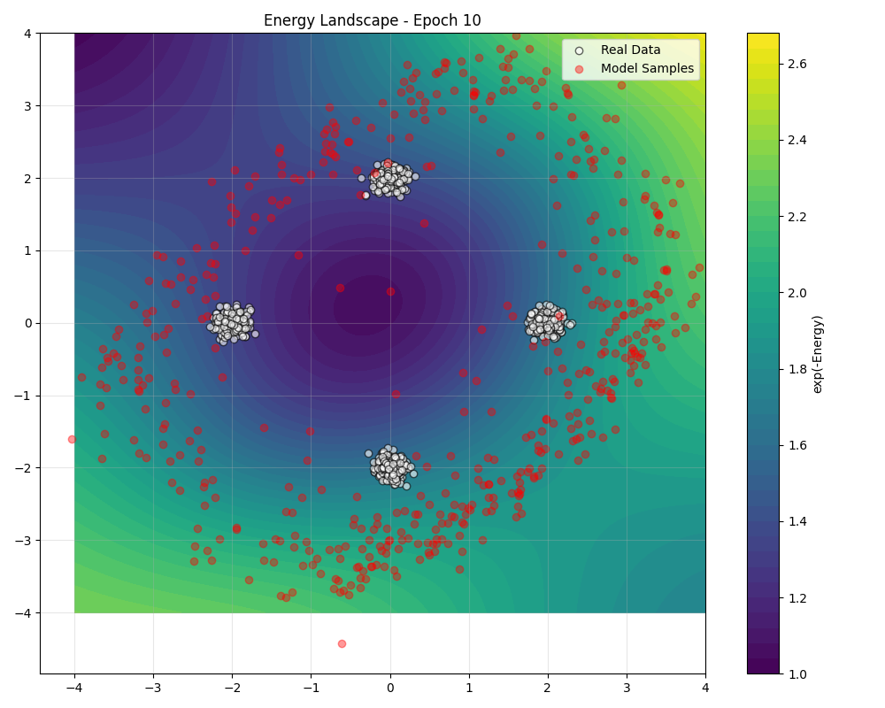

# Training an EBM on a Gaussian Mixture

This tutorial demonstrates how to train an energy-based model (EBM) on a 2D Gaussian mixture distribution using the TorchEBM library. We'll build a simple MLP-based energy function, train it with Contrastive Divergence, and visualize the results.

!!! tip "Key Concepts Covered"
    - Building an MLP-based energy function
    - Training with Contrastive Divergence
    - Sampling with Langevin dynamics
    - Visualizing the energy landscape and samples

## Overview

Energy-based models provide a flexible framework for modeling complex probability distributions. This tutorial focuses on a simple but illustrative example: learning a 2D Gaussian mixture distribution. This is a good starting point because:

1. It's easy to visualize in 2D
2. It has multimodal structure that challenges simple models
3. We can generate synthetic training data with known properties

## Prerequisites

Before starting, make sure you have TorchEBM installed:

```bash
pip install torchebm
```

We'll also use the following libraries:

```python
from pathlib import Path
import torch
import torch.nn as nn
import torch.optim as optim
import matplotlib.pyplot as plt
import numpy as np
from torchebm.core import BaseEnergyFunction
from torchebm.samplers import LangevinDynamics
from torchebm.losses import ContrastiveDivergence
```

## Step 1: Define the Energy Function

We'll create a simple MLP (Multi-Layer Perceptron) energy function by subclassing `BaseEnergyFunction`:

```python
class MLPEnergy(BaseEnergyFunction):
    """Simple MLP-based energy function for demonstration."""

    def __init__(self, input_dim, hidden_dim=64):
        super().__init__()
        self.net = nn.Sequential(
            nn.Linear(input_dim, hidden_dim),
            nn.SiLU(),  # Sigmoid Linear Unit (SiLU/Swish)
            nn.Linear(hidden_dim, hidden_dim),
            nn.SiLU(),
            nn.Linear(hidden_dim, 1),
        )

    def forward(self, x):
        """Compute energy values for input samples."""
        # Energy function should return scalar energy per sample
        return self.net(x).squeeze(-1)
```

This energy function maps input points to scalar energy values. Lower energy corresponds to higher probability density. Note that we're using the SiLU activation function (also known as Swish) instead of ReLU for smoother gradients.

## Step 2: Generate Target Data

Let's create a function to generate synthetic data from a mixture of Gaussians arranged in a circle:

```python
def generate_mixture_data(n_samples=1000, centers=None, std=0.1):
    """Generate samples from a mixture of 2D Gaussians."""
    if centers is None:
        # Default: 4 Gaussians in a circle
        radius = 2.0
        centers = [
            [radius * np.cos(angle), radius * np.sin(angle)]
            for angle in [0, np.pi / 2, np.pi, 3 * np.pi / 2]
        ]

    centers = torch.tensor(centers, dtype=torch.float32)
    n_components = len(centers)

    # Randomly pick components and generate samples
    data = []
    for _ in range(n_samples):
        idx = np.random.randint(0, n_components)
        sample = torch.randn(2) * std + centers[idx]
        data.append(sample)

    return torch.stack(data)
```

<div class="grid" markdown>

<div markdown>
We can visualize the generated data to see what our target distribution looks like:

```python
# Generate and plot data
real_data = generate_mixture_data(1000)
plt.figure(figsize=(6, 6))
plt.scatter(real_data[:, 0], real_data[:, 1], s=10, alpha=0.5)
plt.title("Target Distribution: 2D Gaussian Mixture")
plt.grid(True, alpha=0.3)
plt.show()
```
</div>

<div markdown>


*The target distribution consists of 4 Gaussian components arranged in a circle.*
</div>

</div>

## Step 3: Set Up the Visualization Function

Before we set up the training components, let's define a function to visualize the energy landscape and generated samples:

```python
def visualize_model(
    energy_fn, real_samples, model_samples=None, title="Energy Landscape", grid_size=100
):
    """Visualize the energy landscape and samples."""
    # Create a grid for evaluation
    x = torch.linspace(-4, 4, grid_size)
    y = torch.linspace(-4, 4, grid_size)
    xx, yy = torch.meshgrid(x, y, indexing="ij")
    grid_points = torch.stack([xx.flatten(), yy.flatten()], dim=1)

    # Move grid points to the same device as energy_fn
    device = next(energy_fn.parameters()).device
    grid_points = grid_points.to(device)

    # Compute energy on the grid
    with torch.no_grad():
        energies = energy_fn(grid_points).reshape(grid_size, grid_size).cpu()

    # Plot energy as a colormap
    plt.figure(figsize=(10, 8))
    energy_plot = plt.contourf(
        xx.cpu(), yy.cpu(), torch.exp(-energies), 50, cmap="viridis"
    )
    plt.colorbar(energy_plot, label="exp(-Energy)")

    # Plot real samples
    plt.scatter(
        real_samples[:, 0],
        real_samples[:, 1],
        color="white",
        edgecolor="black",
        alpha=0.6,
        label="Real Data",
    )

    # Plot model samples if provided
    if model_samples is not None:
        plt.scatter(
            model_samples[:, 0],
            model_samples[:, 1],
            color="red",
            alpha=0.4,
            label="Model Samples",
        )

    plt.title(title)
    plt.legend()
    plt.grid(alpha=0.3)
    plt.tight_layout()
    return plt
```

## Step 4: Set Up the Training Components

Now we'll set up the sampler, loss function, and optimizer for training:

```python
# Set random seed for reproducibility
torch.manual_seed(42)
np.random.seed(42)

# Set up output directory for saving figures
output_dir = Path("docs/assets/images/examples")
output_dir.mkdir(parents=True, exist_ok=True)

# Check for GPU availability
device = torch.device("cuda" if torch.cuda.is_available() else "cpu")

# Hyperparameters
INPUT_DIM = 2
HIDDEN_DIM = 64
BATCH_SIZE = 128
EPOCHS = 100
LEARNING_RATE = 0.001
SAMPLER_STEP_SIZE = 0.1
SAMPLER_NOISE_SCALE = 0.01  # Smaller noise scale for better stability
CD_STEPS = 10
USE_PCD = True  # Persistent Contrastive Divergence

# Generate synthetic data
real_data = generate_mixture_data(n_samples=1000)
# Move data to the correct device
real_data = real_data.to(device)

# Create the energy model
energy_model = MLPEnergy(input_dim=INPUT_DIM, hidden_dim=HIDDEN_DIM).to(device)

# Set up the Langevin dynamics sampler
sampler = LangevinDynamics(
    energy_function=energy_model,
    step_size=SAMPLER_STEP_SIZE,
    noise_scale=SAMPLER_NOISE_SCALE,
    device=device,
)

# Set up the Contrastive Divergence loss
cd_loss = ContrastiveDivergence(
    energy_function=energy_model,
    sampler=sampler,
    n_steps=CD_STEPS,
    persistent=USE_PCD,
    device=device,
)

# Optimizer
optimizer = optim.Adam(energy_model.parameters(), lr=LEARNING_RATE)
```

!!! info "Langevin Dynamics"
    Langevin dynamics is a sampling method that uses gradient information to explore the energy landscape. It adds noise to the gradient updates, allowing the sampler to overcome energy barriers and explore multimodal distributions.

!!! tip "Persistent Contrastive Divergence"
    Setting `persistent=True` enables Persistent Contrastive Divergence (PCD), which maintains a set of persistent chains between parameter updates. This can lead to better exploration of the energy landscape and improved training stability, especially for complex distributions.

## Step 5: The Training Loop

Now we're ready to train our energy-based model:

```python
# Create data loader
dataset = torch.utils.data.TensorDataset(real_data)
dataloader = torch.utils.data.DataLoader(
    dataset, batch_size=BATCH_SIZE, shuffle=True
)

# Training parameters
VISUALIZE_EVERY = 10

# Training loop
print("Starting training...")
for epoch in range(EPOCHS):
    epoch_loss = 0.0
    
    for i, (batch_data,) in enumerate(dataloader):
        batch_data = batch_data.to(device)
        
        # Zero gradients
        optimizer.zero_grad()
        
        # Compute CD loss and get negative samples
        loss, neg_samples = cd_loss(batch_data)
        
        # Backpropagate and update parameters
        loss.backward()
        optimizer.step()
        
        epoch_loss += loss.item()
    
    # Print progress
    avg_loss = epoch_loss / len(dataloader)
    print(f"Epoch {epoch+1}/{EPOCHS}, Loss: {avg_loss:.6f}")
    
    # Visualize progress periodically
    if (epoch + 1) % VISUALIZE_EVERY == 0:
        # Generate samples from the model for visualization
        with torch.no_grad():
            init_noise = torch.randn(500, INPUT_DIM, device=device)
            model_samples = sampler.sample_chain(init_noise, n_steps=100).cpu()
        
        # Visualize
        plt = visualize_model(
            energy_model,
            real_data.cpu(),
            model_samples.cpu(),
            title=f"Energy Landscape - Epoch {epoch+1}",
        )
        plt.savefig(output_dir / f"energy_landscape_epoch_{epoch+1}.png")
        plt.close()
```

## Training Progress Visualization

<div class="grid cards" markdown>

-   :material-image-frame:{ .lg .middle } __Epoch 10__

    ---

    

    *Early training: The model has begun to identify the four modes.*

-   :material-image-frame:{ .lg .middle } __Epoch 20__

    ---

    

    *Continued progress: The energy landscape is taking shape.*

-   :material-image-frame:{ .lg .middle } __Epoch 30__

    ---

    

    *Mid-training: The modes are becoming well-defined.*

-   :material-image-frame:{ .lg .middle } __Epoch 100__

    ---

    

    *Final model: The energy function has learned the four-mode structure.*

</div>

As training progresses, we can see how the energy landscape evolves to capture the four-mode structure of our target distribution. The brighter regions in the contour plot represent areas of higher probability density (lower energy), and the red points show samples drawn from the model.

## Step 6: Final Evaluation

After training, we generate a final set of samples from our model for evaluation:

```python
# Final visualization
with torch.no_grad():
    init_noise = torch.randn(1000, INPUT_DIM, device=device)
    model_samples = sampler.sample_chain(init_noise, n_steps=500).cpu()

plt = visualize_model(
    energy_model, real_data.cpu(), model_samples.cpu(), title="Final Energy Landscape"
)
plt.savefig(output_dir / "energy_landscape_final.png")
plt.show()
```

## Understanding the Results

The final energy landscape shows that our model has successfully learned the four-mode structure of the target distribution. The contour plot shows four distinct regions of low energy (high probability) corresponding to the four Gaussian components.

<div class="grid" markdown>

<div markdown>
The red points (samples from our model) closely match the distribution of the white points (real data), indicating that our energy-based model has effectively captured the target distribution.

This simple example demonstrates the core workflow for training energy-based models with TorchEBM:

1. Define an energy function
2. Set up a sampler for generating negative samples
3. Use Contrastive Divergence for training
4. Monitor progress through visualization
</div>

<div markdown>


*The final energy landscape shows that the model has successfully learned the four-mode structure of the target distribution.*
</div>

</div>

## Tips for Training EBMs

When training your own energy-based models, consider these tips:

<div class="grid cards" markdown>

-   :fontawesome-solid-bolt:{ .lg .middle } __Sampling Parameters__

    ---

    The step size and noise scale of the Langevin dynamics sampler are critical. Too large values can lead to unstable sampling, while too small values may result in poor mixing.

    ```python
    # Try different step sizes and noise scales
    step_size = 0.01  # Smaller for stability
    noise_scale = 0.005  # Smaller for more accurate sampling
    ```

-   :fontawesome-solid-sliders:{ .lg .middle } __CD Steps__

    ---

    The number of MCMC steps in Contrastive Divergence affects the quality of negative samples. More steps generally lead to better results but increase computation time.

    ```python
    # For complex distributions, use more steps
    cd_loss = ContrastiveDivergence(
        energy_function=energy_model,
        sampler=sampler,
        n_steps=20,  # Increase for better samples
        persistent=True
    )
    ```

-   :fontawesome-solid-gauge-high:{ .lg .middle } __Learning Rate__

    ---

    Energy-based models can be sensitive to the learning rate. Start with a smaller learning rate and gradually increase if needed.

    ```python
    # Use a smaller learning rate for stability
    optimizer = optim.Adam(
        energy_model.parameters(),
        lr=0.001,  # Start small
        weight_decay=1e-5  # Regularization helps
    )
    ```

-   :fontawesome-solid-network-wired:{ .lg .middle } __Activation Functions__

    ---

    The choice of activation function can affect the smoothness of the energy landscape.

    ```python
    # Try different activation functions
    self.net = nn.Sequential(
        nn.Linear(input_dim, hidden_dim),
        nn.SiLU(),  # Smoother than ReLU
        nn.Linear(hidden_dim, hidden_dim),
        nn.SiLU(),
        nn.Linear(hidden_dim, 1)
    )
    ```

</div>

## Conclusion

In this tutorial, we've learned how to:

1. Define a simple energy-based model using an MLP
2. Generate synthetic data from a 2D Gaussian mixture
3. Train the model using Contrastive Divergence and Langevin dynamics
4. Visualize the energy landscape and generated samples

Energy-based models provide a powerful and flexible framework for modeling complex probability distributions. While we've focused on a simple 2D example, the same principles apply to more complex, high-dimensional distributions.

## Complete Code

Here's the complete code for this example:

```python
from pathlib import Path
import torch
import torch.nn as nn
import torch.optim as optim
import matplotlib.pyplot as plt
import numpy as np

from torchebm.core import BaseEnergyFunction
from torchebm.samplers import LangevinDynamics
from torchebm.losses import ContrastiveDivergence


# 1. Define a simple energy function using MLP
class MLPEnergy(BaseEnergyFunction):
    """Simple MLP-based energy function for demonstration."""

    def __init__(self, input_dim, hidden_dim=64):
        super().__init__()
        self.net = nn.Sequential(
            nn.Linear(input_dim, hidden_dim),
            nn.SiLU(),  # Sigmoid Linear Unit (SiLU/Swish)
            nn.Linear(hidden_dim, hidden_dim),
            nn.SiLU(),
            nn.Linear(hidden_dim, 1),
        )

    def forward(self, x):
        """Compute energy values for input samples."""
        # Energy function should return scalar energy per sample
        return self.net(x).squeeze(-1)


# 2. Generate synthetic data (mixture of 2D Gaussians)
def generate_mixture_data(n_samples=1000, centers=None, std=0.1):
    """Generate samples from a mixture of 2D Gaussians."""
    if centers is None:
        # Default: 4 Gaussians in a circle
        radius = 2.0
        centers = [
            [radius * np.cos(angle), radius * np.sin(angle)]
            for angle in [0, np.pi / 2, np.pi, 3 * np.pi / 2]
        ]

    centers = torch.tensor(centers, dtype=torch.float32)
    n_components = len(centers)

    # Randomly pick components and generate samples
    data = []
    for _ in range(n_samples):
        idx = np.random.randint(0, n_components)
        sample = torch.randn(2) * std + centers[idx]
        data.append(sample)

    return torch.stack(data)


# 3. Utility function for visualization
def visualize_model(
    energy_fn, real_samples, model_samples=None, title="Energy Landscape", grid_size=100
):
    """Visualize the energy landscape and samples."""
    # Create a grid for evaluation
    x = torch.linspace(-4, 4, grid_size)
    y = torch.linspace(-4, 4, grid_size)
    xx, yy = torch.meshgrid(x, y, indexing="ij")
    grid_points = torch.stack([xx.flatten(), yy.flatten()], dim=1)

    # Move grid points to the same device as energy_fn
    device = next(energy_fn.parameters()).device
    grid_points = grid_points.to(device)

    # Compute energy on the grid
    with torch.no_grad():
        energies = energy_fn(grid_points).reshape(grid_size, grid_size).cpu()

    # Plot energy as a colormap
    plt.figure(figsize=(10, 8))
    energy_plot = plt.contourf(
        xx.cpu(), yy.cpu(), torch.exp(-energies), 50, cmap="viridis"
    )
    plt.colorbar(energy_plot, label="exp(-Energy)")

    # Plot real samples
    plt.scatter(
        real_samples[:, 0],
        real_samples[:, 1],
        color="white",
        edgecolor="black",
        alpha=0.6,
        label="Real Data",
    )

    # Plot model samples if provided
    if model_samples is not None:
        plt.scatter(
            model_samples[:, 0],
            model_samples[:, 1],
            color="red",
            alpha=0.4,
            label="Model Samples",
        )

    plt.title(title)
    plt.legend()
    plt.grid(alpha=0.3)
    plt.tight_layout()
    return plt


def main():
    # Set random seed for reproducibility
    torch.manual_seed(42)
    np.random.seed(42)

    # Ensure output directory exists
    output_dir = Path("docs/assets/images/examples")
    output_dir.parent.mkdir(parents=True, exist_ok=True)
    output_dir.mkdir(exist_ok=True)

    # Check for GPU availability
    device = torch.device("cuda" if torch.cuda.is_available() else "cpu")
    print(f"Using device: {device}")

    # Generate synthetic data
    real_data = generate_mixture_data(n_samples=1000)
    # Move data to the correct device
    real_data = real_data.to(device)

    print(f"Generated {len(real_data)} samples from mixture of Gaussians")

    # Define model components
    input_dim = 2
    hidden_dim = 64

    # Create the energy function
    energy_fn = MLPEnergy(input_dim=input_dim, hidden_dim=hidden_dim).to(device)

    # Create the sampler (Langevin dynamics)
    sampler = LangevinDynamics(
        energy_function=energy_fn,
        step_size=0.1,  # Step size for Langevin updates
        noise_scale=0.01,  # Noise scale for stochastic gradient Langevin dynamics
        device=device,
    )

    # Create the Contrastive Divergence loss
    cd_loss = ContrastiveDivergence(
        energy_function=energy_fn,
        sampler=sampler,
        n_steps=10,  # Run MCMC for 10 steps per iteration
        persistent=True,  # Use persistent chains for better mixing
        device=device,
    )

    # Create optimizer
    optimizer = optim.Adam(energy_fn.parameters(), lr=0.001)

    # Training parameters
    num_epochs = 100
    batch_size = 128

    # Create data loader
    dataset = torch.utils.data.TensorDataset(real_data)
    dataloader = torch.utils.data.DataLoader(
        dataset, batch_size=batch_size, shuffle=True
    )

    # Training loop
    print("Starting training...")
    for epoch in range(num_epochs):
        epoch_loss = 0.0

        for i, (batch_data,) in enumerate(dataloader):
            batch_data = batch_data.to(device)

            # Zero gradients
            optimizer.zero_grad()

            # Compute CD loss and get negative samples
            loss, neg_samples = cd_loss(batch_data)

            # Backpropagate and update parameters
            loss.backward()
            optimizer.step()

            epoch_loss += loss.item()

        # Print progress
        avg_loss = epoch_loss / len(dataloader)
        print(f"Epoch {epoch+1}/{num_epochs}, Loss: {avg_loss:.6f}")

        # Visualize intermediate results every 10 epochs
        if (epoch + 1) % 10 == 0:
            # Generate samples from the model for visualization
            with torch.no_grad():
                init_noise = torch.randn(500, input_dim, device=device)
                model_samples = sampler.sample_chain(init_noise, n_steps=100).cpu()

            # Visualize
            plt = visualize_model(
                energy_fn,
                real_data.cpu(),
                model_samples.cpu(),
                title=f"Energy Landscape - Epoch {epoch+1}",
            )
            plt.savefig(output_dir / f"energy_landscape_epoch_{epoch+1}.png")
            plt.close()

    print("Training complete!")

    # Final visualization
    with torch.no_grad():
        init_noise = torch.randn(1000, input_dim, device=device)
        model_samples = sampler.sample_chain(init_noise, n_steps=500).cpu()

    plt = visualize_model(
        energy_fn, real_data.cpu(), model_samples.cpu(), title="Final Energy Landscape"
    )
    plt.savefig(output_dir / "energy_landscape_final.png")
    plt.show()


if __name__ == "__main__":
    main()
```