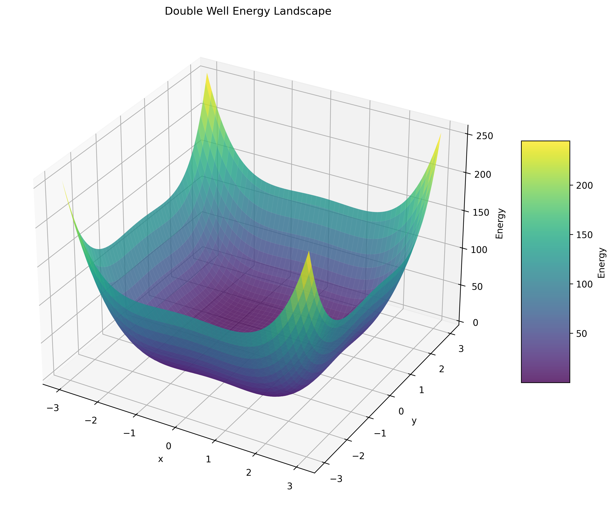
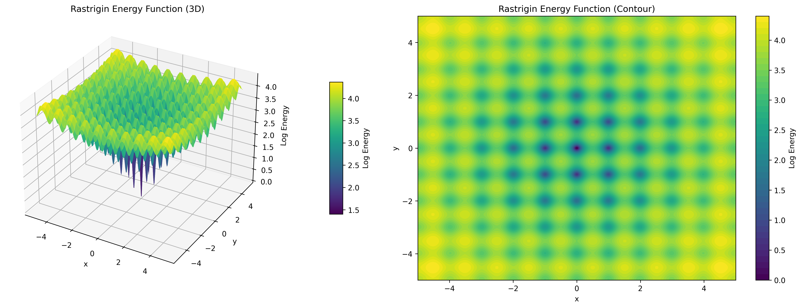
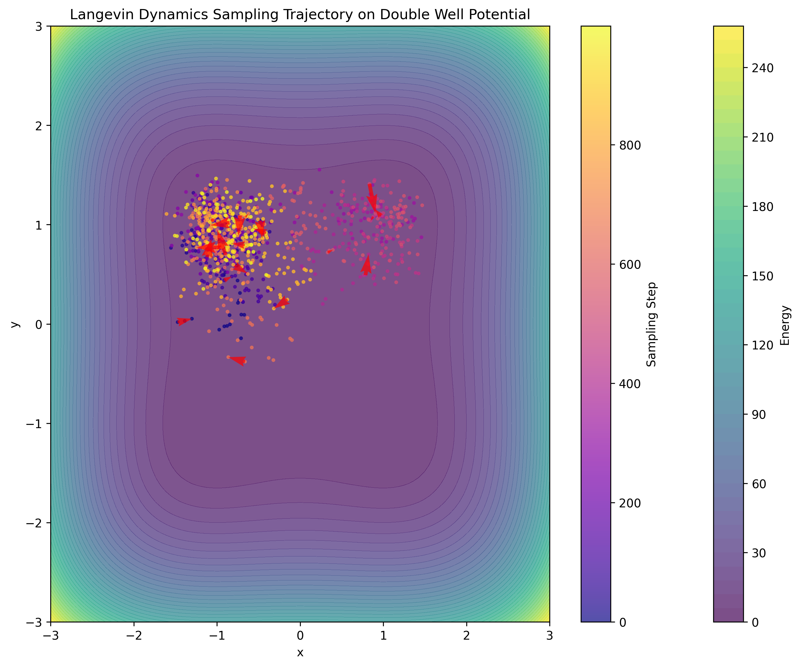
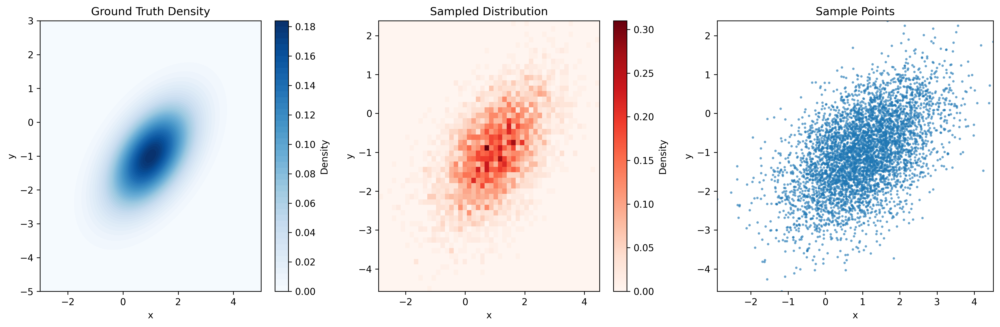
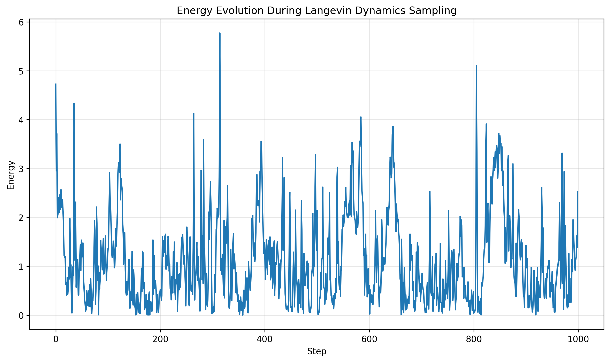
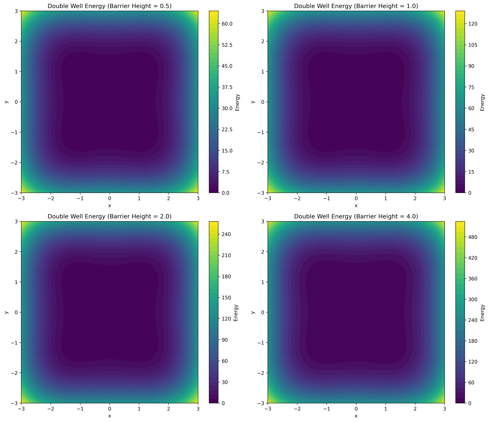

# Visualization in TorchEBM

Data visualization is an essential tool for understanding, analyzing, and communicating the behavior of energy-based models. This guide covers various visualization techniques available in TorchEBM to help you gain insights into energy landscapes, sampling processes, and model performance.

## Energy Landscape Visualization

Visualizing energy landscapes is crucial for understanding the structure of the probability distribution you're working with. TorchEBM provides utilities to create both 2D and 3D visualizations of energy functions.

### Basic Energy Landscape Visualization

Here's a simple example to visualize a 2D energy function:

```python
import torch
import numpy as np
import matplotlib.pyplot as plt
from torchebm.core import DoubleWellEnergy

# Create the energy function
energy_fn = DoubleWellEnergy(barrier_height=2.0)

# Create a grid for visualization
x = np.linspace(-3, 3, 100)
y = np.linspace(-3, 3, 100)
X, Y = np.meshgrid(x, y)
Z = np.zeros_like(X)

# Compute energy values
for i in range(X.shape[0]):
    for j in range(X.shape[1]):
        point = torch.tensor([X[i, j], Y[i, j]], dtype=torch.float32).unsqueeze(0)
        Z[i, j] = energy_fn(point).item()

# Create 3D surface plot
fig = plt.figure(figsize=(10, 8))
ax = fig.add_subplot(111, projection='3d')
surf = ax.plot_surface(X, Y, Z, cmap='viridis', alpha=0.8)
ax.set_xlabel('x')
ax.set_ylabel('y')
ax.set_zlabel('Energy')
ax.set_title('Double Well Energy Landscape')
plt.colorbar(surf, ax=ax, shrink=0.5, aspect=5)
plt.tight_layout()
plt.show()
```



### Advanced Energy Landscape Visualization

For more advanced visualizations, you can combine contour plots with 3D surfaces:

```python
import torch
import numpy as np
import matplotlib.pyplot as plt
from mpl_toolkits.mplot3d import Axes3D
from matplotlib import cm
from torchebm.core import RastriginEnergy

# Create energy function
energy_fn = RastriginEnergy(a=10.0)

# Create a grid
resolution = 200
x = np.linspace(-5, 5, resolution)
y = np.linspace(-5, 5, resolution)
X, Y = np.meshgrid(x, y)
Z = np.zeros_like(X)

# Compute energy values
for i in range(X.shape[0]):
    for j in range(X.shape[1]):
        point = torch.tensor([X[i, j], Y[i, j]], dtype=torch.float32).unsqueeze(0)
        Z[i, j] = energy_fn(point).item()

# Apply log-scaling for better visualization
Z_vis = np.log(Z - np.min(Z) + 1)

# Create figure with two subplots
fig = plt.figure(figsize=(16, 6))

# 3D surface plot
ax1 = fig.add_subplot(121, projection='3d')
surf = ax1.plot_surface(X, Y, Z_vis, cmap=cm.viridis, linewidth=0, antialiased=True)
ax1.set_title('Rastrigin Energy Function (3D)')
ax1.set_xlabel('x')
ax1.set_ylabel('y')
ax1.set_zlabel('Log Energy')

# 2D contour plot
ax2 = fig.add_subplot(122)
contour = ax2.contourf(X, Y, Z_vis, 50, cmap=cm.viridis)
ax2.set_title('Rastrigin Energy Function (Contour)')
ax2.set_xlabel('x')
ax2.set_ylabel('y')
fig.colorbar(contour, ax=ax2, label='Log Energy')

plt.tight_layout()
plt.show()
```



## Sampling Trajectory Visualization

Visualizing the trajectory of sampling algorithms can provide insights into their behavior and convergence properties.

### Visualizing Langevin Dynamics Trajectories

```python
import torch
import numpy as np
import matplotlib.pyplot as plt
from torchebm.core import DoubleWellEnergy
from torchebm.samplers.langevin_dynamics import LangevinDynamics

# Create energy function and sampler
energy_fn = DoubleWellEnergy(barrier_height=2.0)
sampler = LangevinDynamics(
    energy_function=energy_fn,
    step_size=0.01
)

# We'll manually track the trajectory in a 2D space
dim = 2
n_steps = 1000
initial_point = torch.tensor([[-2.0, 0.0]], dtype=torch.float32)

# Track the trajectory manually
trajectory = torch.zeros((1, n_steps, dim))
current_sample = initial_point

# Run the sampling steps and store each position
for i in range(n_steps):
    current_sample = sampler.langevin_step(current_sample, torch.randn_like(current_sample))
    trajectory[:, i, :] = current_sample.clone().detach()

# Prepare the background energy landscape
x = np.linspace(-3, 3, 100)
y = np.linspace(-3, 3, 100)
X, Y = np.meshgrid(x, y)
Z = np.zeros_like(X)

for i in range(X.shape[0]):
    for j in range(X.shape[1]):
        point = torch.tensor([X[i, j], Y[i, j]], dtype=torch.float32).unsqueeze(0)
        Z[i, j] = energy_fn(point).item()

# Plot contour with trajectory
plt.figure(figsize=(10, 8))
contour = plt.contourf(X, Y, Z, 50, cmap='viridis', alpha=0.7)
plt.colorbar(label='Energy')

# Extract trajectory coordinates
traj_x = trajectory[0, :, 0].numpy()
traj_y = trajectory[0, :, 1].numpy()

# Plot trajectory with colormap based on step number
points = plt.scatter(
    traj_x, traj_y, 
    c=np.arange(len(traj_x)),
    cmap='plasma',
    s=5,
    alpha=0.7
)
plt.colorbar(points, label='Sampling Step')

# Plot arrows to show direction of trajectory
step = 50  # Plot an arrow every 50 steps
plt.quiver(
    traj_x[:-1:step], traj_y[:-1:step],
    traj_x[1::step] - traj_x[:-1:step], traj_y[1::step] - traj_y[:-1:step],
    scale_units='xy', angles='xy', scale=1, color='red', alpha=0.7
)

plt.xlabel('x')
plt.ylabel('y')
plt.title('Langevin Dynamics Sampling Trajectory on Double Well Potential')
plt.tight_layout()
plt.show()
```



### Visualizing Multiple Chains

```python
import torch
import numpy as np
import matplotlib.pyplot as plt
from torchebm.core import RastriginEnergy
from torchebm.samplers.langevin_dynamics import LangevinDynamics

# Create energy function and sampler
energy_fn = RastriginEnergy(a=10.0)
sampler = LangevinDynamics(
    energy_function=energy_fn,
    step_size=0.01
)

# Set random seed for reproducibility
torch.manual_seed(42)
np.random.seed(42)

# Parameters for sampling
dim = 2
n_steps = 1000
num_chains = 5

# Generate random starting points
initial_points = torch.randn(num_chains, dim) * 3  

# Track the trajectories manually
trajectories = torch.zeros((num_chains, n_steps, dim))
current_samples = initial_points.clone()

# Run the sampling steps and store each position
for i in range(n_steps):
    current_samples = sampler.langevin_step(current_samples, torch.randn_like(current_samples))
    trajectories[:, i, :] = current_samples.clone().detach()

# Create background contour
x = np.linspace(-5, 5, 100)
y = np.linspace(-5, 5, 100)
X, Y = np.meshgrid(x, y)
Z = np.zeros_like(X)

for i in range(X.shape[0]):
    for j in range(X.shape[1]):
        point = torch.tensor([X[i, j], Y[i, j]], dtype=torch.float32).unsqueeze(0)
        Z[i, j] = energy_fn(point).item()

# Plot contour
plt.figure(figsize=(12, 10))
contour = plt.contourf(X, Y, Z, 50, cmap='viridis', alpha=0.7)
plt.colorbar(label='Energy')

# Plot each trajectory with a different color
colors = ['red', 'blue', 'green', 'orange', 'purple']
for i in range(num_chains):
    traj_x = trajectories[i, :, 0].numpy()
    traj_y = trajectories[i, :, 1].numpy()
    
    plt.plot(traj_x, traj_y, alpha=0.7, linewidth=1, c=colors[i], 
             label=f'Chain {i+1}')
    
    # Mark start and end points
    plt.scatter(traj_x[0], traj_y[0], c='black', s=50, marker='o')
    plt.scatter(traj_x[-1], traj_y[-1], c=colors[i], s=100, marker='*')

plt.xlabel('x')
plt.ylabel('y')
plt.title('Multiple Langevin Dynamics Sampling Chains on Rastrigin Potential')
plt.legend()
plt.tight_layout()
plt.show()
```


## Distribution Visualization

Visualizing the distribution of samples can help assess the quality of your sampling algorithm.

### Comparing Generated Samples with Ground Truth

```python
import torch
import numpy as np
import matplotlib.pyplot as plt
from scipy import stats
from torchebm.core import GaussianEnergy
from torchebm.samplers.langevin_dynamics import LangevinDynamics

# Create a Gaussian energy function
mean = torch.tensor([1.0, -1.0])
cov = torch.tensor([[1.0, 0.5], [0.5, 1.0]])
energy_fn = GaussianEnergy(mean=mean, cov=cov)

# Sample using Langevin dynamics
sampler = LangevinDynamics(
    energy_function=energy_fn,
    step_size=0.01
)

# Generate samples
n_samples = 5000
dim = 2
n_steps = 1000
burn_in = 200

# Initialize random samples
x = torch.randn(n_samples, dim)

# Run sampling for burn-in period (discard these samples)
for i in range(burn_in):
    x = sampler.langevin_step(x, torch.randn_like(x))

# Run sampling for the desired number of steps
for i in range(n_steps):
    x = sampler.langevin_step(x, torch.randn_like(x))

# Final samples
samples = x

# Convert to numpy for visualization
samples_np = samples.numpy()
mean_np = mean.numpy()
cov_np = cov.numpy()

# Create a grid for the ground truth density
x = np.linspace(-3, 5, 100)
y = np.linspace(-5, 3, 100)
X, Y = np.meshgrid(x, y)
pos = np.dstack((X, Y))

# Calculate multivariate normal PDF
rv = stats.multivariate_normal(mean_np, cov_np)
Z = rv.pdf(pos)

# Create figure with multiple plots
fig = plt.figure(figsize=(15, 5))

# Ground truth contour
ax1 = fig.add_subplot(131)
ax1.contourf(X, Y, Z, 50, cmap='Blues')
ax1.set_title('Ground Truth Density')
ax1.set_xlabel('x')
ax1.set_ylabel('y')

# Sample density (using kernel density estimation)
ax2 = fig.add_subplot(132)
h = ax2.hist2d(samples_np[:, 0], samples_np[:, 1], bins=50, cmap='Reds', density=True)
plt.colorbar(h[3], ax=ax2, label='Density')
ax2.set_title('Sampled Distribution')
ax2.set_xlabel('x')
ax2.set_ylabel('y')

# Scatter plot of samples
ax3 = fig.add_subplot(133)
ax3.scatter(samples_np[:, 0], samples_np[:, 1], alpha=0.5, s=3)
ax3.set_title('Sample Points')
ax3.set_xlabel('x')
ax3.set_ylabel('y')
ax3.set_xlim(ax2.get_xlim())
ax3.set_ylim(ax2.get_ylim())

plt.tight_layout()
plt.show()
```



## Energy Evolution Visualization

Tracking how energy values evolve during sampling can help assess convergence.

```python
import torch
import matplotlib.pyplot as plt
from torchebm.core import DoubleWellEnergy
from torchebm.samplers.langevin_dynamics import LangevinDynamics

# Create energy function and sampler
energy_fn = DoubleWellEnergy(barrier_height=2.0)
sampler = LangevinDynamics(
    energy_function=energy_fn,
    step_size=0.01
)

# Parameters for sampling
dim = 2
n_steps = 1000
initial_point = torch.tensor([[-2.0, 0.0]], dtype=torch.float32)

# Track the trajectory and energy manually
trajectory = torch.zeros((1, n_steps, dim))
energy_values = torch.zeros(n_steps)
current_sample = initial_point.clone()

# Run the sampling steps and store each position and energy
for i in range(n_steps):
    current_sample = sampler.langevin_step(current_sample, torch.randn_like(current_sample))
    trajectory[:, i, :] = current_sample.clone().detach()
    energy_values[i] = energy_fn(current_sample).item()

# Convert to numpy for plotting
energy_values_np = energy_values.numpy()

# Plot energy evolution
plt.figure(figsize=(10, 6))
plt.plot(energy_values_np)
plt.xlabel('Step')
plt.ylabel('Energy')
plt.title('Energy Evolution During Langevin Dynamics Sampling')
plt.grid(True, alpha=0.3)
plt.tight_layout()
plt.show()
```



## Interactive Visualizations

Since actual interactive visualizations can't be included in documentation, here's an example showing energy landscapes with different parameters:

```python
import numpy as np
import torch
import matplotlib.pyplot as plt
from torchebm.core import DoubleWellEnergy

# Create a grid for visualization
x = np.linspace(-3, 3, 100)
y = np.linspace(-3, 3, 100)
X, Y = np.meshgrid(x, y)
Z = np.zeros_like(X)

# Create barrier height values
barrier_heights = [0.5, 1.0, 2.0, 4.0]

# Create a figure with multiple subplots
fig, axes = plt.subplots(2, 2, figsize=(14, 12))
axes = axes.flatten()

# Calculate energy landscapes for different barrier heights
for i, barrier_height in enumerate(barrier_heights):
    # Create energy function with the specified barrier height
    energy_fn = DoubleWellEnergy(barrier_height=barrier_height)
    
    # Compute energy values
    for j in range(X.shape[0]):
        for k in range(X.shape[1]):
            point = torch.tensor([X[j, k], Y[j, k]], dtype=torch.float32).unsqueeze(0)
            Z[j, k] = energy_fn(point).item()
    
    # Create contour plot
    contour = axes[i].contourf(X, Y, Z, 50, cmap='viridis')
    fig.colorbar(contour, ax=axes[i], label='Energy')
    axes[i].set_xlabel('x')
    axes[i].set_ylabel('y')
    axes[i].set_title(f'Double Well Energy (Barrier Height = {barrier_height})')

plt.tight_layout()
plt.show()
```



## Conclusion

Effective visualization is key to understanding and debugging energy-based models. TorchEBM provides tools for visualizing energy landscapes, sampling trajectories, and model performance. These visualizations can help you gain insights into your models and improve their design and performance.

Remember to adapt these examples to your specific needs - you might want to visualize higher-dimensional spaces using dimensionality reduction techniques, or create specialized plots for your particular application. 