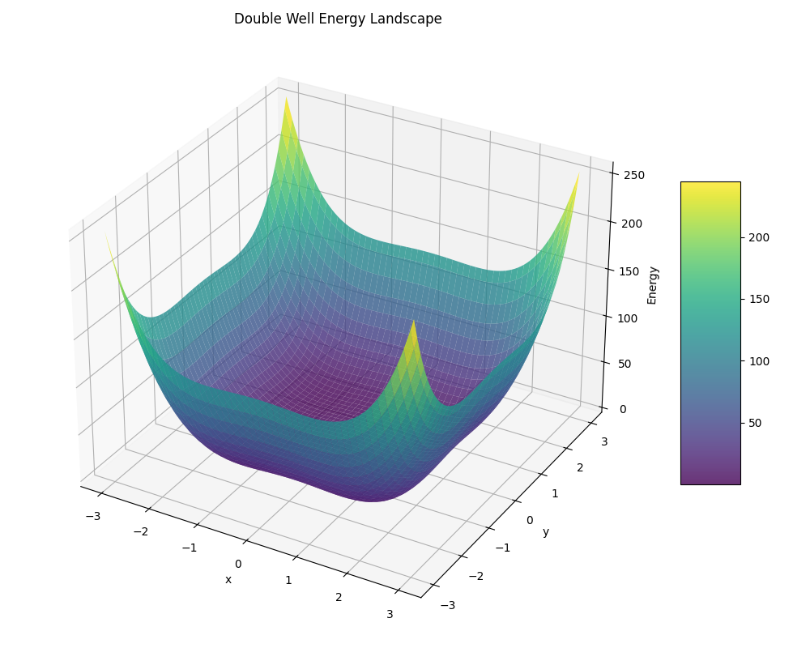
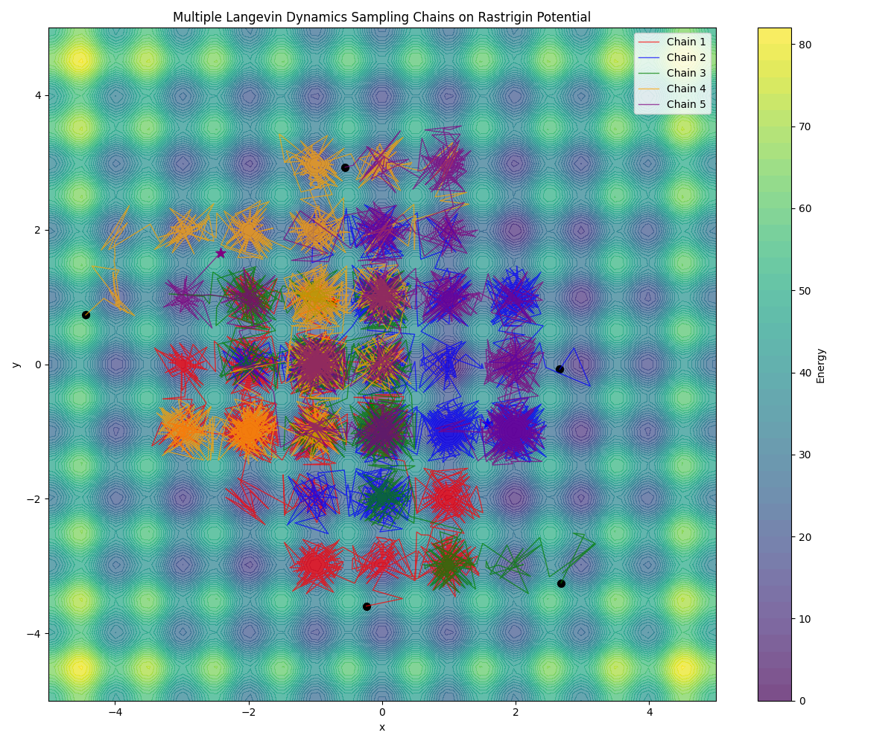
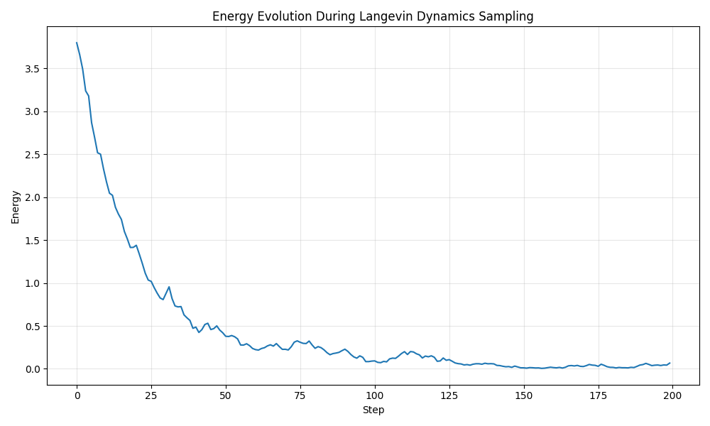

# Visualization in TorchEBM

Data visualization is an essential tool for understanding, analyzing, and communicating the behavior of energy-based models. This guide covers various visualization techniques available in TorchEBM to help you gain insights into energy landscapes, sampling processes, and model performance.

## Energy Landscape Visualization

Visualizing energy landscapes is crucial for understanding the structure of the probability distribution you're working with. TorchEBM provides utilities to create both 2D and 3D visualizations of energy functions.

### Basic Energy Landscape Visualization

Here's a simple example to visualize a 2D energy function:

```python
import torch
import numpy as np
import matplotlib.pyplot as plt
from torchebm.core import DoubleWellEnergy

# Create the energy function
energy_fn = DoubleWellEnergy(barrier_height=2.0)

# Create a grid for visualization
x = np.linspace(-3, 3, 100)
y = np.linspace(-3, 3, 100)
X, Y = np.meshgrid(x, y)
Z = np.zeros_like(X)

# Compute energy values
for i in range(X.shape[0]):
    for j in range(X.shape[1]):
        point = torch.tensor([X[i, j], Y[i, j]], dtype=torch.float32).unsqueeze(0)
        Z[i, j] = energy_fn(point).item()

# Create 3D surface plot
fig = plt.figure(figsize=(10, 8))
ax = fig.add_subplot(111, projection='3d')
surf = ax.plot_surface(X, Y, Z, cmap='viridis', alpha=0.8)
ax.set_xlabel('x')
ax.set_ylabel('y')
ax.set_zlabel('Energy')
ax.set_title('Double Well Energy Landscape')
plt.colorbar(surf, ax=ax, shrink=0.5, aspect=5)
plt.tight_layout()
plt.show()
```



### Visualizing Energy as Probability Density

Often, it's more intuitive to visualize the probability density (exp(-Energy)) rather than the energy itself:

```python
import torch
import numpy as np
import matplotlib.pyplot as plt
from torchebm.core import DoubleWellEnergy

# Create the energy function
energy_fn = DoubleWellEnergy(barrier_height=2.0)

# Create a grid for visualization
grid_size = 100
plot_range = 3.0
x_coords = np.linspace(-plot_range, plot_range, grid_size)
y_coords = np.linspace(-plot_range, plot_range, grid_size)
X, Y = np.meshgrid(x_coords, y_coords)
Z = np.zeros_like(X)

# Compute energy values
for i in range(X.shape[0]):
    for j in range(X.shape[1]):
        point = torch.tensor([X[i, j], Y[i, j]], dtype=torch.float32).unsqueeze(0)
        Z[i, j] = energy_fn(point).item()

# Convert energy to probability density (unnormalized)
# Subtract max for numerical stability before exponentiating
log_prob_values = -Z
log_prob_values = log_prob_values - np.max(log_prob_values)
prob_density = np.exp(log_prob_values)

# Create contour plot
plt.figure(figsize=(10, 8))
contour = plt.contourf(X, Y, prob_density, levels=50, cmap='viridis')
plt.colorbar(label='exp(-Energy) (unnormalized density)')
plt.xlabel('X1')
plt.ylabel('X2')
plt.title('Double Well Probability Density')
plt.grid(True, alpha=0.3)
plt.tight_layout()
plt.show()
```


## Sampling Trajectory Visualization

Visualizing the trajectory of sampling algorithms can provide insights into their behavior and convergence properties.

### Visualizing Langevin Dynamics Trajectories

```python
from torchebm.core import DoubleWellEnergy, LinearScheduler, WarmupScheduler
from torchebm.samplers import LangevinDynamics

# Create energy function and sampler
energy_fn = DoubleWellEnergy(barrier_height=5.0)

# Define a cosine scheduler for the Langevin dynamics
scheduler_linear = LinearScheduler(
    initial_value=0.05,
    final_value=0.03,
    total_steps=100
)

scheduler = WarmupScheduler(
    main_scheduler=scheduler_linear,
    warmup_steps=10,
    warmup_init_factor=0.01
)

sampler = LangevinDynamics(
    energy_function=energy_fn,
    step_size=scheduler

)

# Initial point
initial_point = torch.tensor([[-2.0, 0.0]], dtype=torch.float32)

# Run sampling and get trajectory
trajectory = sampler.sample(
    x=initial_point,
    dim=2,
    n_steps=1000,
    return_trajectory=True
)

# Background energy landscape
x = np.linspace(-3, 3, 100)
y = np.linspace(-3, 3, 100)
X, Y = np.meshgrid(x, y)
Z = np.zeros_like(X)

for i in range(X.shape[0]):
    for j in range(X.shape[1]):
        point = torch.tensor([X[i, j], Y[i, j]], dtype=torch.float32).unsqueeze(0)
        Z[i, j] = energy_fn(point).item()

# Visualize
plt.figure(figsize=(10, 8))
plt.contourf(X, Y, Z, 50, cmap='viridis', alpha=0.7)
plt.colorbar(label='Energy')

# Extract trajectory coordinates
traj_x = trajectory[0, :, 0].numpy()
traj_y = trajectory[0, :, 1].numpy()

# Plot trajectory
plt.plot(traj_x, traj_y, 'r-', linewidth=1, alpha=0.7)
plt.scatter(traj_x[0], traj_y[0], c='black', s=50, marker='o', label='Start')
plt.scatter(traj_x[-1], traj_y[-1], c='blue', s=50, marker='*', label='End')

plt.xlabel('x')
plt.ylabel('y')
plt.title('Langevin Dynamics Trajectory')
plt.legend()
plt.grid(True, alpha=0.3)
plt.savefig('langevin_trajectory.png')
plt.show()
```


### Visualizing Multiple Chains

```python
import torch
import numpy as np
import matplotlib.pyplot as plt
from torchebm.core import RastriginEnergy
from torchebm.samplers import LangevinDynamics

# Set random seed for reproducibility
torch.manual_seed(44)
np.random.seed(43)

# Create energy function and sampler
energy_fn = RastriginEnergy(a=10.0)
sampler = LangevinDynamics(
    energy_function=energy_fn,
    step_size=0.008
)

# Parameters for sampling
dim = 2
n_steps = 1000
num_chains = 5

# Generate random starting points
initial_points = torch.randn(num_chains, dim) * 3

# Run sampling and get trajectory
trajectories = sampler.sample(
    x=initial_points,
    dim=dim,
    n_samples=num_chains,
    n_steps=n_steps,
    return_trajectory=True
)

# Create background contour
x = np.linspace(-5, 5, 100)
y = np.linspace(-5, 5, 100)
X, Y = np.meshgrid(x, y)
Z = np.zeros_like(X)
print(trajectories.shape)

for i in range(X.shape[0]):
    for j in range(X.shape[1]):
        point = torch.tensor([X[i, j], Y[i, j]], dtype=torch.float32).unsqueeze(0)
        Z[i, j] = energy_fn(point).item()

# Plot contour
plt.figure(figsize=(12, 10))
contour = plt.contourf(X, Y, Z, 50, cmap='viridis', alpha=0.7)
plt.colorbar(label='Energy')

# Plot each trajectory with a different color
colors = ['red', 'blue', 'green', 'orange', 'purple']
for i in range(num_chains):
    traj_x = trajectories[i, :, 0].numpy()
    traj_y = trajectories[i, :, 1].numpy()

    plt.plot(traj_x, traj_y, alpha=0.7, linewidth=1, c=colors[i],
             label=f'Chain {i + 1}')

    # Mark start and end points
    plt.scatter(traj_x[0], traj_y[0], c='black', s=50, marker='o')
    plt.scatter(traj_x[-1], traj_y[-1], c=colors[i], s=100, marker='*')

plt.xlabel('x')
plt.ylabel('y')
plt.title('Multiple Langevin Dynamics Sampling Chains on Rastrigin Potential')
plt.legend()
plt.tight_layout()
plt.savefig('multiple_chains.png')
plt.show()
```



## Distribution Visualization

Visualizing the distribution of samples can help assess the quality of your sampling algorithm.

### Comparing Generated Samples with Ground Truth

```python
import torch
import numpy as np
import matplotlib.pyplot as plt
from scipy import stats
from torchebm.core import GaussianEnergy
from torchebm.samplers import LangevinDynamics

# Create a Gaussian energy function
mean = torch.tensor([1.0, -1.0])
cov = torch.tensor([[1.0, 0.5], [0.5, 1.0]])
energy_fn = GaussianEnergy(mean=mean, cov=cov)

# Sample using Langevin dynamics
sampler = LangevinDynamics(
    energy_function=energy_fn,
    step_size=0.01
)

# Generate samples
n_samples = 5000
burn_in = 200

# Initialize random samples
x = torch.randn(n_samples, 2)

# Perform sampling
samples = sampler.sample(
    x=x,
    n_steps=1000,
    burn_in=burn_in,
    return_trajectory=False
)

# Convert to numpy for visualization
samples_np = samples.numpy()
mean_np = mean.numpy()
cov_np = cov.numpy()

# Create a grid for the ground truth density
x = np.linspace(-3, 5, 100)
y = np.linspace(-5, 3, 100)
X, Y = np.meshgrid(x, y)
pos = np.dstack((X, Y))

# Calculate multivariate normal PDF
rv = stats.multivariate_normal(mean_np, cov_np)
Z = rv.pdf(pos)

# Create figure with multiple plots
fig = plt.figure(figsize=(15, 5))

# Ground truth contour
ax1 = fig.add_subplot(131)
ax1.contourf(X, Y, Z, 50, cmap='Blues')
ax1.set_title('Ground Truth Density')
ax1.set_xlabel('x')
ax1.set_ylabel('y')

# Sample density (using kernel density estimation)
ax2 = fig.add_subplot(132)
h = ax2.hist2d(samples_np[:, 0], samples_np[:, 1], bins=50, cmap='Reds', density=True)
plt.colorbar(h[3], ax=ax2, label='Density')
ax2.set_title('Sampled Distribution')
ax2.set_xlabel('x')
ax2.set_ylabel('y')

# Scatter plot of samples
ax3 = fig.add_subplot(133)
ax3.scatter(samples_np[:, 0], samples_np[:, 1], alpha=0.5, s=3)
ax3.set_title('Sample Points')
ax3.set_xlabel('x')
ax3.set_ylabel('y')
ax3.set_xlim(ax2.get_xlim())
ax3.set_ylim(ax2.get_ylim())

plt.tight_layout()
plt.savefig('distribution_comparison_updated.png')
plt.show()
```


## Energy Evolution Visualization

Tracking how energy values evolve during sampling can help assess convergence.

```python
import numpy as np
import torch
import matplotlib.pyplot as plt
from torchebm.core import DoubleWellEnergy, GaussianEnergy, CosineScheduler
from torchebm.samplers import LangevinDynamics


SAMPLER_STEP_SIZE = CosineScheduler(
    initial_value=1e-2, final_value=1e-3, total_steps=50
)

SAMPLER_NOISE_SCALE = CosineScheduler(
    initial_value=2e-1, final_value=1e-2, total_steps=50
)

# Create energy function and sampler
energy_fn = GaussianEnergy(mean=torch.tensor([0.0, 0.0]), cov=torch.eye(2) * 0.5)
sampler = LangevinDynamics(
    energy_function=energy_fn,
    step_size=SAMPLER_STEP_SIZE,
    noise_scale=SAMPLER_NOISE_SCALE
)

# Parameters for sampling
dim = 2
n_steps = 200
initial_point = torch.tensor([[-2.0, 0.0]], dtype=torch.float32)

# Track the energy during sampling
energy_values = []
current_sample = initial_point.clone()

# Run the sampling steps and store each energy
for i in range(n_steps):
    noise = torch.randn_like(current_sample)
    current_sample = sampler.langevin_step(current_sample, noise)
    energy_values.append(energy_fn(current_sample).item())

# Convert to numpy for plotting
energy_values_np = np.array(energy_values)

# Plot energy evolution
plt.figure(figsize=(10, 6))
plt.plot(energy_values_np)
plt.xlabel('Step')
plt.ylabel('Energy')
plt.title('Energy Evolution During Langevin Dynamics Sampling')
plt.grid(True, alpha=0.3)
plt.tight_layout()
plt.savefig('energy_evolution_updated.png')
plt.show()

```



## Visualizing Training Progress with Different Loss Functions

You can also visualize how different loss functions affect the training dynamics:

```python
import torch
import numpy as np
import matplotlib.pyplot as plt
from torchebm.core import BaseEnergyFunction
from torchebm.losses import ContrastiveDivergence, ScoreMatching
from torchebm.samplers import LangevinDynamics
from torchebm.datasets import TwoMoonsDataset
import torch.nn as nn
import torch.optim as optim

# Define a simple MLP energy function
class MLPEnergy(BaseEnergyFunction):
    def __init__(self, input_dim, hidden_dim=64):
        super().__init__()
        self.network = nn.Sequential(
            nn.Linear(input_dim, hidden_dim),
            nn.SELU(),
            nn.Linear(hidden_dim, hidden_dim),
            nn.SELU(),
            nn.Linear(hidden_dim, 1)
        )
    
    def forward(self, x):
        return self.network(x).squeeze(-1)

# Training function
def train_and_record_loss(loss_type, n_epochs=100):
    # Reset model
    energy_model = MLPEnergy(input_dim=2, hidden_dim=32).to(device)
    
    # Setup sampler and loss
    sampler = LangevinDynamics(
        energy_function=energy_model,
        step_size=0.1,
        device=device
    )
    
    if loss_type == 'CD':
        loss_fn = ContrastiveDivergence(
            energy_function=energy_model,
            sampler=sampler,
            k_steps=10,
            persistent=True
        )
    elif loss_type == 'SM':
        loss_fn = ScoreMatching(
            energy_function=energy_model,
            hutchinson_samples=5
        )
    
    optimizer = optim.Adam(energy_model.parameters(), lr=0.001)
    
    # Record loss
    losses = []
    
    # Train
    for epoch in range(n_epochs):
        epoch_loss = 0.0
        for batch in dataloader:
            optimizer.zero_grad()
            loss = loss_fn(batch)
            loss.backward()
            optimizer.step()
            epoch_loss += loss.item()
        
        avg_loss = epoch_loss / len(dataloader)
        losses.append(avg_loss)
        if (epoch + 1) % 10 == 0:
            print(f"{loss_type} - Epoch {epoch+1}/{n_epochs}, Loss: {avg_loss:.4f}")
    
    return losses

# Setup data and device
device = torch.device("cuda" if torch.cuda.is_available() else "cpu")
dataset = TwoMoonsDataset(n_samples=1000, noise=0.1, device=device)
dataloader = torch.utils.data.DataLoader(dataset, batch_size=64, shuffle=True)

# Train with different loss functions
cd_losses = train_and_record_loss('CD')
sm_losses = train_and_record_loss('SM')

# Plot losses
plt.figure(figsize=(10, 6))
plt.plot(cd_losses, label='Contrastive Divergence')
plt.plot(sm_losses, label='Score Matching')
plt.xlabel('Epoch')
plt.ylabel('Loss')
plt.title('Training Loss Comparison')
plt.legend()
plt.grid(True, alpha=0.3)
plt.tight_layout()
plt.savefig('loss_comparison.png')
plt.show()
```


## Conclusion

Effective visualization is key to understanding and debugging energy-based models. TorchEBM provides tools for visualizing energy landscapes, sampling trajectories, and model performance. These visualizations can help you gain insights into your models and improve their design and performance.

Remember to adapt these examples to your specific needs - you might want to visualize higher-dimensional spaces using dimensionality reduction techniques, or create specialized plots for your particular application. 