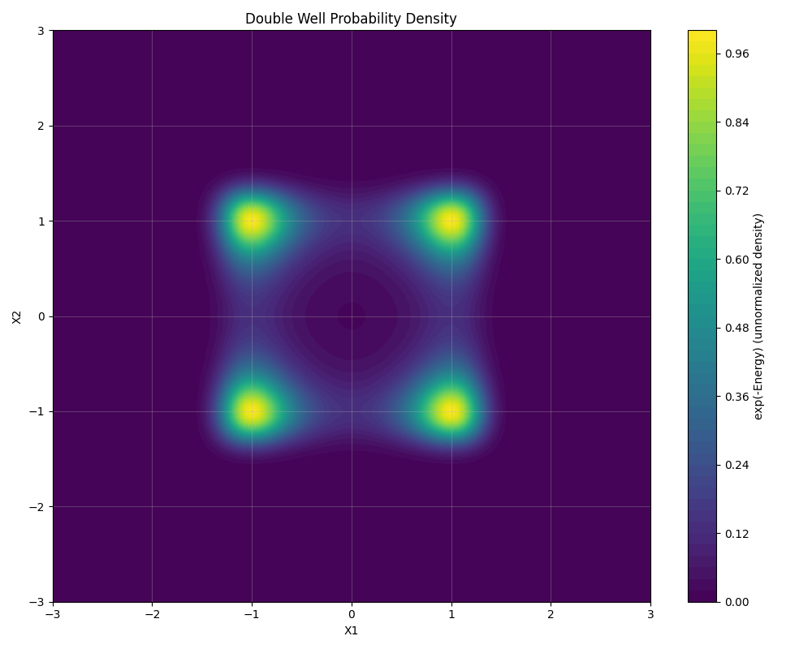

# Visualization in TorchEBM

Visualization is an essential tool for understanding, debugging, and communicating the behavior of Energy-Based Models. This guide covers several key visualization techniques.

## Visualizing the Energy Landscape

Plotting the energy landscape helps you understand what your model has learned. For 2D data, the most common visualization is a contour plot, where colors represent energy values. It's often more intuitive to plot the unnormalized probability density, \( \exp(-E(x)) \).

```python
import torch
import numpy as np
import matplotlib.pyplot as plt

@torch.no_grad()
def plot_energy_surface(model, plot_range=3.0, grid_size=100, device="cpu"):
    model.eval()
    plt.figure(figsize=(8, 8))
    
    # Create a grid of points
    x_coords = torch.linspace(-plot_range, plot_range, grid_size, device=device)
    y_coords = torch.linspace(-plot_range, plot_range, grid_size, device=device)
    xv, yv = torch.meshgrid(x_coords, y_coords, indexing="xy")
    grid = torch.stack([xv.flatten(), yv.flatten()], dim=1)

    # Compute energy values and convert to probability density
    energy_values = model(grid).cpu().numpy().reshape(grid_size, grid_size)
    log_prob = -energy_values
    prob_density = np.exp(log_prob - np.max(log_prob))

    # Plot the contour
    plt.contourf(xv.cpu().numpy(), yv.cpu().numpy(), prob_density, levels=50, cmap="viridis")
    plt.colorbar(label="exp(-Energy) (unnormalized density)")
    plt.title("Learned Energy Landscape")
    plt.show()

# Assuming you have a trained `model`
# from training import MLPModel
# model = MLPModel().to(device)
# plot_energy_surface(model, device=device)
```



## Visualizing Sampling Trajectories

To understand how your sampler explores the energy landscape, you can visualize its trajectory. The `sample` method in TorchEBM samplers can return the full trajectory by setting `return_trajectory=True`.

```python
# Assuming you have a `model` and `sampler`
# initial_points = torch.randn(5, 2, device=device)
# trajectory = sampler.sample(x=initial_points, n_steps=1000, return_trajectory=True)

# ... (plotting code for energy surface) ...

# Plot trajectories
# for i in range(trajectory.shape[0]):
#     traj = trajectory[i].cpu().numpy()
#     plt.plot(traj[:, 0], traj[:, 1], alpha=0.7)
#     plt.scatter(traj[0, 0], traj[0, 1], c='black', marker='o', label='Start' if i == 0 else "")
#     plt.scatter(traj[-1, 0], traj[-1, 1], c='red', marker='*', label='End' if i == 0 else "")
```

This can produce visualizations of single or multiple chains exploring the energy surface.


## Visualizing Sample Distributions

To evaluate how well your model has learned the data distribution, you can generate a large number of samples and compare their distribution to the real data. A 2D histogram or a kernel density estimate (KDE) plot is useful for this.

```python
# Assuming you have `real_data` (torch.Tensor) and `model_samples` (torch.Tensor)

plt.figure(figsize=(12, 6))

# Plot real data
plt.subplot(1, 2, 1)
plt.hist2d(real_data[:, 0], real_data[:, 1], bins=50, cmap='Blues', density=True)
plt.title('Real Data Distribution')

# Plot model samples
plt.subplot(1, 2, 2)
plt.hist2d(model_samples[:, 0], model_samples[:, 1], bins=50, cmap='Reds', density=True)
plt.title('Model Sample Distribution')

plt.show()
```

This side-by-side comparison provides a clear visual assessment of your model's performance.

 