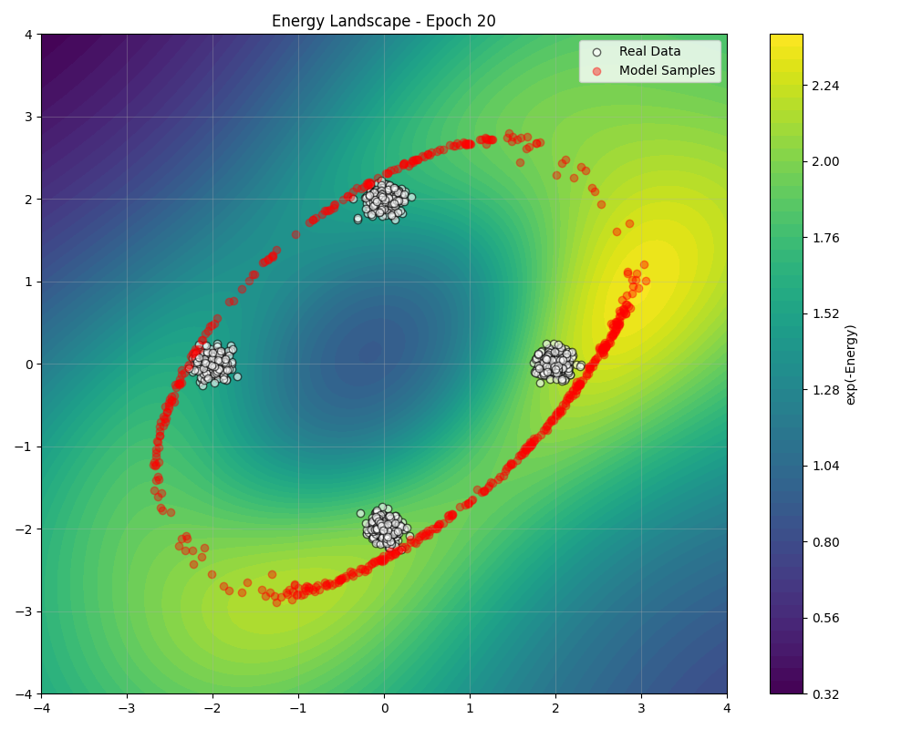
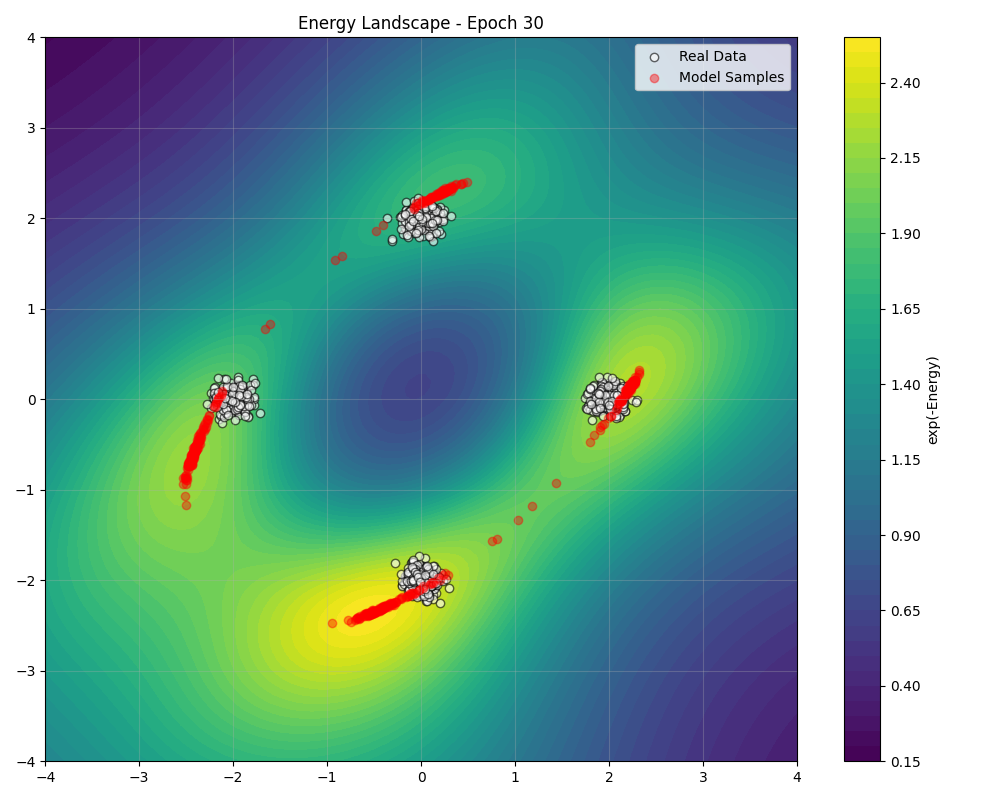

<div class="hero-banner" id="glassBanner" style="position: relative; border-radius: 16px; padding: 40px; margin-bottom: 40px; color: var(--md-default-fg-color); backdrop-filter: blur(12px); box-shadow: 0 10px 25px rgba(0,0,0,0.2); border: 1px solid rgba(255,255,255,0.15); overflow: hidden; z-index: 1;">
  <div style="position: absolute; top: 0; right: 0; bottom: 0; left: 0; background: url('assets/images/energy_grid_bg.png') no-repeat center center; background-size: cover; z-index: 0;" class="banner-bg-image"></div>
  <!-- Glass background layers -->
  <div style="position: absolute; top: 0; right: 0; bottom: 0; left: 0; z-index: -3;" class="banner-base-layer"></div>
  <div id="radialBg" style="position: absolute; top: 0; right: 0; bottom: 0; left: 0; background: radial-gradient(circle at 50% 50%, var(--md-accent-fg-color--transparent) 0%, rgba(0,0,0,0) 70%); opacity: 0.9; z-index: -2; transition: background 0.2s ease;"></div>
  <div style="position: absolute; bottom: 0; left: 0; width: 100%; height: 100%; background: linear-gradient(0deg, var(--md-primary-fg-color--transparent) 0%, rgba(30, 40, 70, 0) 40%); z-index: -1; transform-origin: bottom; animation: wave 8s ease-in-out infinite alternate;"></div>
  
  <!-- Energy pulse container (replacing clouds) -->
  <div id="energyContainer" style="position: absolute; top: 0; left: 0; width: 100%; height: 100%; overflow: hidden; z-index: 0; opacity: 0; transition: opacity 0.5s ease;"></div>
  
  <!-- Parallax layers -->
  <div class="parallax-layer layer-1" data-depth="0.1"></div>
  <div class="parallax-layer layer-2" data-depth="0.2"></div>
  <div class="parallax-layer layer-3" data-depth="0.3"></div>
  
  <!-- Content -->
  <div style="position: relative; z-index: 1;">
    
    <h1 style="font-size: 2.5em; text-align: center; margin-bottom: 20px; text-shadow: 0 2px 4px rgba(0,0,0,0.2);"><strong>PyTorch Toolkit for Generative Modeling</strong></h1>
    <p style="font-size: 1.3em; text-align: center; max-width: 800px; margin: 0 auto 30px auto; line-height: 1.6;">
      A high-performance PyTorch library that makes Energy-Based Models <strong>accessible</strong> and <strong>efficient</strong> for researchers and practitioners alike.
    </p>
  </div>

  <!-- Inline styles for animations -->
  <style>
    @keyframes wave {
      0% { transform: scaleY(1.02) translateY(-2px); }
      100% { transform: scaleY(1) translateY(0); }
    }
    
    @keyframes pulse {
      0% { transform: scale(0.8); opacity: 0; }
      50% { opacity: 0.8; }
      100% { transform: scale(1.2); opacity: 0; }
    }
    
    @keyframes drift {
      0% { transform: translate(0, 0); }
      50% { transform: translate(10px, 5px); }
      100% { transform: translate(0, 0); }
    }
    
    .energy-pulse {
      position: absolute;
      border-radius: 50%;
      opacity: 0;
      filter: blur(3px);
      animation: pulse 4s ease-in-out infinite;
      box-shadow: 0 0 15px 5px currentColor;
    }
    
    .parallax-layer {
      position: absolute;
      top: 0;
      left: 0;
      width: 100%;
      height: 100%;
      pointer-events: none;
    }
    
    .layer-1 {
      background: radial-gradient(circle at 25% 25%, rgba(255, 87, 34, 0.05) 0%, rgba(0,0,0,0) 50%);
      animation: drift 8s ease-in-out infinite;
    }
    
    .layer-2 {
      background: radial-gradient(circle at 75% 75%, rgba(33, 150, 243, 0.05) 0%, rgba(0,0,0,0) 50%);
      animation: drift 12s ease-in-out infinite reverse;
    }
    
    .layer-3 {
      background: radial-gradient(circle at 50% 50%, rgba(156, 39, 176, 0.05) 0%, rgba(0,0,0,0) 50%);
      animation: drift 15s ease-in-out infinite;
    }
    
    /* Light mode specific styles */
    [data-md-color-scheme="default"] .banner-bg-image {
      opacity: 0.6; /* Reduced from 0.55 for better visibility */
      mix-blend-mode: multiply; /* Better blend mode for visibility */
    }
    
    [data-md-color-scheme="default"] .banner-base-layer {
      background: rgba(255, 255, 255, 0.3); /* Reduced from 0.7 to 0.3 */
    }
    
    [data-md-color-scheme="default"] #glassBanner {
      color: rgba(0, 0, 0, 1.0);
      box-shadow: 0 10px 25px rgba(0, 0, 0, 0.1);
      background: linear-gradient(135deg, rgba(255, 255, 255, 0.2) 0%, rgba(16, 24, 32, 0.1) 100%); /* More transparent */
    }
    
    [data-md-color-scheme="default"] #radialBg {
      background: radial-gradient(circle at 50% 50%, rgba(255, 87, 34, 0.55) 0%, rgba(0,0,0,0) 90%); /* More vibrant orange */
      opacity: 1;
    }
    
    [data-md-color-scheme="default"] .energy-pulse {
      color: #ff5722; /* Deep orange energy pulses */
    }
    
    [data-md-color-scheme="default"] .primary-btn {
      box-shadow: 0 2px 5px rgba(0, 0, 0, 0.1);
    }
    
    [data-md-color-scheme="default"] .primary-btn:hover {
      background: #e64a19; /* Deep Orange 700 */
      box-shadow: 0 4px 8px rgba(0, 0, 0, 0.15);
    }
    
    [data-md-color-scheme="default"] .banner-btn:not(.primary-btn):hover {
      background: rgba(0, 0, 0, 0.05);
      border-color: rgba(0, 0, 0, 0.3);
      box-shadow: 0 2px 5px rgba(0, 0, 0, 0.05);
    }
    
    /* Dark mode specific styles */
    [data-md-color-scheme="slate"] .banner-bg-image {
      opacity: 0.25;
      mix-blend-mode: lighten;
    }
    
    [data-md-color-scheme="slate"] .banner-base-layer {
      background: rgba(16, 24, 32, 0.7);
    }
    
    [data-md-color-scheme="slate"] #glassBanner {
      color: rgba(255, 255, 255, 1.0);
      box-shadow: 0 10px 25px rgba(0, 0, 0, 0.3);
      border-color: rgba(255, 255, 255, 0.05);
      background: linear-gradient(135deg, rgba(16, 24, 32, 0.4) 0%, rgba(16, 24, 32, 0.2) 100%);
    }
    
    [data-md-color-scheme="slate"] #radialBg {
      background: radial-gradient(circle at 50% 50%, rgba(255, 87, 34, 0.3) 0%, rgba(0,0,0,0) 70%); /* More vibrant orange */
    }
    
    [data-md-color-scheme="slate"] .energy-pulse {
      color: #ff7043; /* Brighter deep orange energy pulses */
    }
    
    [data-md-color-scheme="slate"] .primary-btn {
      box-shadow: 0 2px 5px rgba(0, 0, 0, 0.2);
    }
    
    [data-md-color-scheme="slate"] .primary-btn:hover {
      background: #ff5722; /* Deep Orange 500 */
      filter: brightness(1.1);
      box-shadow: 0 4px 8px rgba(0, 0, 0, 0.3);
    }
    
    [data-md-color-scheme="slate"] .banner-btn:not(.primary-btn):hover {
      background: rgba(255, 255, 255, 0.05);
      border-color: rgba(255, 255, 255, 0.4);
      box-shadow: 0 2px 5px rgba(0, 0, 0, 0.2);
    }
  </style>

  <!-- Inline JavaScript -->
  <script>
    // Initialize after DOM is loaded
    document.addEventListener('DOMContentLoaded', function() {
      const radialBg = document.getElementById('radialBg');
      const banner = document.getElementById('glassBanner');
      const energyContainer = document.getElementById('energyContainer');
      const parallaxLayers = document.querySelectorAll('.parallax-layer');
      
      // Mouse movement tracking for desktop - Enhanced radial effect
      document.addEventListener('mousemove', (e) => {
        const rect = banner.getBoundingClientRect();
        const x = e.clientX - rect.left;
        const y = e.clientY - rect.top;
        
        const centerX = (x / rect.width) * 100;
        const centerY = (y / rect.height) * 100;
        
        // Update radial gradient position with more vibrant colors
        if (document.documentElement.getAttribute('data-md-color-scheme') === 'default') {
          radialBg.style.background = `radial-gradient(circle at ${centerX}% ${centerY}%, rgba(255, 87, 34, 0.35) 0%, rgba(0,0,0,0) 70%)`;
        } else {
          radialBg.style.background = `radial-gradient(circle at ${centerX}% ${centerY}%, rgba(255, 87, 34, 0.3) 0%, rgba(0,0,0,0) 70%)`;
        }
        
        // Parallax effect
        parallaxLayers.forEach(layer => {
          const depth = parseFloat(layer.getAttribute('data-depth'));
          const moveX = (centerX - 50) * depth;
          const moveY = (centerY - 50) * depth;
          layer.style.transform = `translate(${moveX}px, ${moveY}px)`;
        });
      });
      
      // Touch events for mobile
      document.addEventListener('touchmove', (e) => {
        const touch = e.touches[0];
        const rect = banner.getBoundingClientRect();
        const x = touch.clientX - rect.left;
        const y = touch.clientY - rect.top;
        
        const centerX = (x / rect.width) * 100;
        const centerY = (y / rect.height) * 100;
        
        // Update radial gradient position
        if (document.documentElement.getAttribute('data-md-color-scheme') === 'default') {
          radialBg.style.background = `radial-gradient(circle at ${centerX}% ${centerY}%, rgba(255, 87, 34, 0.35) 0%, rgba(0,0,0,0) 70%)`;
        } else {
          radialBg.style.background = `radial-gradient(circle at ${centerX}% ${centerY}%, rgba(255, 87, 34, 0.3) 0%, rgba(0,0,0,0) 70%)`;
        }
        
        // Parallax effect
        parallaxLayers.forEach(layer => {
          const depth = parseFloat(layer.getAttribute('data-depth'));
          const moveX = (centerX - 50) * depth;
          const moveY = (centerY - 50) * depth;
          layer.style.transform = `translate(${moveX}px, ${moveY}px)`;
        });
      });
      
      // Create energy pulses (replacing clouds)
      function createEnergyPulses() {
        energyContainer.innerHTML = '';
        const pulseCount = 15;
        const colors = ['#ff5722', '#2196f3', '#9c27b0', '#4caf50', '#ff9800']; // Vibrant colors
        
        for (let i = 0; i < pulseCount; i++) {
          const pulse = document.createElement('div');
          pulse.className = 'energy-pulse';
          
          // Randomize pulse properties
          const size = 5 + Math.random() * 15; // Smaller than clouds
          const left = Math.random() * 100;
          const top = Math.random() * 100;
          const delay = Math.random() * 4;
          const duration = 3 + Math.random() * 4;
          const colorIndex = Math.floor(Math.random() * colors.length);
          
          pulse.style.width = `${size}px`;
          pulse.style.height = `${size}px`;
          pulse.style.left = `${left}%`;
          pulse.style.top = `${top}%`;
          pulse.style.animationDelay = `${delay}s`;
          pulse.style.animationDuration = `${duration}s`;
          pulse.style.color = colors[colorIndex];
          
          energyContainer.appendChild(pulse);
        }
      }
      
      // Initialize energy pulses
      createEnergyPulses();
      
      // Activate energy effects on hover
      banner.addEventListener('mouseenter', () => {
        energyContainer.style.opacity = '1';
      });
      
      banner.addEventListener('mouseleave', () => {
        energyContainer.style.opacity = '0';
      });
      
      // Update pulses occasionally
      setInterval(() => {
        if (parseFloat(getComputedStyle(energyContainer).opacity) > 0) {
          createEnergyPulses();
        }
      }, 10000);
    });
  </script>
</div>

<p align="center" style="margin-bottom: 20px;">
    <a href="https://pypi.org/project/torchebm/" target="_blank" title="PyPI version">
        
    </a>
    <a href="https://github.com/soran-ghaderi/torchebm/blob/master/LICENSE" target="_blank" title="License">
        
    </a>
    <a href="https://github.com/soran-ghaderi/torchebm" target="_blank" title="GitHub Repo Stars">
        
    </a>
    <!-- Consider adding: build status, documentation status, code coverage -->
</p>

<p class="lead" style="text-align: center; font-size: 1.3em; margin-bottom: 30px;" markdown>
**TorchEBM** provides components for 🔬 sampling, 🧠 inference, and 📊 model training.
</p>

<div style="text-align: center; margin-bottom: 40px;" markdown>
[:material-rocket-launch:{ .lg .middle } Getting Started](guides/index.md){ .md-button .md-button--primary }
[:material-flask-outline:{ .lg .middle } Examples](examples/index.md){ .md-button }
[:material-file-document:{ .lg .middle } API Reference](api/index.md){ .md-button }
[:material-tools: Development](developer_guide/contributing.md){ .md-button }
</div>

---

## What is TorchEBM?

**Energy-Based Models (EBMs)** offer a powerful and flexible framework for generative modeling by assigning an unnormalized probability (or "energy") to each data point. Lower energy corresponds to higher probability.

**TorchEBM** simplifies working with EBMs in [PyTorch](https://pytorch.org/). It provides a suite of tools designed for researchers and practitioners, enabling efficient implementation and exploration of:

*   **Defining complex energy functions:** Easily create custom energy landscapes using PyTorch modules.
*   **Training:** Loss functions and procedures suitable for EBM parameter estimation including score matching and contrastive divergence variants.
*   **Sampling:** Algorithms to draw samples from the learned distribution \( p(x) \).

---

## Core Components

TorchEBM is structured around several key components:

<div class="grid cards" markdown>

-   :material-function-variant:{ .lg .middle } __Energy Functions__

    ---

    Implement energy functions using `BaseEnergyFunction`. Includes predefined analytical functions (Gaussian, Double Well) and supports custom neural network architectures.

    [:octicons-arrow-right-24: Details](examples/energy_functions/index.md)

-   :material-chart-scatter-plot:{ .lg .middle } __Samplers__

    ---

    MCMC samplers like Langevin Dynamics (`LangevinDynamics`), Hamiltonian Monte Carlo, and more are provided for generating samples from the energy distribution.

    [:octicons-arrow-right-24: Details](api/torchebm/samplers/index.md)

-   :material-calculator-variant:{ .lg .middle } __Loss Functions__

    ---

    Comprehensive loss functions for EBM training, including Contrastive Divergence, Score Matching, and Noise Contrastive Estimation.

    [:octicons-arrow-right-24: Details](api/torchebm/losses/index.md)

-   :material-database-search:{ .lg .middle } __Datasets__

    ---

    Helper functions to generate synthetic datasets (e.g., `make_gaussian_mixture`) useful for testing, debugging, and visualization purposes.

    [:octicons-arrow-right-24: Details](examples/datasets/index.md)

-   :material-view-grid-plus:{ .lg .middle } __Visualization__

    ---

    Tools for visualizing energy landscapes, sampling processes, and training progression to better understand model behavior.

    [:octicons-arrow-right-24: Details](examples/visualization/index.md)

-   :material-rocket-launch:{ .lg .middle } __Accelerated Computing__

    ---

    CUDA implementations of key algorithms for dramatically faster sampling and training on GPU hardware.

    [:octicons-arrow-right-24: Details](api/torchebm/cuda/index.md)

</div>

---

## Quick Start

Install the library using pip:

```bash
pip install torchebm
```

Here's a minimal example of defining an energy function and a sampler:
<div class="grid cards" markdown>

- __Create and Sample from Energy Models__

    ---
    ```python
    import torch
    from torchebm.core import GaussianEnergy
    from torchebm.samplers import LangevinDynamics
    
    device = torch.device("cuda" if torch.cuda.is_available() else "cpu")
    # Define an (analytical) energy function -> next example: trainable
    energy_fn = GaussianEnergy(mean=torch.zeros(2), cov=torch.eye(2), device=device)
    
    # Define a sampler
    sampler = LangevinDynamics(energy_function=energy_fn, step_size=0.01, device=device)
    
    # Generate samples
    initial_points = torch.randn(500, 2, device=device)
    samples = sampler.sample(x=initial_points, n_steps=100)
    
    print(f"Output batch_shape: {samples.shape}")
    # Output batch_shape: torch.Size([500, 2])
    ```
</div>
---

## Training and Visualization Example

Training EBMs typically involves adjusting the energy function's parameters so that observed data points have lower energy than samples generated by the model. Contrastive Divergence (CD) is a common approach.

Here's an example of setting up training using `ContrastiveDivergence` and `LangevinDynamics`:
<div class="grid cards" markdown>

- __Train an EBM__

    ---
  ```python
  import torch.optim as optim
  from torch.utils.data import DataLoader

  from torchebm.losses import ContrastiveDivergence
  from torchebm.datasets import GaussianMixtureDataset
  
  # A trainable EBM
  class MLPEnergy(BaseEnergyFunction):
      def __init__(self, input_dim, hidden_dim=64):
          super().__init__()
          self.net = nn.Sequential(
              nn.Linear(input_dim, hidden_dim),
              nn.SiLU(),
              nn.Linear(hidden_dim, hidden_dim),
              nn.SiLU(),
              nn.Linear(hidden_dim, 1),
          )
  
      def forward(self, x):
          return self.net(x).squeeze(-1) # a scalar value

  energy_fn = MLPEnergy(input_dim=2).to(device)
  
  cd_loss_fn = ContrastiveDivergence(
      energy_function=energy_fn,
      sampler=sampler, # from the previous example
      k_steps=10 # MCMC steps for negative samples gen
  )
  
  optimizer = optim.Adam(energy_fn.parameters(), lr=0.001)
  
  mixture_dataset = GaussianMixtureDataset(n_samples=500, n_components=4, std=0.1, seed=123).get_data()
  dataloader = DataLoader(mixture_dataset, batch_size=32, shuffle=True)
  
  # Training Loop
  for epoch in range(10):
      epoch_loss = 0.0
      for i, batch_data in enumerate(dataloader):
          batch_data = batch_data.to(device)
  
          optimizer.zero_grad()
  
          loss, neg_samples = cd_loss(batch_data)
  
          loss.backward()
          optimizer.step()
  
          epoch_loss += loss.item()
  
      avg_loss = epoch_loss / len(dataloader)
      print(f"Epoch {epoch+1}/{EPOCHS}, Loss: {avg_loss:.6f}")
  ```
</div>

Visualizing the learned energy landscape during training can be insightful. Below shows the evolution of an MLP-based energy function trained on a 2D Gaussian mixture:

!!! example "Training Progression (Gaussian Mixture Example)"

    === "Epoch 100 (Final)"
        <div class="energy-grid" markdown>
        <div class="energy-main" markdown>
        <figure markdown>
          { width="450" }
          <figcaption>Learned landscape matching the target distribution.</figcaption>
        </figure>

        This visualization demonstrates how the model learns regions of low energy (high probability density, warmer colors) corresponding to the data distribution (white points), while assigning higher energy elsewhere. Red points are samples generated from the EBM at that training stage.
    
        [:octicons-arrow-right-24: Full Training Example](examples/training/training_ebm_gaussian.md)
        
        </div>
        <div class="energy-others" markdown>
        { width="450" }
        { width="450" }
        { width="450" }
        </div>
        </div>

    === "Epoch 30"
        <div class="energy-grid" markdown>
        <div class="energy-main" markdown>
        <figure markdown>
          { width="450" }
          <figcaption>Modes become more distinct.</figcaption>
        </figure>
        This visualization demonstrates how the model learns regions of low energy (high probability density, warmer colors) corresponding to the data distribution (white points), while assigning higher energy elsewhere. Red points are samples generated from the EBM at that training stage.
    
        [:octicons-arrow-right-24: Full Training Example](examples/training/training_ebm_gaussian.md)
        
        </div>
        <div class="energy-others" markdown>
        { width="450" }
        { width="450" }
        { width="450" }
        </div>
        </div>

    === "Epoch 20"
        <div class="energy-grid" markdown>
        <div class="energy-main" markdown>

        <figure markdown>
          { width="450" }
          <figcaption>Energy landscape refinement.</figcaption>
        </figure>
        This visualization demonstrates how the model learns regions of low energy (high probability density, warmer colors) corresponding to the data distribution (white points), while assigning higher energy elsewhere. Red points are samples generated from the EBM at that training stage.
    
        [:octicons-arrow-right-24: Full Training Example](examples/training/training_ebm_gaussian.md)
        
        </div>
        <div class="energy-others" markdown>
        { width="450" }
        { width="450" }
        { width="450" }
        </div>
        </div>

    === "Epoch 10"
        <div class="energy-grid" markdown>
        <div class="energy-main" markdown>

        <figure markdown>
          { width="450" }
          <figcaption>Early stage: Model starts identifying modes.</figcaption>
        </figure>
        This visualization demonstrates how the model learns regions of low energy (high probability density, warmer colors) corresponding to the data distribution (white points), while assigning higher energy elsewhere. Red points are samples generated from the EBM at that training stage.
    
        [:octicons-arrow-right-24: Full Training Example](examples/training/training_ebm_gaussian.md)
        
        </div>
        <div class="energy-others" markdown>
        { width="450" }
        { width="450" }
        { width="450" }
        </div>
        </div>
---

!!! info "Latest Release"

    TorchEBM is currently in early development. Check our [GitHub repository](https://github.com/soran-ghaderi/torchebm) for the latest updates and features.

## Example Analytical Energy Landscapes

!!! note "Toy Examples"
    
    These are some TorchEBM's built-in toy analytical energy landscapes for functionality and performance testing purposes.

=== "Gaussian Energy"

    <div class="energy-grid" markdown>
    <div class="energy-main" markdown>
    { .spotlight }
    
    <div class="energy-caption energy-caption-bottom">
    **Gaussian Energy**
    
    $E(x) = \frac{1}{2}(x-\mu)^T\Sigma^{-1}(x-\mu)$
    </div>
    </div>
    <div class="energy-others" markdown>
    
    
    
    </div>
    </div>
    
    ```python
    from torchebm.core import GaussianEnergy
    import torch
    
    energy_fn = GaussianEnergy(
        mean=torch.zeros(2),
        cov=torch.eye(2)
    )
    ```

=== "Double Well Energy"

    <div class="energy-grid" markdown>
    <div class="energy-main" markdown>
    { .spotlight }
    
    <div class="energy-caption energy-caption-bottom">
    **Double Well Energy**
    
    $E(x) = h \sum_{i=1}^n \left[(x_i^2 - 1)^2\right]$
    </div>
    </div>
    <div class="energy-others" markdown>
    
    
    
    </div>
    </div>
    
    ```python
    from torchebm.core import DoubleWellEnergy
    
    energy_fn = DoubleWellEnergy(
        barrier_height=2.0
    )
    ```

=== "Rastrigin Energy"

    <div class="energy-grid" markdown>
    <div class="energy-main" markdown>
    { .spotlight }
    
    <div class="energy-caption energy-caption-bottom">
    **Rastrigin Energy**
    
    $E(x) = an + \sum_{i=1}^n \left[ x_i^2 - a\cos(2\pi x_i) \right]$
    </div>
    </div>
    <div class="energy-others" markdown>
    
    
    
    </div>
    </div>
    
    ```python
    from torchebm.core import RastriginEnergy
    
    energy_fn = RastriginEnergy(
        a=10.0
    )
    ```

=== "Rosenbrock Energy"

    <div class="energy-grid" markdown>
    <div class="energy-main" markdown>
    { .spotlight }
    
    <div class="energy-caption energy-caption-bottom">
    **Rosenbrock Energy**
    
    $E(x) = \sum_{i=1}^{n-1} \left[ a(x_{i+1} - x_i^2)^2 + (x_i - 1)^2 \right]$
    </div>
    </div>
    <div class="energy-others" markdown>
    
    
    
    </div>
    </div>
    
    ```python
    from torchebm.core import RosenbrockEnergy
    
    energy_fn = RosenbrockEnergy(
        a=1.0, 
        b=100.0
    )
    ```


## Community & Contribution

TorchEBM is an open-source project developed with the research community in mind.

*   **Bug Reports & Feature Requests:** Please use the [GitHub Issues](https://github.com/soran-ghaderi/torchebm/issues).
*   **Contributing Code:** We welcome contributions! Please see the [Contributing Guidelines](developer_guide/contributing.md). Consider following the [Commit Conventions](developer_guide/contributing.md#commit-message-conventions).
*   **Show Support:** If you find TorchEBM helpful for your work, consider starring the repository on [GitHub](https://github.com/soran-ghaderi/torchebm)! :material-star-outline:

---

## Citation

Please consider citing the TorchEBM repository if it contributes to your research:

```bibtex
@misc{torchebm_library_2025,
  author       = {Ghaderi, Soran and Contributors},
  title        = {TorchEBM: A PyTorch Library for Training Energy-Based Models},
  year         = {2025},
  url          = {https://github.com/soran-ghaderi/torchebm},
}
```

---

## License

TorchEBM is available under the **MIT License**. See the [LICENSE file](https://github.com/soran-ghaderi/torchebm/blob/master/LICENSE) for details.

