<div class="home-top">
  <svg viewBox="0 0 100 100" fill="none" xmlns="http://www.w3.org/2000/svg" class="home-nabla" aria-hidden="true">
    <polygon points="27.9,26.9 18.8,26.9 54.6,89.0 95.0,19.0 90.4,11.1 54.6,73.1" fill="#4DE8A0" stroke="#0a2818" stroke-width="1" stroke-linejoin="bevel"/>
    <polygon points="72.1,26.9 76.7,19.0 5.0,19.0 45.4,89.0 54.6,89.0 18.8,26.9" fill="#C7FF00" stroke="#0a2818" stroke-width="1" stroke-linejoin="bevel"/>
    <polygon points="50.0,65.1 54.6,73.1 90.4,11.0 9.6,11.1 5.0,19.0 76.7,19.0" fill="#1A7848" stroke="#0a2818" stroke-width="1" stroke-linejoin="bevel"/>
  </svg>

  <div class="home-title">
    <span class="home-torch">Torch</span><span class="home-ebm">EBM</span>
    <span class="home-berry" aria-hidden="true">&#127827;</span>
  </div>

  <p class="home-tagline">
    A high-performance PyTorch library that makes Energy-Based Models
    <strong>accessible</strong> and <strong>efficient</strong> for researchers and practitioners alike.
  </p>

  <div class="home-actions">
    <a href="tutorials/" class="md-button md-button--primary">
      <span class="twemoji"><svg xmlns="http://www.w3.org/2000/svg" viewBox="0 0 24 24"><path d="M13.13 22.19l-1.63-3.83c1.57-.58 3.04-1.36 4.4-2.27l-2.77 6.1M5.64 12.5l-3.83-1.63 6.1-2.77C7 9.46 6.22 10.93 5.64 12.5M21.61 2.39S16.66.27 11 5.93c-2.73 2.74-4.09 5.98-4.65 8.55l3.17 3.17c2.57-.56 5.81-1.92 8.55-4.65 5.66-5.66 3.54-10.61 3.54-10.61M12.83 14.59a2.495 2.495 0 0 1-3.54 0 2.513 2.513 0 0 1 0-3.54 2.495 2.495 0 0 1 3.54 0 2.513 2.513 0 0 1 0 3.54M6.34 17.66c-.56.56-1.56.56-3.34.56 0-1.78 0-2.78.56-3.34.56-.56 2.22-.56 2.78 0 .56.56.56 2.22 0 2.78Z"/></svg></span>
      Get Started
    </a>
    <a href="https://github.com/soran-ghaderi/torchebm" class="md-button">
      <span class="twemoji"><svg xmlns="http://www.w3.org/2000/svg" viewBox="0 0 496 512"><path d="M165.9 397.4c0 2-2.3 3.6-5.2 3.6-3.3.3-5.6-1.3-5.6-3.6 0-2 2.3-3.6 5.2-3.6 3-.3 5.6 1.3 5.6 3.6zm-31.1-4.5c-.7 2 1.3 4.3 4.3 4.9 2.6 1 5.6 0 6.2-2s-1.3-4.3-4.3-5.2c-2.6-.7-5.5.3-6.2 2.3zm44.2-1.7c-2.9.7-4.9 2.6-4.6 4.9.3 2 2.9 3.3 5.9 2.6 2.9-.7 4.9-2.6 4.6-4.6-.3-1.9-3-3.2-5.9-2.9zM244.8 8C106.1 8 0 113.3 0 252c0 110.9 69.8 205.8 169.5 239.2 12.8 2.3 17.3-5.6 17.3-12.1 0-6.2-.3-40.4-.3-61.4 0 0-70 15-84.7-29.8 0 0-11.4-29.1-27.8-36.6 0 0-22.9-15.7 1.6-15.4 0 0 24.9 2 38.6 25.8 21.9 38.6 58.6 27.5 72.9 20.9 2.3-16 8.8-27.1 16-33.7-55.9-6.2-112.3-14.3-112.3-110.5 0-27.5 7.6-41.3 23.6-58.9-2.6-6.5-11.1-33.3 2.6-67.9 20.9-6.5 69 27 69 27 20-5.6 41.5-8.5 62.8-8.5s42.8 2.9 62.8 8.5c0 0 48.1-33.6 69-27 13.7 34.7 5.2 61.4 2.6 67.9 16 17.7 25.8 31.5 25.8 58.9 0 96.5-58.9 104.2-114.8 110.5 9.2 7.9 17 22.9 17 46.4 0 33.7-.3 75.4-.3 83.6 0 6.5 4.6 14.4 17.3 12.1C428.2 457.8 496 362.9 496 252 496 113.3 383.5 8 244.8 8z"/></svg></span>
      GitHub
    </a>
  </div>

  <style>
    .md-content h1:first-child { display: none; }
    .home-top {
      text-align: center;
      padding: 0 0 20px;
      margin-bottom: 20px;
    }
    .home-nabla {
      display: block;
      margin: 0 auto 20px;
      width: 220px;
      height: 220px;
      max-width: 60vw;
    }
    .home-title {
      font-size: 3.2em;
      font-weight: 700;
      font-family: Raleway, sans-serif;
      letter-spacing: 0.5px;
      line-height: 1.1;
      margin-bottom: 16px;
    }
    .home-torch {
      background: linear-gradient(90deg, #C7FF00, #C7FF4C);
      -webkit-background-clip: text;
      -webkit-text-fill-color: transparent;
      background-clip: text;
      text-shadow: none;
      filter: drop-shadow(0 0 1px #000) drop-shadow(0 0 1px #000);
    }
    .home-ebm {
      background: linear-gradient(90deg, #00c6ff, #0072ff);
      -webkit-background-clip: text;
      -webkit-text-fill-color: transparent;
      background-clip: text;
      text-shadow: none;
      filter: drop-shadow(0 0 1px #000) drop-shadow(0 0 1px #000);
    }
    .home-berry {
      font-size: 0.5em;
      vertical-align: super;
      -webkit-text-fill-color: initial;
    }
    .home-tagline {
      font-size: 1.2em;
      max-width: 700px;
      margin: 0 auto 24px;
      line-height: 1.6;
      color: var(--md-default-fg-color--light);
    }
    .home-actions {
      display: flex;
      justify-content: center;
      gap: 12px;
      flex-wrap: wrap;
    }
    @media (max-width: 600px) {
      .home-nabla { width: 160px; height: 160px; }
      .home-title { font-size: 2.4em; }
      .home-tagline { font-size: 1em; padding: 0 16px; }
    }
  </style>
</div>

<p align="center" style="margin-bottom: 20px;">
    <a href="https://pypi.org/project/torchebm/" target="_blank" title="PyPI version">
        
    </a>
    <a href="https://github.com/soran-ghaderi/torchebm/blob/master/LICENSE" target="_blank" title="License">
        
    </a>
    <a href="https://github.com/soran-ghaderi/torchebm" target="_blank" title="GitHub Repo Stars">
        
    </a>
    <a href="https://deepwiki.com/soran-ghaderi/torchebm"></a>
    <!-- Consider adding: build status, documentation status, code coverage -->
    <a href="https://github.com/soran-ghaderi/torchebm/actions" target="_blank" title="Build Status">
      
    </a>
    <!-- Docs badge -->
    <a href="https://github.com/soran-ghaderi/torchebm/actions" target="_blank" title="Documentation">
      
    </a>
    <a href="https://pepy.tech/project/torchebm" target="_blank" title="Downloads">
        
    </a>
    <a href="https://pypi.org/project/torchebm/" target="_blank" title="Python Versions">
        
    </a>
</p>

<div style="text-align: center; margin: 30px 0;">
<figure>
  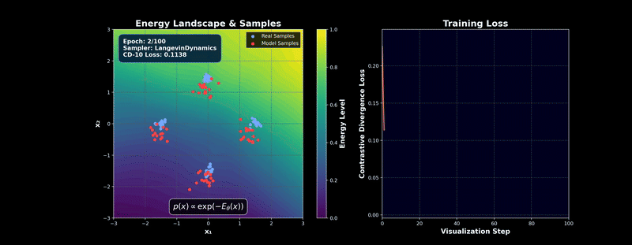
  <figcaption style="margin-top: 12px; font-size: 0.9em; color: var(--md-default-fg-color--light);">
    Training an energy-based model to capture a target distribution.
  </figcaption>
</figure>
</div>
---

## What is TorchEBM 🍓?

Energy-based models assign a scalar energy to each input, implicitly defining a probability distribution where lower energy means higher probability. This formulation is remarkably general. MCMC sampling, score matching, contrastive divergence, and even flow/diffusion-based generation all operate within or connect naturally to the energy-based framework.

**TorchEBM** gives you composable PyTorch building blocks that span this entire landscape. You can define energy functions, train models with different learning objectives, and generate samples via MCMC, energy minimization, or learned continuous-time dynamics.

---

## In Action


<div style="display: flex; justify-content: center; gap: 20px; flex-wrap: wrap; margin: 30px 0;">
<figure style="text-align: center; margin: 0; flex: 1; min-width: 300px; max-width: 50%;">
  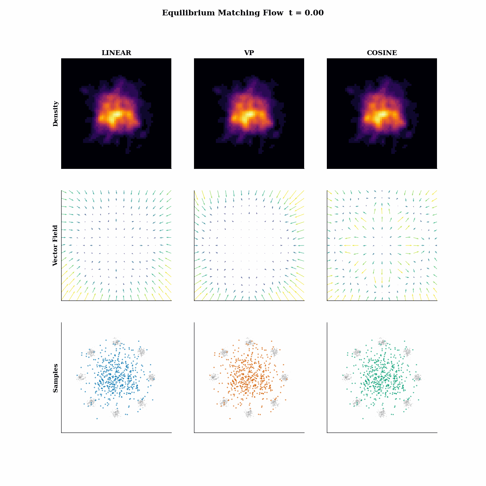
  <figcaption style="margin-top: 12px; font-size: 0.9em; color: var(--md-default-fg-color--light);">
    Eight-gaussians distribution.
  </figcaption>
</figure>
<figure style="text-align: center; margin: 0; flex: 1; min-width: 300px; max-width: 50%;">
  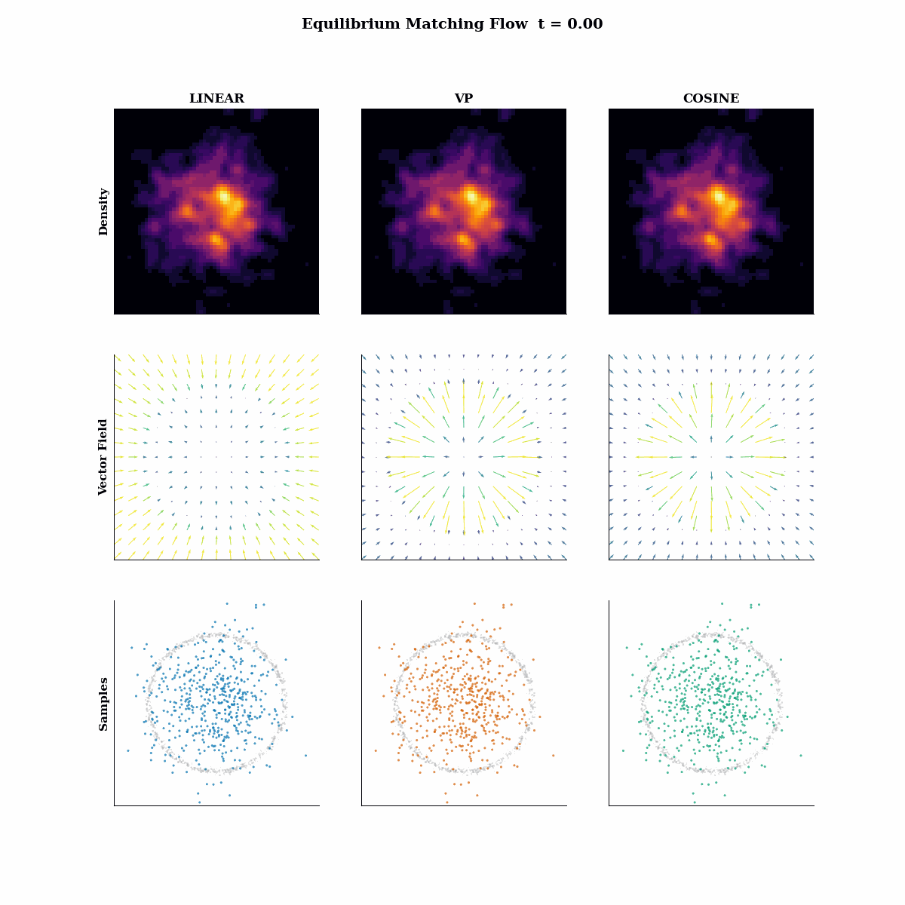
  <figcaption style="margin-top: 12px; font-size: 0.9em; color: var(--md-default-fg-color--light);">
    Circles distribution.
  </figcaption>
</figure>
</div>
<p style="text-align: center; font-size: 0.9em; color: var(--md-default-fg-color--light); margin-top: -10px;">
  Equilibrium matching with different interpolants transforming noise into structured distributions.
</p>

---

## Core Components

<div class="grid cards" markdown>

-   :material-function-variant:{ .lg .middle } __Core__

    ---

    Base classes, energy models (analytical potentials and custom neural networks), schedulers, and the device/dtype management layer shared across all components.

    [:octicons-arrow-right-24: API Reference](api/torchebm/core/index.md)

-   :material-chart-scatter-plot:{ .lg .middle } __Samplers__

    ---

    Draw samples from energy landscapes via MCMC methods, gradient-based optimization, or learned flow/diffusion dynamics (ODE/SDE).

    [:octicons-arrow-right-24: API Reference](api/torchebm/samplers/index.md)

-   :material-scale-balance:{ .lg .middle } __Loss Functions__

    ---

    Training objectives for energy-based and flow-based models, including contrastive divergence variants, score matching variants, and equilibrium matching.

    [:octicons-arrow-right-24: API Reference](api/torchebm/losses/index.md)

-   :material-sine-wave:{ .lg .middle } __Interpolants__

    ---

    Define how noise and data are mixed along a continuous time path. Used in flow matching, diffusion, and related generative schemes.

    [:octicons-arrow-right-24: API Reference](api/torchebm/interpolants/index.md)

-   :material-math-integral:{ .lg .middle } __Integrators__

    ---

    Numerical solvers for SDEs, ODEs, and Hamiltonian systems. Pluggable into samplers and flow-based generation pipelines.

    [:octicons-arrow-right-24: API Reference](api/torchebm/integrators/index.md)

-   :material-brain:{ .lg .middle } __Models__

    ---

    Neural network architectures for parameterizing energy functions and velocity fields, including vision transformers and guidance wrappers.

    [:octicons-arrow-right-24: API Reference](api/torchebm/models/index.md)

-   :material-database-search:{ .lg .middle } __Datasets__

    ---

    Synthetic 2D distributions for rapid prototyping and visual evaluation. All are PyTorch `Dataset` objects.

    [:octicons-arrow-right-24: API Reference](api/torchebm/datasets/index.md)

-   :material-rocket-launch:{ .lg .middle } __CUDA__

    ---

    CUDA-accelerated kernels and mixed precision support for performance-critical sampling and training.

    [:octicons-arrow-right-24: API Reference](api/torchebm/cuda/index.md)

</div>

---

## Energy Landscapes

<div style="display: flex; justify-content: center;">
<table align="center">
  <tr>
    <td></td>
    <td>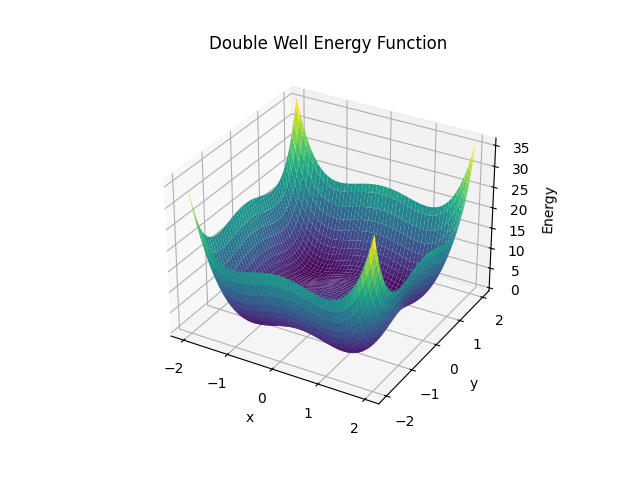</td>
    <td>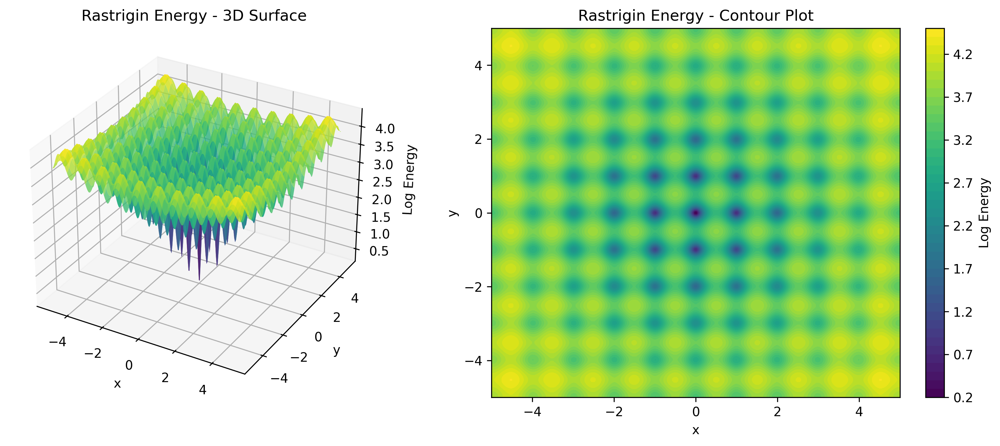</td>
  </tr>
  <tr>
    <td align="center">Gaussian</td>
    <td align="center">Double Well</td>
    <td align="center">Rastrigin</td>
  </tr>
  <tr>
    <td>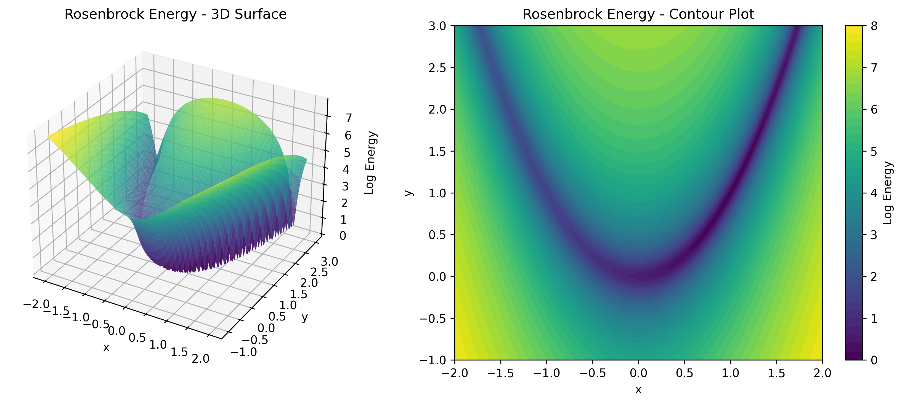</td>
    <td>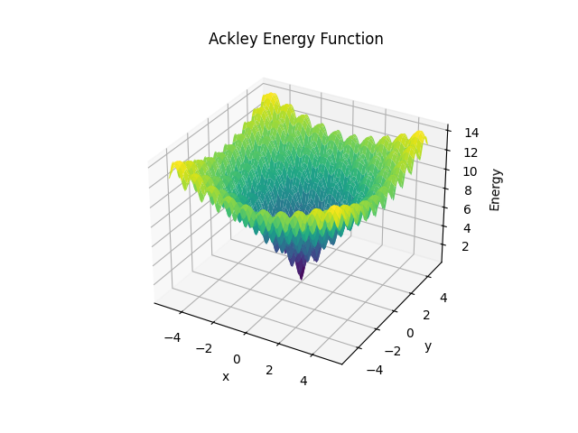</td>
    <td>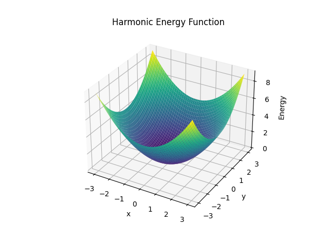</td>
  </tr>
  <tr>
    <td align="center">Rosenbrock</td>
    <td align="center">Ackley</td>
    <td align="center">Harmonic</td>
  </tr>
</table>
</div>

---

## Synthetic Datasets

<div style="display: flex; justify-content: center;">
<table align="center">
  <tr>
    <td>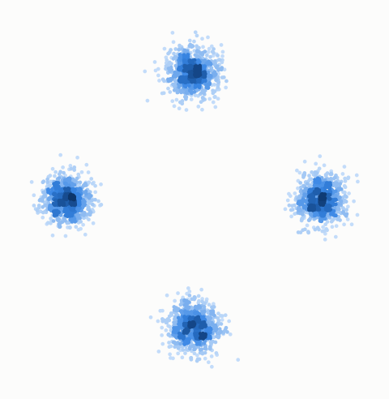</td>
    <td>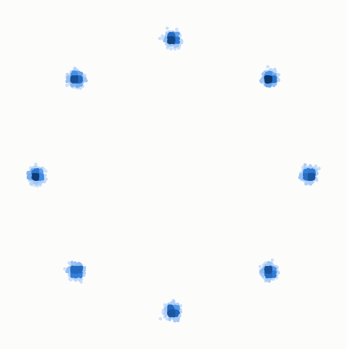</td>
    <td>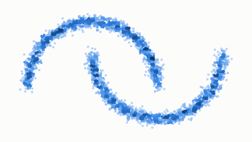</td>
    <td></td>
  </tr>
  <tr>
    <td align="center">Gaussian Mixture</td>
    <td align="center">Eight Gaussians</td>
    <td align="center">Two Moons</td>
    <td align="center">Swiss Roll</td>
  </tr>
  <tr>
    <td>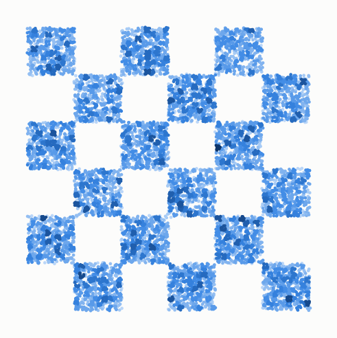</td>
    <td>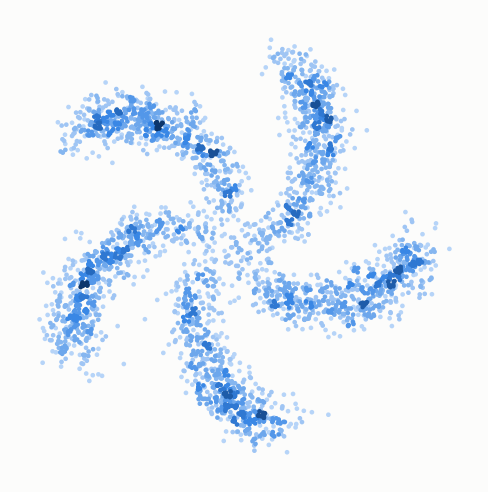</td>
    <td>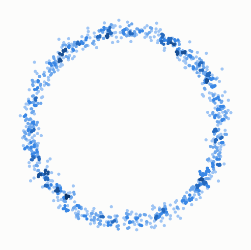</td>
    <td>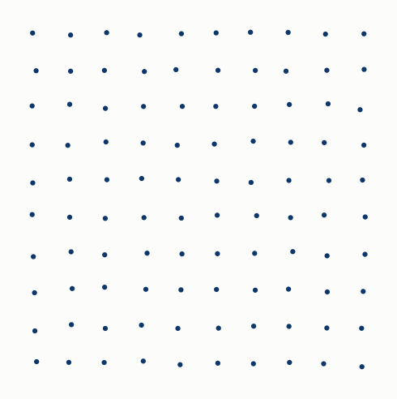</td>
  </tr>
  <tr>
    <td align="center">Checkerboard</td>
    <td align="center">Pinwheel</td>
    <td align="center">Circle</td>
    <td align="center">Grid</td>
  </tr>
</table>
</div>

---

## Quick Start

```bash
pip install torchebm
```

Define an energy model, create a sampler, and draw samples in a few lines:

```python
import torch
from torchebm.core import GaussianModel
from torchebm.samplers import LangevinDynamics

device = torch.device("cuda" if torch.cuda.is_available() else "cpu")
model = GaussianModel(mean=torch.zeros(2), cov=torch.eye(2), device=device)

sampler = LangevinDynamics(model=model, step_size=0.01, device=device)
samples = sampler.sample(x=torch.randn(500, 2, device=device), n_steps=100)
```

See the [tutorials](tutorials/index.md) and [examples](examples/index.md) for training loops, flow-based generation, and more.

## Community & Contribution

TorchEBM is open-source and developed with the research community in mind.

*   **Issues & feature requests** on [GitHub Issues](https://github.com/soran-ghaderi/torchebm/issues)
*   **Contributing** via [developer guide](developer_guide/index.md) and [code guidelines](developer_guide/code_guidelines.md)
*   **Star the repo** on [GitHub](https://github.com/soran-ghaderi/torchebm) if you find it useful :star:

---

## Citation

If TorchEBM is useful in your research, please cite it:

```bibtex
@misc{torchebm_library_2025,
  author       = {Ghaderi, Soran and Contributors},
  title        = {TorchEBM: A PyTorch Library for Training Energy-Based Models},
  year         = {2025},
  url          = {https://github.com/soran-ghaderi/torchebm},
}
```

---

## License

MIT License. See the [LICENSE file](https://github.com/soran-ghaderi/torchebm/blob/master/LICENSE) for details.

