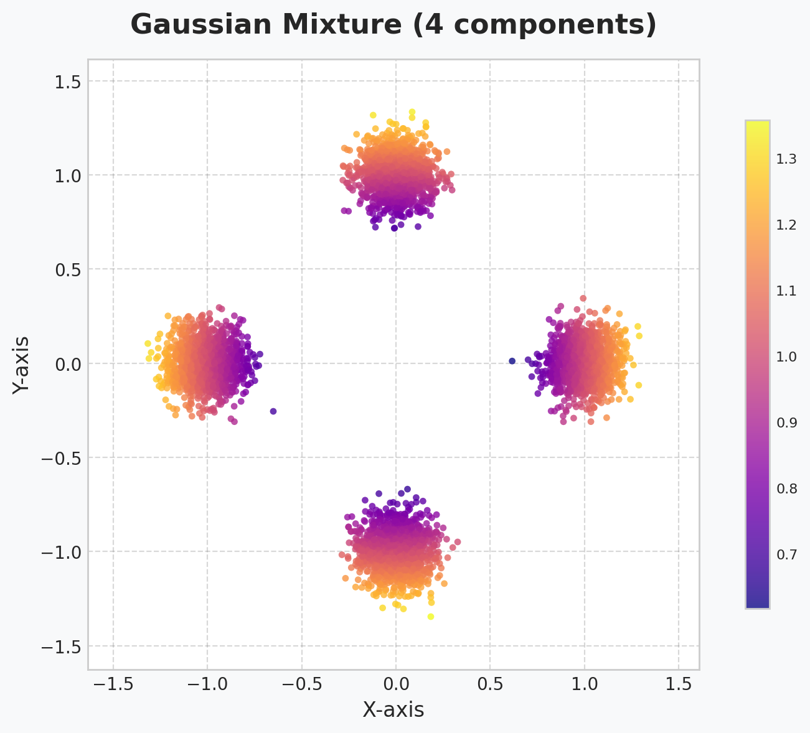
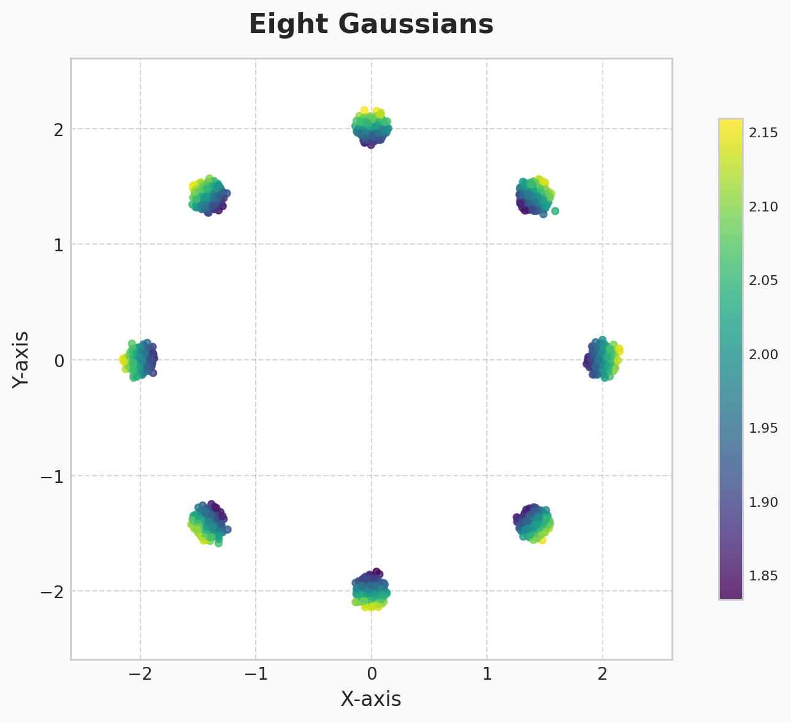
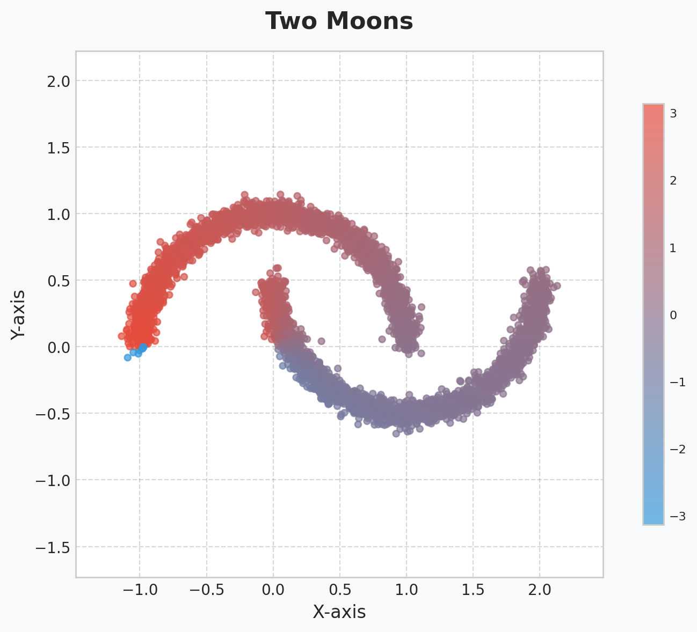
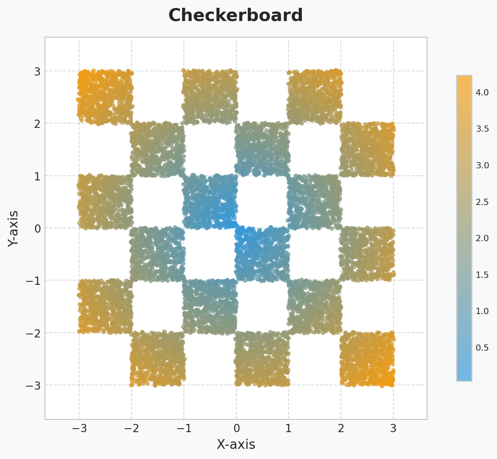
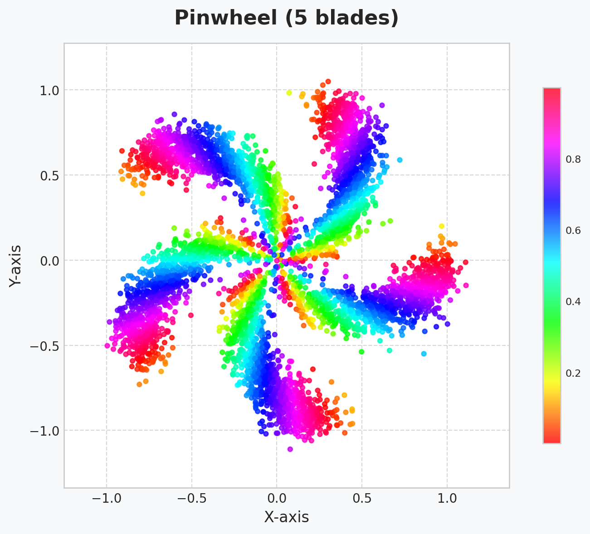

<div class="hero-banner" id="glassBanner" style="position: relative; border-radius: 16px; padding: 20px 40px; margin-bottom: 40px; color: var(--md-default-fg-color); backdrop-filter: blur(12px); box-shadow: 0 10px 25px rgba(0,0,0,0.2); border: 1px solid rgba(255,255,255,0.15); overflow: hidden; z-index: 1;">
  <div style="position: absolute; top: 0; right: 0; bottom: 0; left: 0; background: url('assets/images/energy_grid_bg.png') no-repeat center center; background-size: cover; z-index: 0;" class="banner-bg-image"></div>
  <!-- Glass background layers -->
  <div style="position: absolute; top: 0; right: 0; bottom: 0; left: 0; z-index: -3;" class="banner-base-layer"></div>
  <div id="radialBg" style="position: absolute; top: 0; right: 0; bottom: 0; left: 0; background: radial-gradient(circle at 50% 50%, var(--md-accent-fg-color--transparent) 0%, rgba(0,0,0,0) 70%); opacity: 0.9; z-index: -2; transition: background 0.2s ease;"></div>
  <div style="position: absolute; bottom: 0; left: 0; width: 100%; height: 100%; background: linear-gradient(0deg, var(--md-primary-fg-color--transparent) 0%, rgba(30, 40, 70, 0) 40%); z-index: -1; transform-origin: bottom; animation: wave 8s ease-in-out infinite alternate;"></div>
  
  <!-- Energy pulse container (replacing clouds) -->
  <div id="energyContainer" style="position: absolute; top: 0; left: 0; width: 100%; height: 100%; overflow: hidden; z-index: 0; opacity: 0; transition: opacity 0.5s ease;"></div>
  
  <!-- Parallax layers -->
  <div class="parallax-layer layer-1" data-depth="0.1"></div>
  <div class="parallax-layer layer-2" data-depth="0.2"></div>
  <div class="parallax-layer layer-3" data-depth="0.3"></div>
  <div class="parallax-layer strawberry-layer" data-depth="0.12">
    <!-- <span class="star-emoji" aria-hidden="true">⭐</span> -->
    <span class="strawberry-emoji" aria-hidden="true">🍓</span>
  </div>
  
  <!-- Content -->
  <div style="position: relative; z-index: 1;">
    
    <h1 style="font-size: 2.5em; text-align: center; margin-bottom: 10px; text-shadow: 0 2px 4px rgba(0,0,0,0.2);"><strong>PyTorch Library for Generative Modeling</strong></h1>
    <p style="font-size: 1.3em; text-align: center; max-width: 800px; margin: 0 auto 20px auto; line-height: 1.6;">
      A high-performance PyTorch library that makes Energy-Based Models <strong>accessible</strong> and <strong>efficient</strong> for researchers and practitioners alike.
    </p>
    <div style="display: flex; justify-content: center; gap: 12px; margin-top: 6px;">
      <a id="starCtaBtn" href="https://github.com/soran-ghaderi/torchebm" target="_blank" rel="noopener" aria-label="Star TorchEBM on GitHub" class="glass-star-btn">
        <div class="btn-glow"></div>
        <div class="btn-content">
          <span class="star-icon" aria-hidden="true">⭐</span>
          <span class="btn-text">Star on GitHub</span>
        </div>
        <div class="btn-shine"></div>
      </a>
    </div>
  </div>

  <!-- Inline styles for animations -->
  <style>
    @keyframes wave {
      0% { transform: scaleY(1.02) translateY(-2px); }
      100% { transform: scaleY(1) translateY(0); }
    }
    
    @keyframes pulse {
      0% { transform: scale(0.8); opacity: 0; }
      50% { opacity: 0.8; }
      100% { transform: scale(1.2); opacity: 0; }
    }
    
    @keyframes drift {
      0% { transform: translate(0, 0); }
      50% { transform: translate(10px, 5px); }
      100% { transform: translate(0, 0); }
    }
    
    @keyframes berryFloat {
      0% { transform: translateY(0) rotate(0deg) scale(1); }
      50% { transform: translateY(-8px) rotate(2deg) scale(1.03); }
      100% { transform: translateY(0) rotate(0deg) scale(1); }
    }
    
    .energy-pulse {
      position: absolute;
      border-radius: 50%;
      opacity: 0;
      filter: blur(3px);
      animation: pulse 4s ease-in-out infinite;
      box-shadow: 0 0 15px 5px currentColor;
    }
    
    .parallax-layer {
      position: absolute;
      top: 0;
      left: 0;
      width: 100%;
      height: 100%;
      pointer-events: none;
    }
    
    .layer-1 {
      background: radial-gradient(circle at 25% 25%, rgba(255, 87, 34, 0.05) 0%, rgba(0,0,0,0) 50%);
      animation: drift 8s ease-in-out infinite;
    }
    
    .layer-2 {
      background: radial-gradient(circle at 75% 75%, rgba(33, 150, 243, 0.05) 0%, rgba(0,0,0,0) 50%);
      animation: drift 12s ease-in-out infinite reverse;
    }
    
    .layer-3 {
      background: radial-gradient(circle at 50% 50%, rgba(156, 39, 176, 0.05) 0%, rgba(0,0,0,0) 50%);
      animation: drift 15s ease-in-out infinite;
    }
    
    .strawberry-layer {
      display: flex;
      align-items: flex-end;
      justify-content: flex-end;
      padding: 24px;
      gap: 16px;
    }
    
    .strawberry-emoji, .star-emoji {
      font-size: clamp(48px, 7vw, 96px);
      line-height: 1;
      user-select: none;
      filter: drop-shadow(0 4px 10px rgba(0,0,0,0.25));
      animation: berryFloat 10s ease-in-out infinite;
      opacity: 0.95;
    }

    .star-emoji {
      animation: berryFloat 12s ease-in-out infinite;
    }

    
    /* Light mode specific styles */
    [data-md-color-scheme="default"] .banner-bg-image {
      opacity: 0.6; /* Reduced from 0.55 for better visibility */
      mix-blend-mode: multiply; /* Better blend mode for visibility */
    }
    
    [data-md-color-scheme="default"] .banner-base-layer {
      background: rgba(16, 24, 32, 0.7);
    }
    
    [data-md-color-scheme="default"] #glassBanner {
      color: rgba(255, 255, 255, 1.0) !important;
      box-shadow: 0 10px 25px rgba(0, 0, 0, 0.1);
      background: linear-gradient(135deg, rgba(0, 0, 0, 0.2) 0%, rgba(16, 24, 32, 0.1) 100%); /* More transparent */
    }

    [data-md-color-scheme="default"] .strawberry-emoji {
      text-shadow: 0 0 8px rgba(255, 82, 82, 0.25), 0 0 18px rgba(255, 82, 82, 0.15);
    }

    [data-md-color-scheme="default"] .star-emoji {
      text-shadow: 0 0 10px rgba(255, 215, 64, 0.35), 0 0 18px rgba(255, 215, 64, 0.2);
    }

    [data-md-color-scheme="default"] #glassBanner h1 {
      color: rgba(255, 255, 255, 1.0) !important;
    }
    
    [data-md-color-scheme="default"] #radialBg {
      background: radial-gradient(circle at 50% 50%, rgba(255, 87, 34, 0.55) 0%, rgba(0,0,0,0) 90%); /* More vibrant orange */
      opacity: 1;
    }
    
    [data-md-color-scheme="default"] .energy-pulse {
      color: #ff5722; /* Deep orange energy pulses */
    }
    
    [data-md-color-scheme="default"] .primary-btn {
      box-shadow: 0 2px 5px rgba(0, 0, 0, 0.1);
    }
    
    [data-md-color-scheme="default"] .primary-btn:hover {
      background: #e64a19; /* Deep Orange 700 */
      box-shadow: 0 4px 8px rgba(0, 0, 0, 0.15);
    }
    
    [data-md-color-scheme="default"] .banner-btn:not(.primary-btn):hover {
      background: rgba(0, 0, 0, 0.05);
      border-color: rgba(0, 0, 0, 0.3);
      box-shadow: 0 2px 5px rgba(0, 0, 0, 0.05);
    }
    
    /* Dark mode specific styles */
    [data-md-color-scheme="slate"] .banner-bg-image {
      opacity: 0.25;
      mix-blend-mode: lighten;
    }
    
    [data-md-color-scheme="slate"] .banner-base-layer {
      background: rgba(16, 24, 32, 0.7);
    }
    
    [data-md-color-scheme="slate"] #glassBanner {
      color: rgba(255, 255, 255, 1.0) !important;
      box-shadow: 0 10px 25px rgba(0, 0, 0, 0.3);
      border-color: rgba(255, 255, 255, 0.05);
      background: linear-gradient(135deg, rgba(16, 24, 32, 0.4) 0%, rgba(16, 24, 32, 0.2) 100%);
    }

    [data-md-color-scheme="slate"] #glassBanner h1 {
      color: rgba(255, 255, 255, 1.0) !important;
    }
    
    [data-md-color-scheme="slate"] #radialBg {
      background: radial-gradient(circle at 50% 50%, rgba(255, 87, 34, 0.3) 0%, rgba(0,0,0,0) 70%); /* More vibrant orange */
    }
    
    [data-md-color-scheme="slate"] .energy-pulse {
      color: #ff7043; /* Brighter deep orange energy pulses */
    }
    
    [data-md-color-scheme="slate"] .primary-btn {
      box-shadow: 0 2px 5px rgba(0, 0, 0, 0.2);
    }
    
    [data-md-color-scheme="slate"] .primary-btn:hover {
      background: #ff5722; /* Deep Orange 500 */
      filter: brightness(1.1);
      box-shadow: 0 4px 8px rgba(0, 0, 0, 0.3);
    }
    
    [data-md-color-scheme="slate"] .banner-btn:not(.primary-btn):hover {
      background: rgba(255, 255, 255, 0.05);
      border-color: rgba(255, 255, 255, 0.4);
      box-shadow: 0 2px 5px rgba(0, 0, 0, 0.2);
    }
    
    [data-md-color-scheme="slate"] .strawberry-emoji {
      text-shadow: 0 0 10px rgba(255, 105, 180, 0.4), 0 0 22px rgba(255, 105, 180, 0.25);
      filter: drop-shadow(0 6px 14px rgba(0,0,0,0.35));
    }

    [data-md-color-scheme="slate"] .star-emoji {
      text-shadow: 0 0 12px rgba(255, 215, 64, 0.4), 0 0 24px rgba(255, 215, 64, 0.25);
      filter: drop-shadow(0 6px 14px rgba(0,0,0,0.35));
    }

    /* Glass CTA Button Styles */
    @keyframes glassShimmer {
      0% { transform: translateX(-100%); }
      100% { transform: translateX(400%); }
    }
    @keyframes starPulse {
      0%, 100% { transform: scale(1) rotate(0deg); }
      50% { transform: scale(1.15) rotate(5deg); }
    }
    @keyframes glowPulse {
      0%, 100% { opacity: 0.6; transform: scale(1); }
      50% { opacity: 1; transform: scale(1.05); }
    }
    @keyframes ctaBurstFly {
      to { transform: translate(var(--dx), var(--dy)) rotate(180deg); opacity: 0; }
    }

    .glass-star-btn {
      position: relative;
      display: inline-flex;
      align-items: center;
      justify-content: center;
      padding: 12px 24px;
      border-radius: 50px;
      text-decoration: none;
      font-weight: 700;
      font-size: 1.0em;
      color: #fff;
      overflow: hidden;
      transition: all 0.3s cubic-bezier(0.4, 0, 0.2, 1);
      border: 2px solid rgba(255, 255, 255, 0.2);
      background: transparent;
      box-shadow: none;
      will-change: transform;
    }

    .btn-glow {
      position: absolute;
      top: -2px;
      left: -2px;
      right: -2px;
      bottom: -2px;
      border-radius: 50px;
      opacity: 0;
      transition: opacity 0.3s ease;
      animation: glowPulse 3s ease-in-out infinite;
      pointer-events: none;
    }

    .btn-content {
      position: relative;
      display: flex;
      align-items: center;
      gap: 12px;
      z-index: 2;
    }

    .star-icon {
      font-size: 1.3em;
      animation: starPulse 2s ease-in-out infinite;
      filter: drop-shadow(0 0 4px rgba(255, 215, 0, 0.6));
    }

    .btn-text {
      font-weight: 700;
      letter-spacing: 0.5px;
    }


    .btn-shine {
      position: absolute;
      top: 0;
      left: -100%;
      width: 100%;
      height: 100%;
      background: linear-gradient(
        90deg,
        transparent,
        rgba(255, 255, 255, 0.4),
        transparent
      );
      transition: left 0.6s ease;
      pointer-events: none;
    }

    .glass-star-btn:hover {
      transform: translateY(-2px) scale(1.02);
      border-color: rgba(255, 255, 255, 0.4);
      box-shadow: none;
    }

    .glass-star-btn:hover .btn-glow {
      opacity: 1;
    }

    .glass-star-btn:hover .btn-shine {
      left: 100%;
    }


    .glass-star-btn:active {
      transform: translateY(-1px) scale(0.98);
    }

    .burst-star {
      position: absolute; left: 0; top: 0; width: 8px; height: 8px; border-radius: 2px;
      clip-path: polygon(50% 0%, 61% 35%, 98% 35%, 68% 57%, 79% 91%, 50% 70%, 21% 91%, 32% 57%, 2% 35%, 39% 35%);
      pointer-events: none; opacity: 1; transform: translate(-50%, -50%);
      animation: ctaBurstFly 700ms ease-out forwards;
      box-shadow: 0 0 8px rgba(255,255,255,0.35);
    }

    /* Light mode glass button styles */
    [data-md-color-scheme="default"] .glass-star-btn {
      background: transparent;
      border-color: rgba(255, 255, 255, 0.3);
      color: #fff !important;
    }

    [data-md-color-scheme="default"] .btn-glow {
      background: rgba(255, 255, 255, 0.1);
    }

    [data-md-color-scheme="default"] .glass-star-btn:hover {
      color: #fff;
      background: transparent;
    }

    /* Dark mode glass button styles */
    [data-md-color-scheme="slate"] .glass-star-btn {
      background: transparent;
      border-color: rgba(255, 255, 255, 0.2);
      color: #fff !important;
    }

    [data-md-color-scheme="slate"] .btn-glow {
      background: rgba(255, 255, 255, 0.05);
    }

    [data-md-color-scheme="slate"] .glass-star-btn:hover {
      color: #fff;
      background: transparent;
    }

    [data-md-color-scheme="default"] .burst-star {
      background: linear-gradient(180deg, #fff59d, #ffb74d);
    }

    [data-md-color-scheme="slate"] .burst-star {
      background: linear-gradient(180deg, #fff59d, #ffcc80);
    }
  </style>

  <!-- Inline JavaScript -->
  <script>
    // Initialize after DOM is loaded
    document.addEventListener('DOMContentLoaded', function() {
      const radialBg = document.getElementById('radialBg');
      const banner = document.getElementById('glassBanner');
      const energyContainer = document.getElementById('energyContainer');
      const parallaxLayers = document.querySelectorAll('.parallax-layer');
      const starBtn = document.getElementById('starCtaBtn');
      
      // Mouse movement tracking for desktop - Enhanced radial effect
      document.addEventListener('mousemove', (e) => {
        const rect = banner.getBoundingClientRect();
        const x = e.clientX - rect.left;
        const y = e.clientY - rect.top;
        
        const centerX = (x / rect.width) * 100;
        const centerY = (y / rect.height) * 100;
        
        // Update radial gradient position with more vibrant colors
        if (document.documentElement.getAttribute('data-md-color-scheme') === 'default') {
          radialBg.style.background = `radial-gradient(circle at ${centerX}% ${centerY}%, rgba(255, 87, 34, 0.35) 0%, rgba(0,0,0,0) 70%)`;
        } else {
          radialBg.style.background = `radial-gradient(circle at ${centerX}% ${centerY}%, rgba(255, 87, 34, 0.3) 0%, rgba(0,0,0,0) 70%)`;
        }
        
        // Parallax effect
        parallaxLayers.forEach(layer => {
          const depth = parseFloat(layer.getAttribute('data-depth'));
          const moveX = (centerX - 50) * depth;
          const moveY = (centerY - 50) * depth;
          layer.style.transform = `translate(${moveX}px, ${moveY}px)`;
        });
      });
      
      // Touch events for mobile
      document.addEventListener('touchmove', (e) => {
        const touch = e.touches[0];
        const rect = banner.getBoundingClientRect();
        const x = touch.clientX - rect.left;
        const y = touch.clientY - rect.top;
        
        const centerX = (x / rect.width) * 100;
        const centerY = (y / rect.height) * 100;
        
        // Update radial gradient position
        if (document.documentElement.getAttribute('data-md-color-scheme') === 'default') {
          radialBg.style.background = `radial-gradient(circle at ${centerX}% ${centerY}%, rgba(255, 87, 34, 0.35) 0%, rgba(0,0,0,0) 70%)`;
        } else {
          radialBg.style.background = `radial-gradient(circle at ${centerX}% ${centerY}%, rgba(255, 87, 34, 0.3) 0%, rgba(0,0,0,0) 70%)`;
        }
        
        // Parallax effect
        parallaxLayers.forEach(layer => {
          const depth = parseFloat(layer.getAttribute('data-depth'));
          const moveX = (centerX - 50) * depth;
          const moveY = (centerY - 50) * depth;
          layer.style.transform = `translate(${moveX}px, ${moveY}px)`;
        });
      });
      
      // Create energy pulses (replacing clouds)
      function createEnergyPulses() {
        energyContainer.innerHTML = '';
        const pulseCount = 15;
        const colors = ['#ff5722', '#2196f3', '#9c27b0', '#4caf50', '#ff9800']; // Vibrant colors
        
        for (let i = 0; i < pulseCount; i++) {
          const pulse = document.createElement('div');
          pulse.className = 'energy-pulse';
          
          // Randomize pulse properties
          const size = 5 + Math.random() * 15; // Smaller than clouds
          const left = Math.random() * 100;
          const top = Math.random() * 100;
          const delay = Math.random() * 4;
          const duration = 3 + Math.random() * 4;
          const colorIndex = Math.floor(Math.random() * colors.length);
          
          pulse.style.width = `${size}px`;
          pulse.style.height = `${size}px`;
          pulse.style.left = `${left}%`;
          pulse.style.top = `${top}%`;
          pulse.style.animationDelay = `${delay}s`;
          pulse.style.animationDuration = `${duration}s`;
          pulse.style.color = colors[colorIndex];
          
          energyContainer.appendChild(pulse);
        }
      }
      
      // Initialize energy pulses
      createEnergyPulses();
      
      // Activate energy effects on hover
      banner.addEventListener('mouseenter', () => {
        energyContainer.style.opacity = '1';
      });
      
      banner.addEventListener('mouseleave', () => {
        energyContainer.style.opacity = '0';
      });
      
      // Update pulses occasionally
      setInterval(() => {
        if (parseFloat(getComputedStyle(energyContainer).opacity) > 0) {
          createEnergyPulses();
        }
      }, 10000);

      // Star burst effect on CTA (integrated into hero)
      function burst(x, y) {
        const n = 12;
        for (let i = 0; i < n; i++) {
          const s = document.createElement('span');
          s.className = 'burst-star';
          const size = 6 + Math.random() * 8;
          const angle = (Math.PI * 2 * i) / n + (Math.random() * 0.6 - 0.3);
          const distance = 50 + Math.random() * 70;
          const dx = Math.cos(angle) * distance;
          const dy = Math.sin(angle) * distance;
          s.style.width = size + 'px';
          s.style.height = size + 'px';
          s.style.left = x + 'px';
          s.style.top = y + 'px';
          s.style.setProperty('--dx', dx + 'px');
          s.style.setProperty('--dy', dy + 'px');
          banner.appendChild(s);
          s.addEventListener('animationend', () => s.remove());
        }
      }

      if (starBtn) {
        starBtn.addEventListener('click', function (e) {
          const rect = banner.getBoundingClientRect();
          const x = e.clientX - rect.left;
          const y = e.clientY - rect.top;
          burst(x, y);
        });

      }
    });
  </script>
</div>

<p align="center" style="margin-bottom: 20px;">
    <a href="https://pypi.org/project/torchebm/" target="_blank" title="PyPI version">
        
    </a>
    <a href="https://github.com/soran-ghaderi/torchebm/blob/master/LICENSE" target="_blank" title="License">
        
    </a>
    <a href="https://github.com/soran-ghaderi/torchebm" target="_blank" title="GitHub Repo Stars">
        
    </a>
    <a href="https://deepwiki.com/soran-ghaderi/torchebm"></a>
    <!-- Consider adding: build status, documentation status, code coverage -->
    <a href="https://github.com/soran-ghaderi/torchebm/actions" target="_blank" title="Build Status">
      
    </a>
    <!-- Docs badge -->
    <a href="https://github.com/soran-ghaderi/torchebm/actions" target="_blank" title="Documentation">
      
    </a>
    <a href="https://pepy.tech/project/torchebm" target="_blank" title="Downloads">
        
    </a>
    <a href="https://pypi.org/project/torchebm/" target="_blank" title="Python Versions">
        
    </a>
</p>

<p class="lead" style="text-align: center; font-size: 1.3em; margin-bottom: 30px;" markdown>
A PyTorch library for energy-based modeling, with support for flow and diffusion methods.
</p>

<div style="text-align: center; margin-bottom: 40px;" markdown>
[:material-rocket-launch:{ .lg .middle } Getting Started](tutorials/index.md){ .md-button .md-button--primary }
[:material-flask-outline:{ .lg .middle } Examples](examples/index.md){ .md-button }
[:material-file-document:{ .lg .middle } API Reference](api/index.md){ .md-button }
[:material-tools: Development](developer_guide/index.md){ .md-button }
</div>

<!-- Star CTA moved into the hero banner above; removed separate card -->
<div style="text-align: center; margin: 30px 0;">
<figure>
  
  <figcaption style="margin-top: 12px; font-size: 0.9em; color: var(--md-default-fg-color--light);">
    Training an energy-based model to capture a target distribution.
  </figcaption>
</figure>
</div>
---

## What is TorchEBM 🍓?

Energy-based models assign a scalar energy to each input, implicitly defining a probability distribution where lower energy means higher probability. This formulation is remarkably general. MCMC sampling, score matching, contrastive divergence, and even flow/diffusion-based generation all operate within or connect naturally to the energy-based framework.

**TorchEBM** gives you composable PyTorch building blocks that span this entire landscape. You can define energy functions, train models with different learning objectives, and generate samples via MCMC, energy minimization, or learned continuous-time dynamics.

---

## In Action


<div style="display: flex; justify-content: center; gap: 20px; flex-wrap: wrap; margin: 30px 0;">
<figure style="text-align: center; margin: 0; flex: 1; min-width: 300px; max-width: 50%;">
  
  <figcaption style="margin-top: 12px; font-size: 0.9em; color: var(--md-default-fg-color--light);">
    Eight-gaussians distribution.
  </figcaption>
</figure>
<figure style="text-align: center; margin: 0; flex: 1; min-width: 300px; max-width: 50%;">
  
  <figcaption style="margin-top: 12px; font-size: 0.9em; color: var(--md-default-fg-color--light);">
    Circles distribution.
  </figcaption>
</figure>
</div>
<p style="text-align: center; font-size: 0.9em; color: var(--md-default-fg-color--light); margin-top: -10px;">
  Equilibrium matching with different interpolants transforming noise into structured distributions.
</p>

---

## Core Components

<div class="grid cards" markdown>

-   :material-function-variant:{ .lg .middle } __Core__

    ---

    Base classes, energy models (analytical potentials and custom neural networks), schedulers, and the device/dtype management layer shared across all components.

    [:octicons-arrow-right-24: API Reference](api/torchebm/core/index.md)

-   :material-chart-scatter-plot:{ .lg .middle } __Samplers__

    ---

    Draw samples from energy landscapes via MCMC methods, gradient-based optimization, or learned flow/diffusion dynamics (ODE/SDE).

    [:octicons-arrow-right-24: API Reference](api/torchebm/samplers/index.md)

-   :material-scale-balance:{ .lg .middle } __Loss Functions__

    ---

    Training objectives for energy-based and flow-based models, including contrastive divergence variants, score matching variants, and equilibrium matching.

    [:octicons-arrow-right-24: API Reference](api/torchebm/losses/index.md)

-   :material-sine-wave:{ .lg .middle } __Interpolants__

    ---

    Define how noise and data are mixed along a continuous time path. Used in flow matching, diffusion, and related generative schemes.

    [:octicons-arrow-right-24: API Reference](api/torchebm/interpolants/index.md)

-   :material-math-integral:{ .lg .middle } __Integrators__

    ---

    Numerical solvers for SDEs, ODEs, and Hamiltonian systems. Pluggable into samplers and flow-based generation pipelines.

    [:octicons-arrow-right-24: API Reference](api/torchebm/integrators/index.md)

-   :material-brain:{ .lg .middle } __Models__

    ---

    Neural network architectures for parameterizing energy functions and velocity fields, including vision transformers and guidance wrappers.

    [:octicons-arrow-right-24: API Reference](api/torchebm/models/index.md)

-   :material-database-search:{ .lg .middle } __Datasets__

    ---

    Synthetic 2D distributions for rapid prototyping and visual evaluation. All are PyTorch `Dataset` objects.

    [:octicons-arrow-right-24: API Reference](api/torchebm/datasets/index.md)

-   :material-rocket-launch:{ .lg .middle } __CUDA__

    ---

    CUDA-accelerated kernels and mixed precision support for performance-critical sampling and training.

    [:octicons-arrow-right-24: API Reference](api/torchebm/cuda/index.md)

</div>

---

## Energy Landscapes

<div style="display: flex; justify-content: center;">
<table align="center">
  <tr>
    <td></td>
    <td></td>
    <td></td>
  </tr>
  <tr>
    <td align="center">Gaussian</td>
    <td align="center">Double Well</td>
    <td align="center">Rastrigin</td>
  </tr>
  <tr>
    <td></td>
    <td></td>
    <td></td>
  </tr>
  <tr>
    <td align="center">Rosenbrock</td>
    <td align="center">Ackley</td>
    <td align="center">Harmonic</td>
  </tr>
</table>
</div>

---

## Synthetic Datasets

<div style="display: flex; justify-content: center;">
<table align="center">
  <tr>
    <td></td>
    <td></td>
    <td></td>
    <td></td>
  </tr>
  <tr>
    <td align="center">Gaussian Mixture</td>
    <td align="center">Eight Gaussians</td>
    <td align="center">Two Moons</td>
    <td align="center">Swiss Roll</td>
  </tr>
  <tr>
    <td></td>
    <td></td>
    <td></td>
    <td></td>
  </tr>
  <tr>
    <td align="center">Checkerboard</td>
    <td align="center">Pinwheel</td>
    <td align="center">Circle</td>
    <td align="center">Grid</td>
  </tr>
</table>
</div>

---

## Quick Start

```bash
pip install torchebm
```

Define an energy model, create a sampler, and draw samples in a few lines:

```python
import torch
from torchebm.core import GaussianModel
from torchebm.samplers import LangevinDynamics

device = torch.device("cuda" if torch.cuda.is_available() else "cpu")
model = GaussianModel(mean=torch.zeros(2), cov=torch.eye(2), device=device)

sampler = LangevinDynamics(model=model, step_size=0.01, device=device)
samples = sampler.sample(x=torch.randn(500, 2, device=device), n_steps=100)
```

See the [tutorials](tutorials/index.md) and [examples](examples/index.md) for training loops, flow-based generation, and more.

## Community & Contribution

TorchEBM is open-source and developed with the research community in mind.

*   **Issues & feature requests** on [GitHub Issues](https://github.com/soran-ghaderi/torchebm/issues)
*   **Contributing** via [developer guide](developer_guide/index.md) and [code guidelines](developer_guide/code_guidelines.md)
*   **Star the repo** on [GitHub](https://github.com/soran-ghaderi/torchebm) if you find it useful :star:

---

## Citation

If TorchEBM is useful in your research, please cite it:

```bibtex
@misc{torchebm_library_2025,
  author       = {Ghaderi, Soran and Contributors},
  title        = {TorchEBM: A PyTorch Library for Training Energy-Based Models},
  year         = {2025},
  url          = {https://github.com/soran-ghaderi/torchebm},
}
```

---

## License

MIT License. See the [LICENSE file](https://github.com/soran-ghaderi/torchebm/blob/master/LICENSE) for details.

