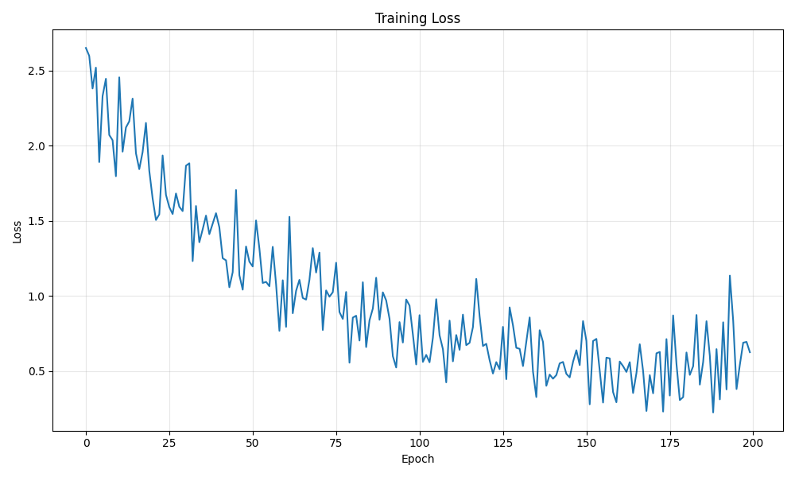

# Loss Functions

Training energy-based models involves estimating and minimizing the difference between the model distribution and the data distribution. TorchEBM provides various loss functions to accomplish this.

## Contrastive Divergence

Contrastive Divergence (CD) is one of the most popular methods for training energy-based models. It uses MCMC sampling to generate negative examples from the current model.

### Basic Usage

```python
import torch
import torch.nn as nn
import torch.optim as optim
from torchebm.core import BaseModel
from torchebm.losses import ContrastiveDivergence
from torchebm.samplers import LangevinDynamics

class MLPModel(BaseModel):
    def __init__(self, input_dim, hidden_dim=64):
        super().__init__()
        self.network = nn.Sequential(
            nn.Linear(input_dim, hidden_dim),
            nn.SELU(),
            nn.Linear(hidden_dim, hidden_dim),
            nn.SELU(),
            nn.Linear(hidden_dim, 1),
            nn.Tanh(),
        )

    def forward(self, x):
        return self.network(x).squeeze(-1)

device = torch.device("cuda" if torch.cuda.is_available() else "cpu")
model = MLPModel(input_dim=2, hidden_dim=64).to(device)

sampler = LangevinDynamics(
    model=model,
    step_size=0.1,
    device=device
)

loss_fn = ContrastiveDivergence(
    model=model,
    sampler=sampler,
    k_steps=10
)

optimizer = optim.Adam(model.parameters(), lr=0.001)

data_batch = torch.randn(128, 2).to(device)
optimizer.zero_grad()
loss, negative_samples = loss_fn(data_batch)
loss.backward()
optimizer.step()
```

### Advanced Options

The `ContrastiveDivergence` loss function in TorchEBM supports several advanced options:

#### Persistent Contrastive Divergence (PCD)

PCD maintains a buffer of negative samples across training iterations, which can lead to better mixing. You can enable it by setting `persistent=True`.

```python
loss_fn = ContrastiveDivergence(
    model=model,
    sampler=sampler,
    k_steps=10,
    persistent=True,
    buffer_size=1024
)
```

#### Using Schedulers for Sampling Parameters

You can use schedulers to dynamically adjust the sampler's step size or noise scale during training:

```python
from torchebm.core import CosineScheduler, ExponentialDecayScheduler, LinearScheduler

step_size_scheduler = CosineScheduler(
    start_value=3e-2,
    end_value=5e-3,
    n_steps=100
)

noise_scheduler = CosineScheduler(
    start_value=3e-1,
    end_value=1e-2,
    n_steps=100
)

sampler = LangevinDynamics(
    model=model,
    step_size=step_size_scheduler,
    noise_scale=noise_scheduler,
    device=device
)

loss_fn = ContrastiveDivergence(
    model=model,
    sampler=sampler,
    k_steps=10,
    persistent=True
)
```

## Score Matching Methods

Score Matching is another approach for training EBMs that avoids the need for MCMC sampling. It directly optimizes the score function (gradient of log-density).

### Score Matching

This is the standard form of score matching, which requires computing the Hessian of the model's energy function. This can be computationally expensive.

```python
import torch
import torch.nn as nn
import torch.optim as optim
from torch.utils.data import DataLoader
from torchebm.core import BaseModel
from torchebm.losses import ScoreMatching
from torchebm.datasets import GaussianMixtureDataset

class MLPModel(BaseModel):
    def __init__(self, input_dim, hidden_dim=64):
        super().__init__()
        self.net = nn.Sequential(
            nn.Linear(input_dim, hidden_dim),
            nn.SiLU(),
            nn.Linear(hidden_dim, hidden_dim),
            nn.SiLU(),
            nn.Linear(hidden_dim, 1),
        )

    def forward(self, x):
        return self.net(x).squeeze(-1)

device = torch.device("cuda" if torch.cuda.is_available() else "cpu")
model = MLPModel(input_dim=2).to(device)

sm_loss_fn = ScoreMatching(
    model=model,
    device=device
)

optimizer = optim.Adam(model.parameters(), lr=0.001)
dataset = GaussianMixtureDataset(n_samples=500, n_components=4, std=0.1, seed=123).get_data()
dataloader = DataLoader(dataset, batch_size=32, shuffle=True)

for epoch in range(10):
    epoch_loss = 0.0
    for batch_data in dataloader:
        batch_data = batch_data.to(device)

        optimizer.zero_grad()
        loss = sm_loss_fn(batch_data)
        loss.backward()
        optimizer.step()

        epoch_loss += loss.item()

    avg_loss = epoch_loss / len(dataloader)
    print(f"Epoch {epoch+1}/10, Loss: {avg_loss:.6f}")
```

### Sliced Score Matching

To make score matching more efficient and scalable, Sliced Score Matching (SSM) approximates the trace of the Hessian using Hutchinson's trick with random projections.

```python
from torchebm.losses import SlicedScoreMatching

ssm_loss_fn = SlicedScoreMatching(
    model=model,
    n_projections=5
)
optimizer.zero_grad()
loss = ssm_loss_fn(data_batch)
loss.backward()
optimizer.step()
```

### Denoising Score Matching

Denoising score matching (DSM) is another efficient alternative. It adds noise to the data points and learns the score of the noised data distribution, avoiding the need to compute the Hessian.

```python
from torchebm.losses import DenoisingScoreMatching

dsm_loss_fn = DenoisingScoreMatching(
    model=model,
    sigma=0.1
)

optimizer.zero_grad()
loss = dsm_loss_fn(data_batch)
loss.backward()
optimizer.step()
```

## Complete Training Example with Loss Function

Here's a complete example showing how to train an EBM using Contrastive Divergence loss:

```python
import torch
import torch.nn as nn
import torch.optim as optim
import numpy as np
import matplotlib.pyplot as plt
from torch.utils.data import DataLoader

from torchebm.core import BaseModel
from torchebm.samplers import LangevinDynamics
from torchebm.losses import ContrastiveDivergence
from torchebm.datasets import TwoMoonsDataset

class MLPModel(BaseModel):
    def __init__(self, input_dim, hidden_dim=64):
        super().__init__()
        self.network = nn.Sequential(
            nn.Linear(input_dim, hidden_dim),
            nn.SELU(),
            nn.Linear(hidden_dim, hidden_dim),
            nn.SELU(),
            nn.Linear(hidden_dim, 1),
            nn.Tanh(),
        )

    def forward(self, x):
        return self.network(x).squeeze(-1)

device = torch.device("cuda" if torch.cuda.is_available() else "cpu")

INPUT_DIM = 2
HIDDEN_DIM = 16
BATCH_SIZE = 256
EPOCHS = 100
LEARNING_RATE = 1e-3
CD_K = 10
USE_PCD = True

dataset = TwoMoonsDataset(n_samples=3000, noise=0.05, seed=42, device=device)
dataloader = DataLoader(dataset, batch_size=BATCH_SIZE, shuffle=True, drop_last=True)

model = MLPModel(INPUT_DIM, HIDDEN_DIM).to(device)
sampler = LangevinDynamics(
    model=model,
    step_size=0.1,
    device=device,
)
loss_fn = ContrastiveDivergence(
    model=model,
    sampler=sampler,
    k_steps=CD_K,
    persistent=USE_PCD,
    buffer_size=BATCH_SIZE
).to(device)

optimizer = optim.Adam(model.parameters(), lr=LEARNING_RATE)

losses = []
print("Starting training...")
for epoch in range(EPOCHS):
    model.train()
    epoch_loss = 0.0

    for i, data_batch in enumerate(dataloader):
        optimizer.zero_grad()

        loss, negative_samples = loss_fn(data_batch)

        loss.backward()

        torch.nn.utils.clip_grad_norm_(model.parameters(), max_norm=1.0)

        optimizer.step()

        epoch_loss += loss.item()

    avg_epoch_loss = epoch_loss / len(dataloader)
    losses.append(avg_epoch_loss)
    print(f"Epoch [{epoch+1}/{EPOCHS}], Average Loss: {avg_epoch_loss:.4f}")

plt.figure(figsize=(10, 6))
plt.plot(losses)
plt.xlabel('Epoch')
plt.ylabel('Loss')
plt.title('Training Loss')
plt.grid(True, alpha=0.3)
plt.tight_layout()
plt.savefig('docs/assets/images/loss_functions/cd_training_loss.png')
plt.show()
```
<figure markdown>

{ width="500" }
</figure>

## Choosing the Right Loss Function

Different loss functions are suitable for different scenarios:

- **Contrastive Divergence**: A good general-purpose method, especially for complex energy landscapes.
- **Persistent CD**: Can provide better mixing properties than standard CD, but requires more memory for the replay buffer.
- **Score Matching**: Avoids MCMC sampling but can be numerically unstable and computationally expensive in high dimensions.
- **Sliced Score Matching**: A scalable and more stable version of Score Matching, suitable for high-dimensional data.
- **Denoising Score Matching**: More stable than standard score matching and computationally efficient, making it a good choice for many problems.

## Tips for Stable Training

1. **Regularization**: Add L2 regularization to prevent the energy from collapsing.
2. **Gradient Clipping**: Use `torch.nn.utils.clip_grad_norm_` to prevent unstable updates.
3. **Learning Rate**: Use a small learning rate, especially at the beginning of training.
4. **Sampling Steps**: Increase the number of sampling steps (`k_steps` in CD) for better quality negative samples.
5. **Batch Size**: Use larger batch sizes for more stable gradient estimates.
6. **Parameter Schedulers**: Use schedulers for sampler parameters to improve mixing during MCMC.
7. **Monitor Energy Values**: Ensure the energy values for positive and negative samples do not collapse or diverge. 