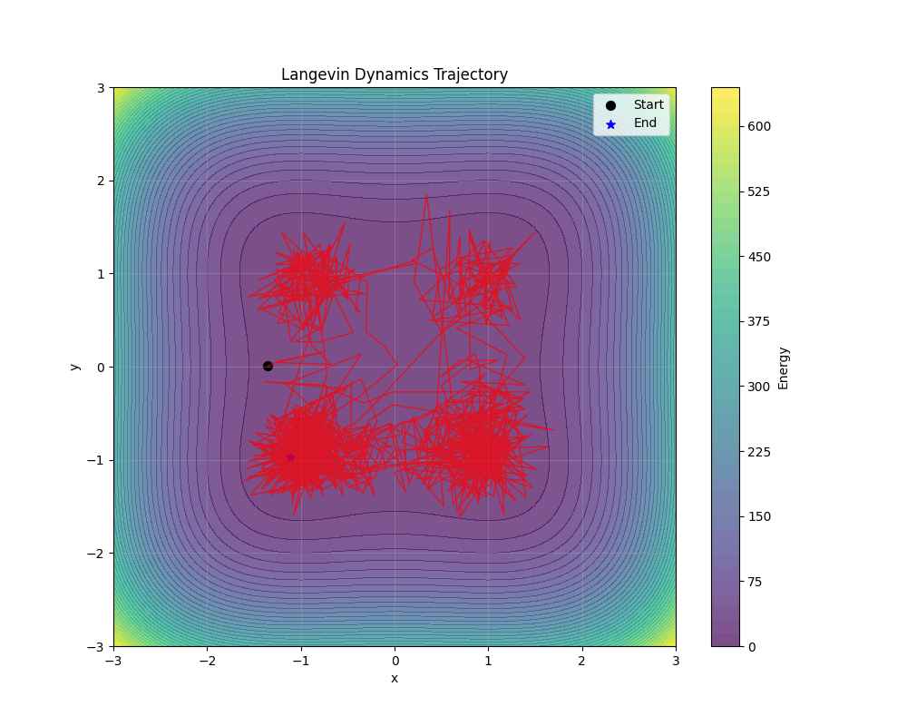

# Sampling Algorithms

Sampling from energy-based models is a core task in TorchEBM. This guide explains the different sampling algorithms available and how to use them effectively.

## Overview of Sampling

In energy-based models, we need to sample from the probability distribution defined by the model:

$$p(x) = \frac{e^{-E(x)}}{Z}$$

Since the normalizing constant Z is typically intractable, we use Markov Chain Monte Carlo (MCMC) methods to generate samples without needing to compute Z.

## Langevin Dynamics

Langevin Dynamics is a gradient-based MCMC method that updates samples using the energy gradient plus Gaussian noise. It's one of the most commonly used samplers in energy-based models due to its simplicity and effectiveness.

### Basic Usage

```python
import torch
from torchebm.core import BaseModel
from torchebm.samplers import LangevinDynamics
import torch.nn as nn

class MLPModel(BaseModel):
    def __init__(self, input_dim, hidden_dim=64):
        super().__init__()
        self.network = nn.Sequential(
            nn.Linear(input_dim, hidden_dim),
            nn.SELU(),
            nn.Linear(hidden_dim, hidden_dim),
            nn.SELU(),
            nn.Linear(hidden_dim, 1)
        )

    def forward(self, x):
        return self.network(x).squeeze(-1)

model = MLPModel(input_dim=2, hidden_dim=32)

device = torch.device("cuda" if torch.cuda.is_available() else "cpu")
langevin_sampler = LangevinDynamics(
    model=model,
    step_size=0.1,
    noise_scale=0.01,
    device=device
)

initial_points = torch.randn(100, 2, device=device)
samples = langevin_sampler.sample(
    x=initial_points,
    n_steps=1000,
    return_trajectory=False
)

print(samples.shape)
```

### Parameters

- `model`: The model to sample from
- `step_size`: Step size for gradient updates (controls exploration vs. stability)
- `noise_scale`: Scale of the noise (default is sqrt(2*step_size))
- `device`: The device to perform sampling on (e.g., "cuda" or "cpu")

### Advanced Features

The `LangevinDynamics` sampler in TorchEBM comes with several advanced features:

#### Returning Trajectories

For visualization or analysis, you can get the full trajectory of the sampling process:

```python
trajectory = langevin_sampler.sample(
    x=initial_points,
    n_steps=1000,
    return_trajectory=True
)

print(trajectory.shape)  # Shape: [n_samples, n_steps, dim]
```

#### Dynamic Parameter Scheduling

TorchEBM allows you to dynamically adjust the step size and noise scale during sampling using schedulers:

```python
from torchebm.core import CosineScheduler, LinearScheduler, ExponentialDecayScheduler

step_size_scheduler = CosineScheduler(
    start_value=3e-2,
    end_value=5e-3,
    n_steps=100
)

noise_scheduler = CosineScheduler(
    start_value=3e-1,
    end_value=1e-2,
    n_steps=100
)

dynamic_sampler = LangevinDynamics(
    model=model,
    step_size=step_size_scheduler,
    noise_scale=noise_scheduler,
    device=device
)
```

## Hamiltonian Monte Carlo (HMC)

HMC uses Hamiltonian dynamics to make more efficient proposals, leading to better exploration of the distribution:

```python
from torchebm.samplers import HamiltonianMonteCarlo
from torchebm.core import DoubleWellModel

model = DoubleWellModel()

hmc_sampler = HamiltonianMonteCarlo(
    model=model,
    step_size=0.1,
    n_leapfrog_steps=10,
    device=device
)

samples = hmc_sampler.sample(
    x=torch.randn(100, 2, device=device),
    n_steps=500,
    return_trajectory=False
)
```

## Integration with Loss Functions

Samplers in TorchEBM are designed to work seamlessly with loss functions for training energy-based models:

```python
from torchebm.losses import ContrastiveDivergence

loss_fn = ContrastiveDivergence(
    model=model,
    sampler=langevin_sampler,
    k_steps=10,
    persistent=True,
    buffer_size=1024
)

optimizer.zero_grad()
loss, negative_samples = loss_fn(data_batch)
loss.backward()
optimizer.step()
```

## Parallel Sampling

TorchEBM supports parallel sampling to speed up the generation of multiple samples:

```python
n_samples = 1000
dim = 2
initial_points = torch.randn(n_samples, dim, device=device)

samples = langevin_sampler.sample(
    x=initial_points,
    n_steps=1000,
    return_trajectory=False
)
```

## Sampler Visualizations

Visualizing the sampling process can help understand the behavior of your model. Here's an example showing how to visualize Langevin Dynamics trajectories:

```python
import numpy as np
import matplotlib.pyplot as plt
import torch
from torchebm.core import DoubleWellModel, LinearScheduler, WarmupScheduler
from torchebm.samplers import LangevinDynamics

model = DoubleWellModel(barrier_height=5.0)

scheduler_linear = LinearScheduler(
    initial_value=0.05,
    final_value=0.03,
    total_steps=100
)

scheduler = WarmupScheduler(
    main_scheduler=scheduler_linear,
    warmup_steps=10,
    warmup_init_factor=0.01
)

sampler = LangevinDynamics(
    model=model,
    step_size=scheduler

)

initial_point = torch.tensor([[-2.0, 0.0]], dtype=torch.float32)

trajectory = sampler.sample(
    x=initial_point,
    dim=2,
    n_steps=1000,
    return_trajectory=True
)

x = np.linspace(-3, 3, 100)
y = np.linspace(-3, 3, 100)
X, Y = np.meshgrid(x, y)
Z = np.zeros_like(X)

for i in range(X.shape[0]):
    for j in range(X.shape[1]):
        point = torch.tensor([X[i, j], Y[i, j]], dtype=torch.float32).unsqueeze(0)
        Z[i, j] = model(point).item()

plt.figure(figsize=(10, 8))
plt.contourf(X, Y, Z, 50, cmap='viridis', alpha=0.7)
plt.colorbar(label='Energy')

traj_x = trajectory[0, :, 0].numpy()
traj_y = trajectory[0, :, 1].numpy()

plt.plot(traj_x, traj_y, 'r-', linewidth=1, alpha=0.7)
plt.scatter(traj_x[0], traj_y[0], c='black', s=50, marker='o', label='Start')
plt.scatter(traj_x[-1], traj_y[-1], c='blue', s=50, marker='*', label='End')

plt.xlabel('x')
plt.ylabel('y')
plt.title('Langevin Dynamics Trajectory')
plt.legend()
plt.grid(True, alpha=0.3)
plt.savefig('langevin_trajectory.png')
plt.show()
```

<figure markdown>
{ width="500" }
</figure>

## Choosing a Sampler

- **Langevin Dynamics**: Good for general-purpose sampling, especially with neural network models
- **Hamiltonian Monte Carlo**: Better exploration of complex energy landscapes, but more computationally expensive
- **Metropolis-Adjusted Langevin Algorithm (MALA)**: Similar to Langevin Dynamics but with an accept/reject step

## Performance Tips

1. **Use GPU acceleration**: Batch processing of samples on GPU can significantly speed up sampling
2. **Adjust step size**: Too large → unstable sampling; too small → slow mixing
3. **Dynamic scheduling**: Use parameter schedulers to automatically adjust step size and noise during sampling
4. **Monitor energy values**: Track energy values to ensure proper mixing and convergence
5**Multiple chains**: Run multiple chains from different starting points to better explore the distribution

## Custom Samplers

TorchEBM provides flexible base classes for creating your own custom sampling algorithms. All samplers inherit from the `BaseSampler` abstract base class which defines the core interfaces and functionalities.

### Creating a Custom Sampler

To implement a custom sampler, you need to subclass `BaseSampler` and implement at minimum the `sample()` method:

```python
from torchebm.core import BaseSampler, BaseModel
import torch
from typing import Optional, Union, Tuple, List, Dict

class MyCustomSampler(BaseSampler):
    def __init__(
        self,
        model: BaseModel,
        my_parameter: float = 0.1,
        dtype: torch.dtype = torch.float32,
        device: Optional[Union[str, torch.device]] = None,
    ):
        super().__init__(model=model, dtype=dtype, device=device)
        self.my_parameter = my_parameter
        
        self.register_scheduler("my_parameter", ConstantScheduler(my_parameter))

    def custom_step(self, x: torch.Tensor) -> torch.Tensor:
        param_value = self.get_scheduled_value("my_parameter")

        gradient = self.model.gradient(x)

        noise = torch.randn_like(x)
        new_x = x - param_value * gradient + noise * 0.01

        return new_x
    
    @torch.no_grad()
    def sample(
        self,
        x: Optional[torch.Tensor] = None,
        dim: int = 10,
        n_steps: int = 100,
        n_samples: int = 1,
        thin: int = 1,
        return_trajectory: bool = False,
        return_diagnostics: bool = False,
        *args,
        **kwargs,
    ) -> Union[torch.Tensor, Tuple[torch.Tensor, List[dict]]]:
        self.reset_schedulers()

        if x is None:
            x = torch.randn(n_samples, dim, dtype=self.dtype, device=self.device)
        else:
            x = x.to(self.device)

        if return_trajectory:
            trajectory = torch.empty(
                (n_samples, n_steps, dim), dtype=self.dtype, device=self.device
            )

        if return_diagnostics:
            diagnostics = self._setup_diagnostics(dim, n_steps, n_samples=n_samples)

        for i in range(n_steps):
            self.step_schedulers()

            x = self.custom_step(x)

            if return_trajectory:
                trajectory[:, i, :] = x

            if return_diagnostics:
                pass

        if return_trajectory:
            if return_diagnostics:
                return trajectory, diagnostics
            return trajectory
        if return_diagnostics:
            return x, diagnostics
        return x
    
    def _setup_diagnostics(self, dim: int, n_steps: int, n_samples: int = None) -> torch.Tensor:
        """Optional method to setup diagnostic storage"""
        if n_samples is not None:
            return torch.empty(
                (n_steps, 3, n_samples, dim), device=self.device, dtype=self.dtype
            )
        else:
            return torch.empty((n_steps, 3, dim), device=self.device, dtype=self.dtype)
```

### Key Components

When implementing a custom sampler, consider these key aspects:

1. **Model**: All samplers work with a model that defines the target distribution.

2. **Parameter Scheduling**: Use the built-in scheduler system to manage parameters that change during sampling:
   ```python
   self.register_scheduler("step_size", ConstantScheduler(0.01))

   current_step_size = self.get_scheduled_value("step_size")

   self.step_schedulers()
   ```

3. **Device and Precision Management**: The base class handles device placement and precision settings:
   ```python
   my_sampler = my_sampler.to("cuda:0")
   ```

4. **Diagnostics Collection**: Implement `_setup_diagnostics()` to collect sampling statistics.

### Example: Simplified Langevin Dynamics

Here's a simplified example of a Langevin dynamics sampler:

```python
class SimpleLangevin(BaseSampler):
    def __init__(
        self,
        model: BaseModel,
        step_size: float = 0.01,
        noise_scale: float = 1.0,
        dtype: torch.dtype = torch.float32,
        device: Optional[Union[str, torch.device]] = None,
    ):
        super().__init__(model=model, dtype=dtype, device=device)
        self.register_scheduler("step_size", ConstantScheduler(step_size))
        self.register_scheduler("noise_scale", ConstantScheduler(noise_scale))
    
    def langevin_step(self, x: torch.Tensor) -> torch.Tensor:
        step_size = self.get_scheduled_value("step_size")
        noise_scale = self.get_scheduled_value("noise_scale")
        
        gradient = self.model.gradient(x)
        noise = torch.randn_like(x)
        
        new_x = (
            x 
            - step_size * gradient 
            + torch.sqrt(torch.tensor(2.0 * step_size)) * noise_scale * noise
        )
        return new_x
    
    @torch.no_grad()
    def sample(
        self,
        x: Optional[torch.Tensor] = None,
        dim: int = 10,
        n_steps: int = 100,
        n_samples: int = 1,
        thin: int = 1,
        return_trajectory: bool = False,
        return_diagnostics: bool = False,
    ) -> Union[torch.Tensor, Tuple[torch.Tensor, List[dict]]]:
        self.reset_schedulers()

        if x is None:
            x = torch.randn(n_samples, dim, dtype=self.dtype, device=self.device)
        else:
            x = x.to(self.device)

        if return_trajectory:
            trajectory = torch.empty(
                (n_samples, n_steps, dim), dtype=self.dtype, device=self.device
            )

        for i in range(n_steps):
            self.step_schedulers()
            x = self.langevin_step(x)

            if return_trajectory:
                trajectory[:, i, :] = x

        if return_trajectory:
            return trajectory
        return x
```

### Tips for Custom Samplers

1. **Performance**: Use `@torch.no_grad()` for the sampling loop to disable gradient computation.

2. **GPU Compatibility**: Handle device placement correctly, especially when generating random noise.

3. **Validation**: Ensure your sampler works with simple distributions before moving to complex ones.

4. **Diagnostics**: Implement helpful diagnostics to monitor convergence and sampling quality.

5. **Mixed Precision**: For better performance on modern GPUs, use the built-in mixed precision support.